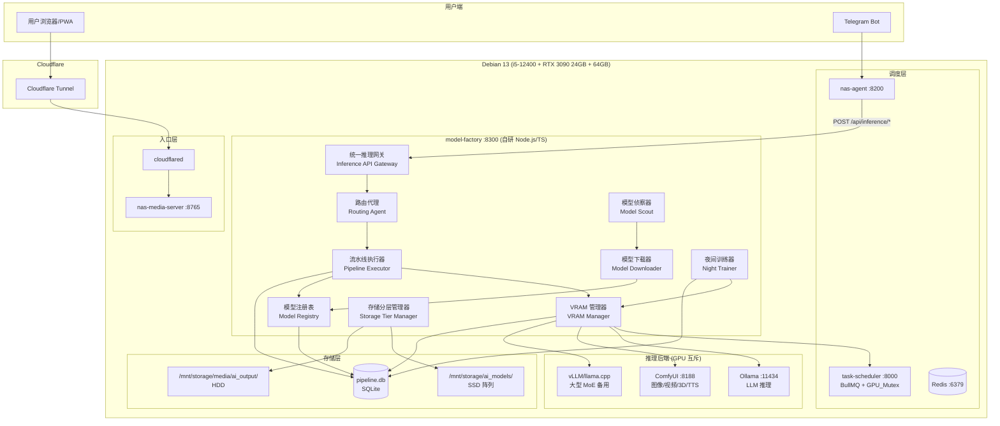
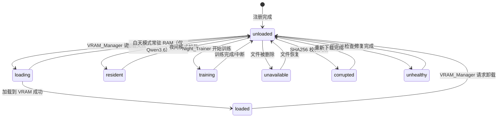
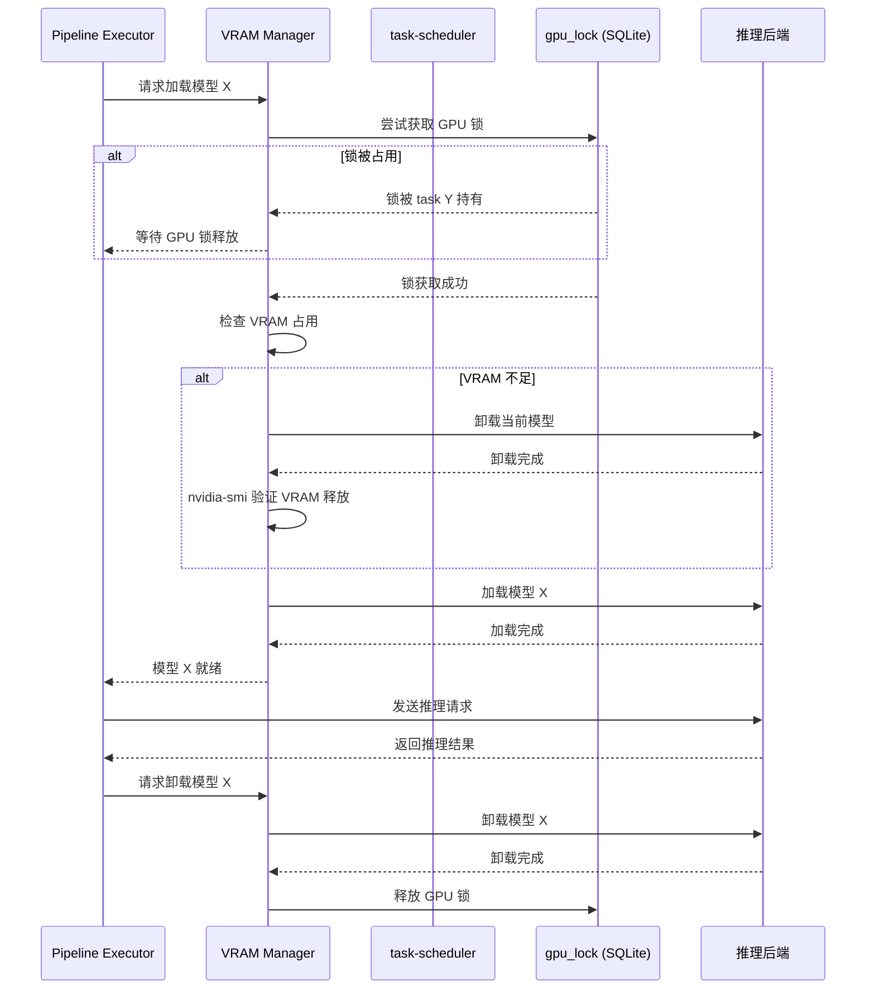
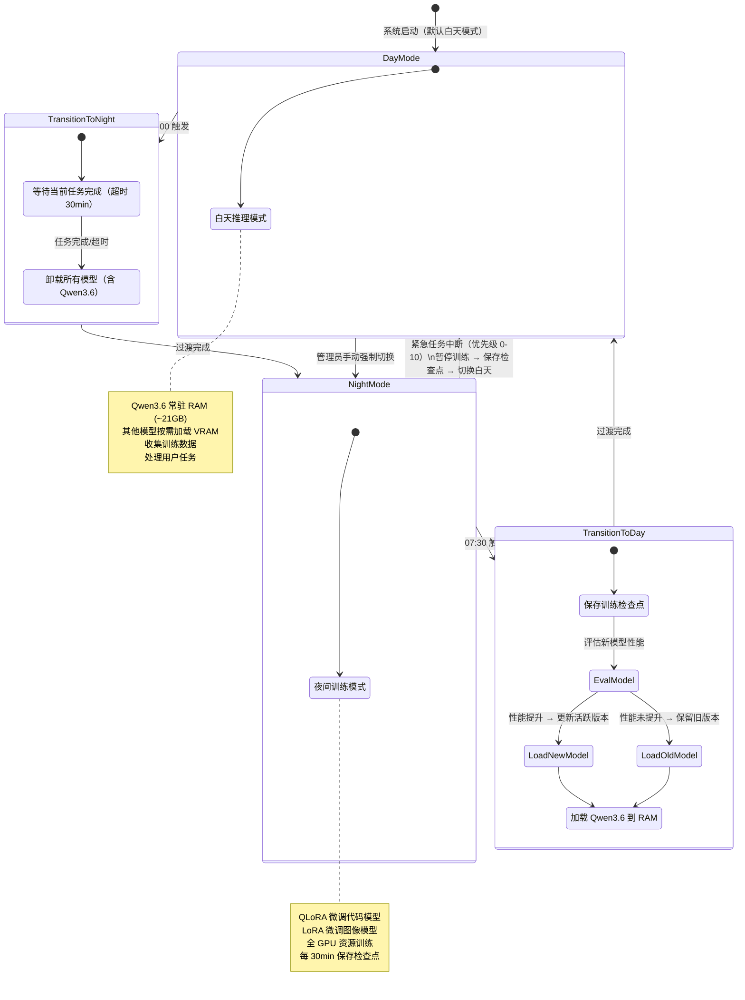
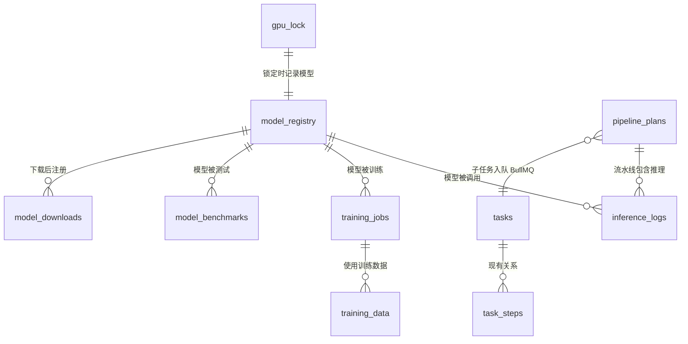

# 技术设计文档 — AI 模型工厂（多模型编排系统）

## 概述

AI 模型工厂是星聚OS的多模型 AI 编排子系统，替代原有的单 Ollama 方案，实现 12+ 专业 AI 模型的统一管理、智能路由和协同工作。系统运行在 Debian 13 + i5-12400 + RTX 3090 24GB + 64GB DDR4 硬件上，作为 `model-factory` systemd 服务（Node.js/TypeScript）运行，与现有 `task-scheduler`（BullMQ 队列）和 `gpu_lock`（SQLite 互斥锁）深度集成。

**核心能力：**
- **路由代理**：Qwen3.6-35B-A3B 常驻 RAM（~21GB GGUF），接收自然语言任务并自动分解为多模型执行计划
- **VRAM 管理**：单 GPU（24GB VRAM）高效调度 12+ 模型，同一时间仅一个大模型占用 VRAM，LRU 策略优化加载/卸载
- **ComfyUI 编排**：Docker 容器运行 ComfyUI，预置漫画上色、视频配音+口型同步、文生视频、3D 资产生成四套工作流模板
- **夜间训练**：白天推理 + 夜间 QLoRA/LoRA 微调，24 小时持续学习循环
- **模型侦察**：定期搜索 HuggingFace/GitHub/Papers with Code，自动发现并推荐各领域最优模型
- **统一推理网关**：屏蔽 Ollama/vLLM/ComfyUI 后端差异，提供标准化 HTTP API

**与现有系统的集成关系：**

| 现有组件 | 集成方式 | 说明 |
|---------|---------|------|
| task-scheduler :8000 | BullMQ 队列 + GPU_Mutex | 流水线子任务入队，复用优先级规则和 GPU 锁 |
| gpu_lock（SQLite 单行表） | 直接读写 pipeline.db | 模型加载/推理期间持有 GPU 锁 |
| nas-agent :8200 | HTTP API 调用 | Agent 通过统一推理网关调用模型 |
| nas-media-server :8765 | 文件路径约定 | AI 输出文件存储到 HDD，通过 Tunnel+CDN 分发 |
| pipeline.db（SQLite） | 新增 7 张表 | 模型注册、下载队列、推理日志、训练任务等 |
| content_registry | MPAA 分级传播 | AI 生成内容继承源素材的 MPAA 分级 |

---

## 架构

### 高层架构图



### 数据流路径

**用户任务流：**
```
用户提交自然语言任务
  → 统一推理网关 /api/inference/pipeline
  → 路由代理（Qwen3.6 常驻 RAM）分析意图、分解子任务
  → 生成 JSON 执行计划（含依赖关系）
  → 用户确认执行计划
  → Pipeline_Executor 将子任务入队 task-scheduler BullMQ
  → 按依赖顺序执行：获取 GPU_Mutex → 加载模型 → 推理 → 卸载模型 → 释放锁
  → 中间结果存 /tmp/ai_pipeline/{task_id}/
  → 最终输出存 /mnt/storage/media/ai_output/
```

**模型下载流：**
```
管理员添加下载任务（HuggingFace repo ID + 量化格式）
  → Model_Downloader 入队下载队列
  → 优先使用 hf-mirror.com 镜像源，失败回退 HuggingFace 官方
  → 断点续传下载到 /mnt/storage/ai_models/{domain}/{model_name}/
  → SHA256 校验完整性
  → 自动注册到 Model_Registry
  → 触发基准测试
```

**24 小时学习循环：**
```
08:00-02:00（白天）：Qwen3.6 常驻 RAM，处理用户任务，收集训练数据
02:00-02:30（过渡期）：等待当前任务完成，卸载所有模型
02:30-07:30（夜间）：QLoRA/LoRA 微调，每 30 分钟保存检查点
07:30-08:00（过渡期）：评估新模型，性能提升则更新活跃版本，切换白天模式
```

---

## 组件与接口

### 1. 模型注册表（Model Registry）

**职责：** 管理所有 AI 模型的元数据、版本、状态和健康检查。

**核心功能：**
- 维护模型元数据：名称、领域分类、文件路径、大小、量化格式、许可证、推理后端类型
- 记录 VRAM/RAM 需求，供 VRAM_Manager 调度参考
- 跟踪模型状态：`unloaded` → `loading` → `loaded` → `resident` → `training` → `unavailable` → `corrupted` → `unhealthy`
- 自动扫描 `/mnt/storage/ai_models/` 目录注册新模型
- 多版本管理，标记当前活跃版本
- 每日完整性检查（SHA256）、每周可用性检查（加载+推理测试）
- 基准测试管理：代码 pass@1、图像 CLIP、TTS MOS、视频帧一致性

**模型状态机：**



### 2. 模型下载器（Model Downloader）

**职责：** 从 HuggingFace Hub 下载模型文件，支持中国镜像加速和断点续传。

**核心功能：**
- 使用 `huggingface-cli download` 命令行工具下载模型
- 镜像源优先级：`hf-mirror.com` → `huggingface.co`（通过 `HF_ENDPOINT` 环境变量切换）
- 断点续传：huggingface-cli 原生支持
- 下载进度追踪：解析 CLI 输出获取已下载大小/总大小/速度
- SHA256 完整性校验
- 失败重试：30 分钟间隔，最多 3 次，指数退避
- 批量下载队列：按提交顺序依次下载

**下载流程：**

```typescript
interface DownloadTask {
  id: string;
  repo_id: string;           // e.g. "Qwen/Qwen3.6-35B-A3B-GGUF"
  filename?: string;          // 指定文件，如 "qwen3.6-35b-a3b-q4_k_m.gguf"
  domain: ModelDomain;        // code | image | video | 3d | tts | lipsync | router
  target_dir: string;         // /mnt/storage/ai_models/{domain}/{model_name}/
  status: 'queued' | 'downloading' | 'verifying' | 'completed' | 'failed';
  progress_bytes: number;
  total_bytes: number;
  speed_bps: number;
  retry_count: number;
  error_message?: string;
}
```

### 3. 路由代理（Routing Agent）

**职责：** 基于 Qwen3.6-35B-A3B 的智能任务分解和模型派发引擎。

**核心功能：**
- 白天模式常驻 RAM（~21GB GGUF 格式，通过 Ollama `keep_alive` 参数）
- 接收自然语言任务描述，分析意图
- 将复杂任务分解为有序子任务列表，每个子任务指定目标模型、输入/输出类型、依赖关系
- 无法理解意图时向用户提出澄清问题
- 生成执行计划后展示摘要，用户确认后执行

**执行计划 JSON 格式：**

```json
{
  "plan_id": "uuid",
  "description": "赛博朋克风格短视频，带配音",
  "estimated_time_min": 45,
  "steps": [
    {
      "task_id": "step-1",
      "model_name": "kimi-k2.6-q3",
      "backend": "ollama",
      "action": "generate_script",
      "input_type": "text",
      "output_type": "json",
      "depends_on": [],
      "estimated_time_min": 5,
      "gpu_required": true
    },
    {
      "task_id": "step-2",
      "model_name": "nucleus-image",
      "backend": "comfyui",
      "action": "text_to_image",
      "input_type": "json",
      "output_type": "image/png",
      "depends_on": ["step-1"],
      "estimated_time_min": 8,
      "gpu_required": true
    }
  ]
}
```

**模型路由规则：**

| 任务类型 | 主力模型 | 备用模型 | 推理后端 |
|---------|---------|---------|---------|
| 代码生成/修复 | Kimi-K2.6 Q3 | GLM-5.1 Q4 | Ollama/vLLM |
| 日常对话/路由 | Qwen3.6-35B-A3B | — | Ollama |
| 图像生成 | Nucleus-Image | — | ComfyUI |
| 风格化上色 | FLUX Kontext | — | ComfyUI |
| 漫画生成 | DiffSensei | — | ComfyUI |
| 视频生成 | Wan 2.7 | — | ComfyUI |
| 3D 资产 | Hunyuan3D 2.0 | — | ComfyUI |
| 3D 场景 | HY-World 2.0 | — | ComfyUI |
| TTS 配音 | CosyVoice2-0.5B | Fish-Speech 1.5 | ComfyUI/独立服务 |
| 口型同步 | LivePortrait | — | ComfyUI/独立服务 |

### 4. VRAM 管理器（VRAM Manager）

**职责：** 管理 RTX 3090 24GB VRAM 的模型加载/卸载调度，集成 GPU 互斥锁。

**核心功能：**
- 加载前检查 VRAM 占用，不足时先卸载当前模型
- 与 task-scheduler 的 `gpu_lock` 表集成，加载/推理期间持有 GPU 锁
- 支持三种推理后端：Ollama（LLM）、ComfyUI（图像/视频/3D/TTS）、vLLM/llama.cpp（大型 MoE 备用）
- LRU 策略：记录模型使用频率，优先保留高频模型
- 记录加载/卸载耗时，超过 120 秒发出性能告警
- 模型推理超时保护：LLM 30min、图像 10min、视频 60min、TTS 15min
- 卸载后通过 `nvidia-smi` 验证 VRAM 完全释放，检测泄漏
- GPU 温度监控：每 10 秒读取，80°C 告警，85°C 暂停任务，90°C 持续 5 分钟强制停止
- RAM 限制：白天模式 Qwen3.6 常驻 RAM ≤ 25GB，系统保留 ≥ 30GB

**VRAM 加载/卸载时序：**



### 5. ComfyUI 编排器（ComfyUI Orchestrator）

**职责：** 管理 ComfyUI Docker 容器和多模型工作流模板的执行。

**核心功能：**
- ComfyUI 作为 Docker 容器运行，GPU 直通（`--gpus all`），端口 `127.0.0.1:8188`
- 预置 4 套工作流模板（JSON 格式）
- 支持管理员通过 ComfyUI Web 界面自定义工作流
- 按工作流节点顺序依次加载模型，每个节点完成后卸载
- 实时推送执行进度到管理后台
- 节点失败时保存中间结果，支持从失败节点重试
- 最终输出存储到 HDD `/mnt/storage/media/ai_output/`

**预置工作流模板：**

#### 工作流 1：漫画上色

```json
{
  "workflow_id": "manga-colorize",
  "name": "漫画上色工作流",
  "nodes": [
    {
      "id": "load_lineart",
      "type": "LoadImage",
      "inputs": { "image": "{input_path}" }
    },
    {
      "id": "colorize",
      "type": "FluxKontextNode",
      "model": "flux-kontext",
      "inputs": {
        "image": "{load_lineart.output}",
        "prompt": "colorize this manga lineart, vibrant colors, {style_prompt}",
        "strength": 0.75
      }
    },
    {
      "id": "save",
      "type": "SaveImage",
      "inputs": {
        "images": "{colorize.output}",
        "filename_prefix": "colorized"
      }
    }
  ]
}
```

#### 工作流 2：视频配音 + 口型同步

```json
{
  "workflow_id": "video-dub-lipsync",
  "name": "视频配音+口型同步工作流",
  "nodes": [
    {
      "id": "load_video",
      "type": "LoadVideo",
      "inputs": { "video": "{input_video_path}" }
    },
    {
      "id": "tts_narration",
      "type": "CosyVoice2Node",
      "model": "cosyvoice2-0.5b",
      "inputs": {
        "text": "{narration_text}",
        "speaker": "{speaker_ref_audio}",
        "language": "zh"
      }
    },
    {
      "id": "tts_dialogue",
      "type": "FishSpeechNode",
      "model": "fish-speech-1.5",
      "inputs": {
        "text": "{dialogue_text}",
        "voice_clone_ref": "{character_voice_ref}",
        "language": "zh"
      }
    },
    {
      "id": "lipsync",
      "type": "LivePortraitNode",
      "model": "liveportrait",
      "inputs": {
        "video": "{load_video.output}",
        "audio": "{tts_dialogue.output}"
      }
    },
    {
      "id": "merge",
      "type": "FFmpegMerge",
      "inputs": {
        "video": "{lipsync.output}",
        "narration": "{tts_narration.output}",
        "dialogue": "{tts_dialogue.output}"
      }
    }
  ]
}
```

#### 工作流 3：文生视频

```json
{
  "workflow_id": "text-to-video",
  "name": "文生视频工作流",
  "nodes": [
    {
      "id": "keyframes",
      "type": "NucleusImageNode",
      "model": "nucleus-image",
      "inputs": {
        "prompt": "{scene_descriptions}",
        "batch_size": "{keyframe_count}"
      }
    },
    {
      "id": "stylize",
      "type": "FluxKontextNode",
      "model": "flux-kontext",
      "inputs": {
        "images": "{keyframes.output}",
        "style_prompt": "{style_description}"
      }
    },
    {
      "id": "animate",
      "type": "Wan27Node",
      "model": "wan-2.7",
      "inputs": {
        "images": "{stylize.output}",
        "motion_prompt": "{motion_descriptions}",
        "fps": 24,
        "duration_sec": 5
      }
    },
    {
      "id": "concat",
      "type": "FFmpegConcat",
      "inputs": {
        "videos": "{animate.output}",
        "transition": "crossfade"
      }
    }
  ]
}
```

#### 工作流 4：3D 资产生成

```json
{
  "workflow_id": "3d-asset-gen",
  "name": "3D 资产生成工作流",
  "nodes": [
    {
      "id": "load_concept",
      "type": "LoadImage",
      "inputs": { "image": "{concept_art_path}" }
    },
    {
      "id": "generate_3d",
      "type": "Hunyuan3DNode",
      "model": "hunyuan3d-2.0",
      "inputs": {
        "image": "{load_concept.output}",
        "output_format": "glb",
        "texture_resolution": 2048
      }
    },
    {
      "id": "export",
      "type": "Export3D",
      "inputs": {
        "mesh": "{generate_3d.output}",
        "formats": ["glb", "fbx"],
        "output_dir": "{output_path}"
      }
    }
  ]
}
```

### 6. 夜间训练器（Night Trainer）

**职责：** 在夜间模式下执行 QLoRA/LoRA 微调训练，实现 24 小时持续学习循环。

**核心功能：**
- 白天自动收集训练数据：代码模型 instruction-response 对、图像模型 prompt-image 对（含用户反馈）
- 训练数据去重和质量过滤：移除重复样本、移除用户拒绝的低质量输出
- 训练数据匿名化：不包含用户身份信息
- 夜间自动启动 QLoRA（代码模型）和 LoRA（图像模型）微调
- 训练前验证数据集质量：≥ 100 条有效样本
- 每 30 分钟保存训练检查点到 `/mnt/storage/ai_models/checkpoints/`
- 训练完成后自动评估：代码 pass@1、图像 FID，仅性能提升时更新活跃版本
- GPU 温度保护：85°C 暂停 10 分钟
- 训练数据存储配额：默认 20GB SSD，超额按时间清理最旧数据
- 连续 3 天无提升时建议调整超参数

**训练工具链：**
- QLoRA 微调：使用 `unsloth` 或 `peft` + `transformers`（Python）
- LoRA 微调：使用 `kohya_ss` 或 `diffusers` 训练脚本（Python）
- 训练脚本由 model-factory 通过 `child_process.spawn` 调用 Python 进程

### 7. 模型侦察器（Model Scout）

**职责：** 定期搜索互联网发现各领域最新最优模型，推荐更新。

**核心功能：**
- 默认每周一次搜索 HuggingFace、GitHub、Papers with Code、主流 AI 评测榜单
- 评估维度：评测分数、VRAM 适配性（≤ 24GB）、许可证、社区活跃度
- 生成更新推荐报告：新旧模型对比、评测分数差异、存储空间需求
- 三种更新策略：仅推荐（默认）、自动下载但不激活、自动下载并激活
- 自动更新后性能不及预期时自动回滚

**搜索实现：**
- HuggingFace API：`GET https://huggingface.co/api/models?sort=trending&filter={domain}`
- Papers with Code API：`GET https://paperswithcode.com/api/v1/papers/?ordering=-published`
- 使用 Qwen3.6 路由代理分析搜索结果，生成结构化推荐报告

### 8. 存储分层管理器（Storage Tier Manager）

**职责：** 管理 SSD（模型）和 HDD（媒体数据）的存储分配和数据迁移。

**存储规则：**

| 数据类型 | 存储位置 | 路径 |
|---------|---------|------|
| AI 模型文件 | SSD 阵列 | `/mnt/storage/ai_models/{domain}/{model_name}/` |
| 训练数据 | SSD | `/mnt/storage/ai_models/training_data/{domain}/` |
| 训练检查点 | SSD | `/mnt/storage/ai_models/checkpoints/{domain}/` |
| LoRA 适配器 | SSD | `/mnt/storage/ai_models/lora_adapters/{domain}/` |
| AI 生成输出 | HDD | `/mnt/storage/media/ai_output/{type}/` |
| 流水线临时文件 | tmpfs/SSD | `/tmp/ai_pipeline/{task_id}/` |
| 归档旧版本模型 | HDD | `/mnt/storage/ai_models_archive/` |

**自动清理策略：**
- SSD 可用空间 < 50GB → 告警 + 自动将不活跃旧版本模型移到 HDD 归档
- 训练检查点保留最近 7 天，过期自动清理
- 流水线临时文件在任务完成后立即清理

### 9. 流水线执行器（Pipeline Executor）

**职责：** 按照路由代理生成的执行计划，依次调用多个模型完成复杂创作任务。

**核心功能：**
- 接收 JSON 执行计划，按依赖关系拓扑排序确定执行顺序
- 每个子任务作为独立 BullMQ job 入队 task-scheduler，类型 `model_factory_pipeline`
- 子任务间传递中间结果：前一步输出文件路径作为下一步输入参数
- 中间结果存储在 `/tmp/ai_pipeline/{task_id}/`
- 无依赖关系的非 GPU 子任务可并行执行（如 FFmpeg 合并）
- 失败重试：最多 3 次，30 秒间隔，支持备用模型回退
- 执行状态检查点：系统重启后可从最后检查点恢复
- 实时进度推送到管理后台

### 10. 统一推理 API 网关（Inference API Gateway）

**职责：** 屏蔽不同推理后端差异，提供标准化 HTTP API。

**API 端点：**

```
POST /api/inference/text        — 文本生成（→ Ollama/vLLM/llama.cpp）
POST /api/inference/image       — 图像生成（→ ComfyUI）
POST /api/inference/video       — 视频生成（→ ComfyUI）
POST /api/inference/tts         — 语音合成（→ ComfyUI/独立 TTS 服务）
POST /api/inference/3d          — 3D 资产生成（→ ComfyUI）
POST /api/inference/lipsync     — 口型同步（→ ComfyUI/独立服务）
POST /api/inference/pipeline    — 多模型流水线（→ Routing Agent + Pipeline Executor）

GET  /api/models                — 模型列表
GET  /api/models/:id            — 模型详情
POST /api/models/:id/benchmark  — 触发基准测试
POST /api/models/download       — 添加下载任务
GET  /api/models/downloads      — 下载队列状态

GET  /api/gpu/status            — GPU 实时状态（温度/功耗/VRAM/当前模型）
GET  /api/gpu/history           — GPU 历史数据（30 天）

POST /api/mode/switch           — 手动切换白天/夜间模式
GET  /api/mode/current          — 当前运行模式

GET  /api/training/status       — 训练状态
GET  /api/training/history      — 训练历史
GET  /api/training/data/stats   — 训练数据统计

GET  /api/storage/status        — 存储使用情况
GET  /api/scout/recommendations — 模型更新推荐
POST /api/scout/trigger         — 手动触发模型搜索

GET  /api/pipelines             — 流水线任务列表
GET  /api/pipelines/:id         — 流水线详情
PUT  /api/pipelines/:id/retry   — 重试失败步骤
DELETE /api/pipelines/:id       — 取消流水线
```

**标准化响应格式：**

```json
{
  "status": "success",
  "result": { ... },
  "model_used": "kimi-k2.6-q3",
  "inference_time_ms": 12345,
  "error": null
}
```

**认证：** 复用现有 NAS 签名机制 `X-NAS-Signature`（HMAC-SHA256）。

### 白天/夜间模式状态机



---

## 数据模型

### 新增 SQLite 表（7 张，写入现有 pipeline.db）

所有新表在现有 `pipeline.db` 数据库中创建，与 `tasks`、`task_steps`、`gpu_lock` 等现有表共存。

```sql
-- ═══════════════════════════════════════════════════════
-- AI 模型工厂新增表（7 张）
-- ═══════════════════════════════════════════════════════

-- 1. model_registry — 模型注册表
CREATE TABLE model_registry (
    id              TEXT PRIMARY KEY,           -- UUID v4
    name            TEXT NOT NULL,              -- 模型名称，如 "kimi-k2.6-q3"
    display_name    TEXT NOT NULL,              -- 显示名称，如 "Kimi-K2.6 Q3.6bit"
    domain          TEXT NOT NULL,              -- code | image | video | 3d | tts | lipsync | router
    backend         TEXT NOT NULL,              -- ollama | vllm | llama_cpp | comfyui
    file_path       TEXT NOT NULL,              -- 模型文件目录路径
    file_size_bytes INTEGER,                    -- 模型文件总大小（字节）
    quantization    TEXT,                       -- Q3 | Q4 | Q5 | Q8 | FP16 | BF16 | GGUF
    license         TEXT,                       -- MIT | Apache-2.0 | 非商用 | 学术
    vram_mb         INTEGER NOT NULL,           -- VRAM 需求（MB）
    ram_mb          INTEGER,                    -- RAM 需求（MB），常驻模型用
    status          TEXT NOT NULL DEFAULT 'unloaded',  -- unloaded | loading | loaded | resident | training | unavailable | corrupted | unhealthy
    version         TEXT DEFAULT '1.0',         -- 当前版本号
    is_active       INTEGER DEFAULT 1,          -- 是否为当前活跃版本（同一模型可有多个版本）
    sha256          TEXT,                       -- 模型文件 SHA256 校验值
    huggingface_repo TEXT,                      -- HuggingFace repo ID
    total_calls     INTEGER DEFAULT 0,          -- 累计调用次数
    last_used_at    TEXT,                       -- 最后使用时间
    last_loaded_at  TEXT,                       -- 最后加载时间
    avg_load_time_ms INTEGER,                   -- 平均加载耗时（毫秒）
    avg_inference_ms INTEGER,                   -- 平均推理耗时（毫秒）
    benchmark_score REAL,                       -- 最新基准测试分数
    created_at      TEXT NOT NULL DEFAULT (datetime('now')),
    updated_at      TEXT NOT NULL DEFAULT (datetime('now'))
);

CREATE INDEX idx_model_registry_domain ON model_registry(domain);
CREATE INDEX idx_model_registry_status ON model_registry(status);
CREATE INDEX idx_model_registry_name ON model_registry(name, is_active);
CREATE INDEX idx_model_registry_last_used ON model_registry(last_used_at);

-- 2. model_downloads — 模型下载队列
CREATE TABLE model_downloads (
    id              TEXT PRIMARY KEY,           -- UUID v4
    repo_id         TEXT NOT NULL,              -- HuggingFace repo ID
    filename        TEXT,                       -- 指定下载的文件名
    domain          TEXT NOT NULL,              -- code | image | video | 3d | tts | lipsync | router
    target_dir      TEXT NOT NULL,              -- 下载目标目录
    status          TEXT NOT NULL DEFAULT 'queued',  -- queued | downloading | verifying | completed | failed
    progress_bytes  INTEGER DEFAULT 0,          -- 已下载字节数
    total_bytes     INTEGER,                    -- 总字节数
    speed_bps       INTEGER,                    -- 当前下载速度（字节/秒）
    mirror_used     TEXT,                       -- 使用的镜像源：hf-mirror.com | huggingface.co
    sha256_expected TEXT,                       -- 预期 SHA256
    sha256_actual   TEXT,                       -- 实际 SHA256
    retry_count     INTEGER DEFAULT 0,          -- 重试次数
    max_retries     INTEGER DEFAULT 3,          -- 最大重试次数
    error_message   TEXT,
    model_registry_id TEXT,                     -- 下载完成后关联的 model_registry ID
    created_at      TEXT NOT NULL DEFAULT (datetime('now')),
    started_at      TEXT,
    completed_at    TEXT
);

CREATE INDEX idx_model_downloads_status ON model_downloads(status);

-- 3. inference_logs — 推理调用日志
CREATE TABLE inference_logs (
    id              TEXT PRIMARY KEY,           -- UUID v4
    model_id        TEXT NOT NULL REFERENCES model_registry(id),
    model_name      TEXT NOT NULL,              -- 冗余存储，方便查询
    endpoint        TEXT NOT NULL,              -- /api/inference/text | image | video | tts | 3d | lipsync
    request_type    TEXT NOT NULL,              -- text | image | video | tts | 3d | lipsync | pipeline
    pipeline_id     TEXT,                       -- 关联的流水线任务 ID
    status          TEXT NOT NULL,              -- success | failed | timeout
    inference_ms    INTEGER,                    -- 推理耗时（毫秒）
    load_ms         INTEGER,                    -- 模型加载耗时（毫秒）
    input_tokens    INTEGER,                    -- 输入 token 数（LLM 专用）
    output_tokens   INTEGER,                    -- 输出 token 数（LLM 专用）
    error_message   TEXT,
    mpaa_rating     TEXT DEFAULT 'PG',          -- 生成内容的 MPAA 分级（继承源素材）
    created_at      TEXT NOT NULL DEFAULT (datetime('now'))
);

CREATE INDEX idx_inference_logs_model ON inference_logs(model_id, created_at);
CREATE INDEX idx_inference_logs_created ON inference_logs(created_at);
CREATE INDEX idx_inference_logs_pipeline ON inference_logs(pipeline_id);

-- 4. training_jobs — 训练任务记录
CREATE TABLE training_jobs (
    id              TEXT PRIMARY KEY,           -- UUID v4
    model_id        TEXT NOT NULL REFERENCES model_registry(id),
    model_name      TEXT NOT NULL,
    training_type   TEXT NOT NULL,              -- qlora | lora
    status          TEXT NOT NULL DEFAULT 'pending',  -- pending | running | paused | completed | failed | skipped
    -- 训练配置
    base_model_path TEXT NOT NULL,              -- 基础模型路径
    output_path     TEXT,                       -- 输出 LoRA 适配器路径
    dataset_path    TEXT NOT NULL,              -- 训练数据集路径
    dataset_size    INTEGER,                    -- 训练样本数
    -- 训练进度
    current_epoch   INTEGER DEFAULT 0,
    total_epochs    INTEGER,
    current_step    INTEGER DEFAULT 0,
    total_steps     INTEGER,
    current_loss    REAL,
    best_loss       REAL,
    -- 评估结果
    eval_score_before REAL,                     -- 训练前基准分数
    eval_score_after  REAL,                     -- 训练后基准分数
    is_promoted     INTEGER DEFAULT 0,          -- 是否已提升为活跃版本
    new_version     TEXT,                       -- 训练产生的新版本号
    -- 检查点
    last_checkpoint_path TEXT,                  -- 最后保存的检查点路径
    last_checkpoint_at   TEXT,
    -- 元数据
    hyperparams     TEXT,                       -- JSON: 超参数配置
    gpu_temp_max    INTEGER,                    -- 训练期间最高 GPU 温度
    error_message   TEXT,
    skip_reason     TEXT,                       -- 跳过原因（如数据不足）
    created_at      TEXT NOT NULL DEFAULT (datetime('now')),
    started_at      TEXT,
    completed_at    TEXT
);

CREATE INDEX idx_training_jobs_status ON training_jobs(status);
CREATE INDEX idx_training_jobs_model ON training_jobs(model_id);

-- 5. training_data — 训练数据元数据
CREATE TABLE training_data (
    id              TEXT PRIMARY KEY,           -- UUID v4
    domain          TEXT NOT NULL,              -- code | image
    data_type       TEXT NOT NULL,              -- instruction_response | prompt_image
    file_path       TEXT NOT NULL,              -- 数据文件路径
    sample_count    INTEGER DEFAULT 1,          -- 样本数量
    quality_score   REAL,                       -- 质量评分 0.0-1.0
    user_feedback   TEXT,                       -- accepted | rejected | modified
    is_deduplicated INTEGER DEFAULT 0,          -- 是否已去重
    is_anonymized   INTEGER DEFAULT 1,          -- 是否已匿名化
    used_in_training TEXT,                      -- 关联的 training_job ID（训练后填入）
    created_at      TEXT NOT NULL DEFAULT (datetime('now'))
);

CREATE INDEX idx_training_data_domain ON training_data(domain, created_at);
CREATE INDEX idx_training_data_quality ON training_data(quality_score);

-- 6. model_benchmarks — 基准测试结果
CREATE TABLE model_benchmarks (
    id              TEXT PRIMARY KEY,           -- UUID v4
    model_id        TEXT NOT NULL REFERENCES model_registry(id),
    model_name      TEXT NOT NULL,
    model_version   TEXT NOT NULL,
    benchmark_type  TEXT NOT NULL,              -- pass_at_1 | clip_score | mos_score | frame_consistency | fid_score
    score           REAL NOT NULL,              -- 测试分数
    test_cases      INTEGER,                    -- 测试用例数
    details         TEXT,                       -- JSON: 详细测试结果
    is_baseline     INTEGER DEFAULT 0,          -- 是否为基线版本
    created_at      TEXT NOT NULL DEFAULT (datetime('now'))
);

CREATE INDEX idx_benchmarks_model ON model_benchmarks(model_id, created_at);
CREATE INDEX idx_benchmarks_type ON model_benchmarks(benchmark_type);

-- 7. pipeline_plans — 路由代理执行计划
CREATE TABLE pipeline_plans (
    id              TEXT PRIMARY KEY,           -- UUID v4（即 plan_id）
    user_input      TEXT NOT NULL,              -- 用户原始输入
    plan_json       TEXT NOT NULL,              -- JSON: 完整执行计划
    status          TEXT NOT NULL DEFAULT 'draft',  -- draft | confirmed | executing | completed | failed | cancelled
    total_steps     INTEGER NOT NULL,           -- 总步骤数
    current_step    INTEGER DEFAULT 0,          -- 当前执行步骤
    estimated_time_min INTEGER,                 -- 预计总耗时（分钟）
    actual_time_min    INTEGER,                 -- 实际总耗时（分钟）
    output_path     TEXT,                       -- 最终输出文件路径
    mpaa_rating     TEXT DEFAULT 'PG',          -- 继承源素材的 MPAA 分级
    error_message   TEXT,
    created_at      TEXT NOT NULL DEFAULT (datetime('now')),
    confirmed_at    TEXT,
    started_at      TEXT,
    completed_at    TEXT
);

CREATE INDEX idx_pipeline_plans_status ON pipeline_plans(status);
CREATE INDEX idx_pipeline_plans_created ON pipeline_plans(created_at);
```

### 与现有表的关联关系



---

## 错误处理

### 错误分类与恢复策略

| 错误类型 | 触发条件 | 恢复策略 | 最大重试 |
|---------|---------|---------|---------|
| 模型加载失败 | VRAM 不足/文件损坏/后端错误 | 释放资源 → 通知 task-scheduler 失败 | 1 |
| 模型推理超时 | 超过类型超时阈值 | 强制终止 → 释放 GPU 锁 → 重试 | 3 |
| 模型推理崩溃 | OOM/CUDA 错误 | 清理 GPU 进程 → 释放 VRAM → 重试 | 3 |
| 下载失败 | 网络错误/校验失败 | 30 分钟后重试，指数退避 | 3 |
| 主力模型不可用 | 未下载/加载失败 | 自动回退到备用模型 | 1 |
| Ollama 服务崩溃 | 进程退出 | 自动重启 Ollama，60 秒内恢复 | 3 |
| ComfyUI 服务崩溃 | 容器退出 | 自动重启容器，恢复中断工作流 | 3 |
| GPU 过热 | 温度 > 85°C | 暂停任务，等待降至 75°C | — |
| GPU 严重过热 | 温度 > 90°C 持续 5 分钟 | 强制卸载所有模型，停止所有 GPU 任务 | — |
| 流水线步骤失败 | 子任务执行错误 | 重试 3 次 → 尝试备用模型 → 保存中间结果 | 3+1 |
| VRAM 泄漏 | 卸载后 nvidia-smi 显示残留 | 强制清理 GPU 进程 | 1 |
| 训练数据不足 | 样本 < 100 条 | 跳过当晚训练，记录原因 | — |
| 模型文件损坏 | SHA256 校验失败 | 标记 corrupted → 自动重新下载 | 1 |

### 重试退避策略

```typescript
function calculateRetryDelay(retryCount: number, baseDelay: number = 30000): number {
  // 指数退避：30s → 60s → 120s，最大 30 分钟
  const delay = baseDelay * Math.pow(2, retryCount);
  const maxDelay = 30 * 60 * 1000; // 30 分钟
  const jitter = Math.random() * 5000; // 0-5 秒随机抖动
  return Math.min(delay, maxDelay) + jitter;
}
```

### 系统启动恢复流程

```
系统启动 → model-factory 服务启动
  1. GPU 状态清理：终止残留 GPU 进程，释放泄漏 VRAM，重置 gpu_lock
  2. 模型状态同步：扫描 /mnt/storage/ai_models/，更新所有模型文件状态
  3. 恢复中断任务：检查 pipeline_plans 中 status='executing' 的任务，从最后检查点恢复
  4. 确定运行模式：根据当前时间决定白天/夜间模式
  5. 白天模式：加载 Qwen3.6 到 RAM
  6. 夜间模式：检查是否有待执行的训练任务
```


---

## 正确性属性

*正确性属性（Correctness Property）是一种在系统所有合法执行中都应成立的特征或行为——本质上是对系统应做什么的形式化陈述。属性是连接人类可读规格说明与机器可验证正确性保证之间的桥梁。*

以下属性基于需求文档中的验收标准推导而来，每个属性都是可通过属性基测试（Property-Based Testing）自动验证的通用量化命题。

### Property 1: VRAM 互斥——同一时间至多一个模型占用 GPU

*对于任意*模型加载/卸载操作序列，在任意时刻，至多有一个模型处于 `loaded` 状态（占用 GPU VRAM），且该模型持有 `gpu_lock` 锁。如果某个模型正在加载（`loading` 状态），则不存在另一个模型同时处于 `loaded` 或 `loading` 状态。

**验证: 需求 4.2, 19.1**

### Property 2: 模型版本单调性——活跃版本性能不低于前一版本

*对于任意*模型和任意版本更新操作（包括夜间训练产生的新版本和 Model_Scout 自动更新），如果新版本的基准测试分数严格低于当前活跃版本的分数，则当前活跃版本保持不变（新版本不会被提升为活跃版本）。即：`is_active` 标记仅在 `new_score >= current_score` 时才从旧版本转移到新版本。

**验证: 需求 7.6, 8.5, 8.7**

### Property 3: 流水线依赖顺序——子任务按依赖关系正确执行

*对于任意*合法的执行计划（JSON DAG），如果子任务 B 的 `depends_on` 列表包含子任务 A 的 `task_id`，则子任务 A 的完成时间必须早于子任务 B 的开始时间。等价地：执行顺序是依赖图的一个合法拓扑排序。

**验证: 需求 3.2, 10.1, 10.3**

### Property 4: 存储分层正确性——模型在 SSD，输出在 HDD

*对于任意*已注册的模型文件，其 `file_path` 必须以 `/mnt/storage/ai_models/` 为前缀（SSD 阵列）。*对于任意* AI 生成的最终输出文件，其存储路径必须以 `/mnt/storage/media/ai_output/` 为前缀（HDD）。*对于任意*训练数据文件，其路径必须以 `/mnt/storage/ai_models/training_data/` 为前缀（SSD）。三类数据不会出现在错误的存储层上。

**验证: 需求 9.1, 9.2, 9.3, 6.7, 10.5**

### Property 5: 白天/夜间模式不变量——训练仅在夜间，推理在白天

*对于任意*时刻，系统恰好处于以下四种状态之一：`DayMode`、`TransitionToNight`、`NightMode`、`TransitionToDay`。当系统处于 `DayMode` 时，不存在任何 `training_jobs` 记录处于 `running` 状态，且 Qwen3.6 模型状态为 `resident`。当系统处于 `NightMode` 时，Qwen3.6 模型状态不为 `resident`，且 GPU 资源完全分配给训练任务。唯一例外：优先级 0-10 的紧急任务可在夜间模式触发临时切换到白天模式。

**验证: 需求 5.1, 5.2, 5.3, 5.7, 7.1**

### Property 6: MPAA 分级传播——生成内容继承源素材分级

*对于任意*多模型流水线执行，如果流水线的输入素材（图片、视频、音频）在 `content_registry` 中标记了 MPAA 分级（G/PG/PG-13/R/NC-17），则流水线的最终输出在 `pipeline_plans.mpaa_rating` 和 `inference_logs.mpaa_rating` 中的分级必须等于所有输入素材中最严格的分级。即：`output_rating = max(input_ratings)`，其中分级严格程度为 G < PG < PG-13 < R < NC-17。

**验证: 需求 3.2（隐含）, 数据模型 inference_logs.mpaa_rating, pipeline_plans.mpaa_rating**

### Property 7: 重试退避正确性——指数退避且不超过上限

*对于任意*重试次数 `n`（0 ≤ n ≤ max_retries），计算出的重试延迟 `delay(n)` 满足：`base_delay * 2^n ≤ delay(n) ≤ base_delay * 2^n + jitter_max`，且 `delay(n) ≤ max_delay`（30 分钟）。其中 `base_delay = 30 秒`，`jitter_max = 5 秒`。延迟随重试次数单调递增（忽略抖动），且永远不超过 30 分钟上限。

**验证: 需求 2.7, 22.1**

### Property 8: GPU 温度安全——超阈值自动暂停

*对于任意* GPU 温度读数序列，当温度超过 85°C 时，所有 GPU 任务（推理或训练）必须在下一个监控周期（10 秒内）被暂停，且仅当温度降至 75°C 以下时才恢复。当温度持续超过 90°C 达 5 分钟时，所有模型必须被强制卸载，所有 GPU 任务必须被终止。温度保护的触发不受当前运行模式（白天/夜间）的影响。

**验证: 需求 7.7, 14.3, 14.4, 14.5**

---

## 测试策略

### 双轨测试方法

本项目采用属性基测试（PBT）+ 单元测试/集成测试的双轨策略：

**属性基测试（Property-Based Testing）：**
- 测试框架：`fast-check`（TypeScript/Node.js 生态最成熟的 PBT 库）
- 每个属性测试最少运行 **100 次迭代**
- 每个测试用 `// Feature: ai-model-factory, Property N: {property_text}` 注释标记
- 标签格式：**Feature: ai-model-factory, Property {number}: {property_text}**
- 覆盖上述 8 个正确性属性

**属性测试实现要点：**

| 属性 | 生成器策略 | 验证方式 |
|------|-----------|---------|
| P1: VRAM 互斥 | 生成随机的模型加载/卸载操作序列 | 在每个操作后检查 loaded 模型数 ≤ 1 |
| P2: 版本单调性 | 生成随机的 (old_score, new_score) 对 | 验证 is_active 仅在 new ≥ old 时转移 |
| P3: 依赖顺序 | 生成随机 DAG（节点数 2-20，边数随机） | 验证执行顺序是合法拓扑排序 |
| P4: 存储分层 | 生成随机的文件路径和数据类型 | 验证路径前缀匹配存储规则 |
| P5: 模式不变量 | 生成随机的时间点和模式切换序列 | 验证每个时间点的模式约束 |
| P6: MPAA 传播 | 生成随机的输入分级组合 | 验证输出分级 = max(输入分级) |
| P7: 退避正确性 | 生成随机的 retry_count (0-10) | 验证延迟在预期范围内 |
| P8: 温度安全 | 生成随机的温度读数序列 | 验证暂停/恢复/强制停止的触发条件 |

**单元测试：**
- 测试框架：`vitest`
- 覆盖具体示例和边界条件：
  - 赛博朋克短视频 9 步流水线端到端场景
  - 模型文件损坏/删除的错误恢复
  - Ollama/ComfyUI 服务崩溃后的自动重启
  - 空任务队列、单任务、满队列的边界情况
  - 模型下载断点续传
  - 白天/夜间模式切换过渡期的任务等待

**集成测试：**
- 测试框架：`vitest` + Docker Compose 测试环境
- 覆盖外部服务集成：
  - Ollama API 调用（加载/卸载/推理）
  - ComfyUI 工作流执行
  - HuggingFace 模型下载（使用 mock server）
  - nvidia-smi GPU 状态读取
  - SQLite pipeline.db 读写并发安全
  - BullMQ 任务队列入队/出队/依赖

### 测试目录结构

```
services/model-factory/
├── src/
│   ├── registry/          # 模型注册表
│   ├── downloader/        # 模型下载器
│   ├── router/            # 路由代理
│   ├── vram/              # VRAM 管理器
│   ├── comfyui/           # ComfyUI 编排器
│   ├── trainer/           # 夜间训练器
│   ├── scout/             # 模型侦察器
│   ├── storage/           # 存储分层管理器
│   ├── pipeline/          # 流水线执行器
│   └── gateway/           # 统一推理网关
├── tests/
│   ├── properties/        # 属性基测试（8 个属性）
│   │   ├── vram-mutex.property.test.ts
│   │   ├── version-monotonicity.property.test.ts
│   │   ├── pipeline-ordering.property.test.ts
│   │   ├── storage-tier.property.test.ts
│   │   ├── day-night-mode.property.test.ts
│   │   ├── mpaa-propagation.property.test.ts
│   │   ├── retry-backoff.property.test.ts
│   │   └── gpu-temperature.property.test.ts
│   ├── unit/              # 单元测试
│   └── integration/       # 集成测试
└── package.json
```
