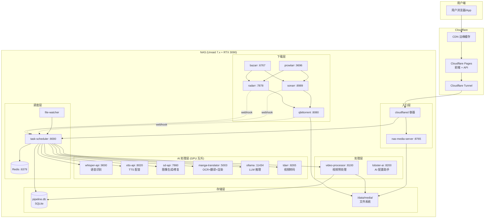
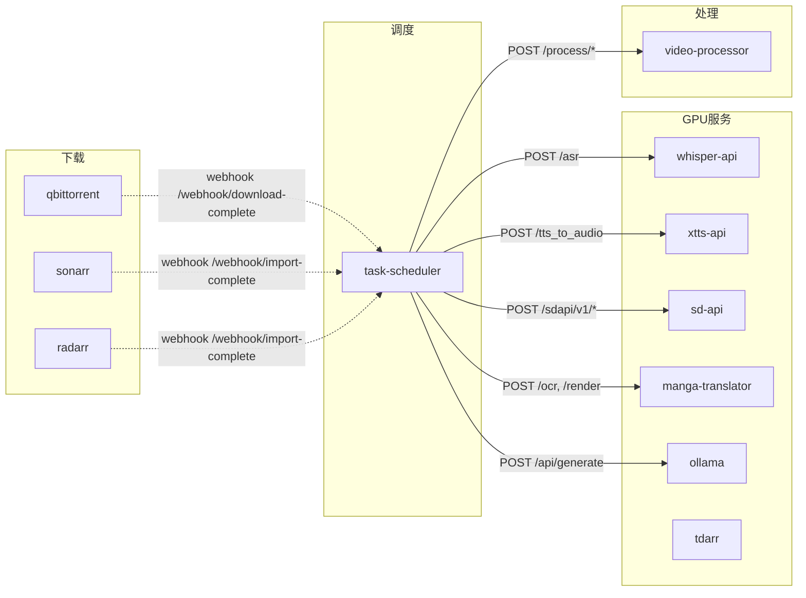
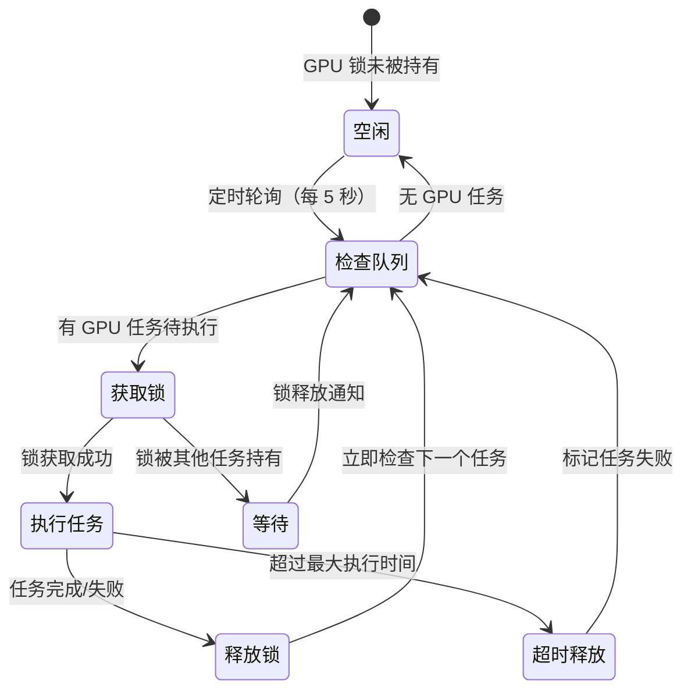
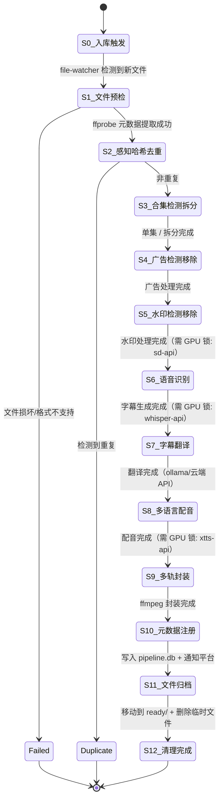
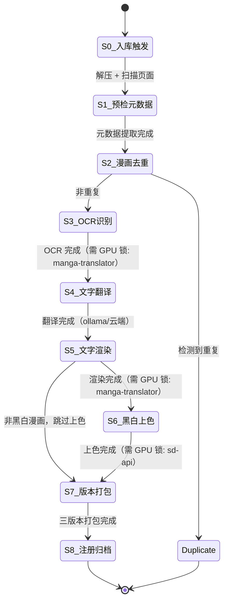
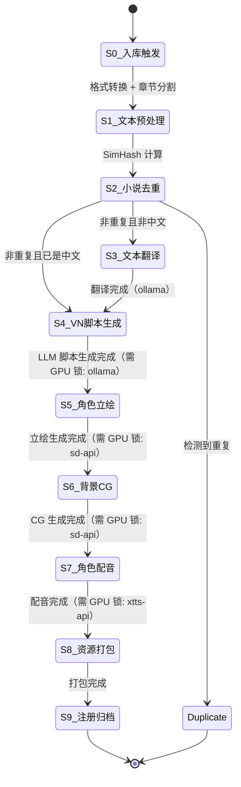
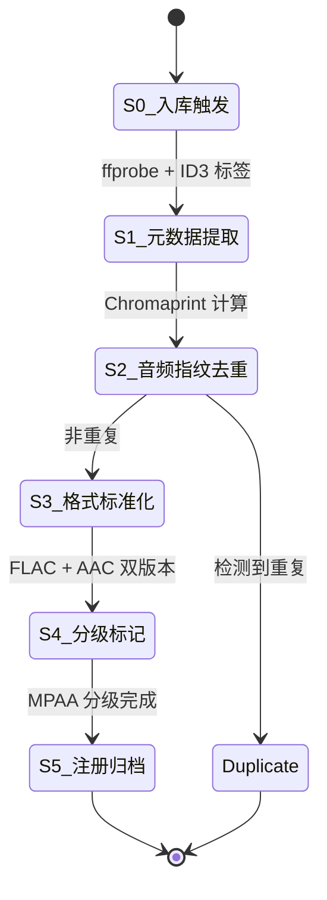
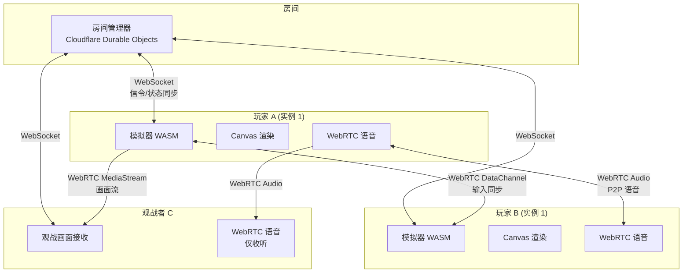
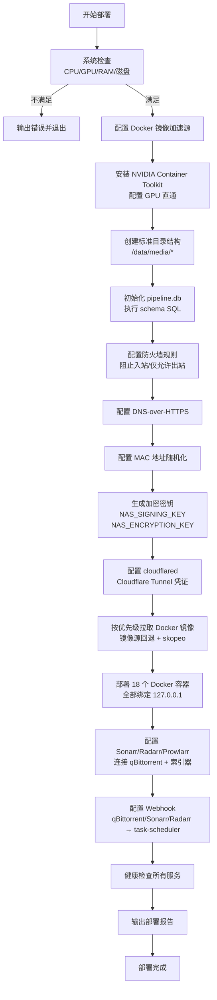

# 技术设计文档 — NAS AI 处理流水线与自动化部署

## 概述

本设计文档描述星聚（StarHub）平台 NAS 端 AI 处理流水线与自动化部署系统的技术架构。系统运行在 Unraid 7.x NAS 上，使用 RTX 3090 24GB GPU 进行异步 AI 处理，所有数据存储在 NAS 本地（SQLite `pipeline.db` + 文件系统），用户通过 `NAS → nas-media-server → Cloudflare Tunnel → CDN 边缘缓存 → 用户` 链路访问内容。

**核心设计原则：**
- NAS 零公网端口，所有流量走 Cloudflare Tunnel
- 所有数据本地存储（SQLite + 文件系统），不使用 Cloudflare D1/R2
- GPU 互斥调度：同一时间仅一个 GPU 密集型任务运行
- 异步批处理，非实时 AI 推理
- 18 个 Docker 容器协同工作，BullMQ + Redis 任务队列
- 深色主题、SVG 图标、默认中文

---

## 架构

### 高层架构图



### 数据流路径

**内容入库流：**
```
下载源 → qBittorrent/Telegram → /data/media/*/incoming/ → file-watcher → task-scheduler → AI 处理链（含自动标签+分级） → /data/media/*/ready/ → pipeline.db 注册
```

**AI 自动标签流（Content_Tagger，集成在 task-scheduler 中）：**
```
内容去重通过后 → Content_Tagger 分析：
  视频: 截图+字幕+文件名 → LLM → 地区/类型/题材/演员特征/画质/时长标签 + MPAA 分级
  漫画: 封面+内页+OCR → LLM → 画风/语言/题材标签 + MPAA 分级
  小说: 前3000字 → LLM → 类型/题材/语言标签 + MPAA 分级
  音频: ID3+Whisper → 类型/语言标签 + MPAA 分级
  服务者照片: 视觉模型 → 人种/体型/年龄/外貌标签
→ 标签写入 content_registry.metadata JSON
→ 低置信度标记"待人工审核"
```

**用户访问流：**
```
用户 → Cloudflare CDN（缓存命中直接返回）→ Cloudflare Tunnel → cloudflared → nas-media-server → /data/media/*/ready/ 文件
```

**管理操作流：**
```
管理后台 → Cloudflare Pages API → Cloudflare Tunnel → task-scheduler API → 任务管理/GPU 状态/队列操作
```

---

## 组件与接口

### Docker 容器拓扑

系统由 18 个 Docker 容器组成，全部绑定 `127.0.0.1`，按功能分为五层：

#### 1. 入口层（无 GPU）

| 容器 | 端口 | 职责 |
|------|------|------|
| `cloudflared` | 无（出站隧道） | Cloudflare Tunnel 客户端，将外部请求转发到内部服务 |
| `nas-media-server` | 127.0.0.1:8765 | 媒体文件 HTTP 服务，支持 Range 请求、ETag/Last-Modified 缓存头 |

#### 2. 调度层（无 GPU）

| 容器 | 端口 | 职责 |
|------|------|------|
| `task-scheduler` | 127.0.0.1:8000 | 中央调度器，BullMQ 任务队列，GPU 互斥锁，Telegram 抓取，带宽调度 |
| `redis` | 127.0.0.1:6379 | BullMQ 队列后端 |
| `file-watcher` | 无（内部进程） | 监控 incoming 目录，触发处理流水线 |

#### 3. AI 处理层（GPU 互斥）

| 容器 | 端口 | GPU | 职责 |
|------|------|-----|------|
| `whisper-api` | 127.0.0.1:9000 | 是 | Whisper large-v3 语音识别 |
| `xtts-api` | 127.0.0.1:8020 | 是 | XTTS-v2 多语言 TTS |
| `sd-api` | 127.0.0.1:7860 | 是 | Stable Diffusion 图像生成/修复/上色 |
| `manga-translator` | 127.0.0.1:5003 | 是 | 漫画 OCR + 翻译 + 文字渲染 |
| `ollama` | 127.0.0.1:11434 | 是 | 本地 LLM 推理（翻译/脚本生成） |
| `tdarr` | 127.0.0.1:8265 | 是 | 视频自动转码 H.265 |

#### 4. 辅助处理层

| 容器 | 端口 | GPU | 职责 |
|------|------|-----|------|
| `video-processor` | 127.0.0.1:8100 | 部分 | 视频去重/去广告/去水印/拆分（ffmpeg + Python） |
| `lobster-ai` | 127.0.0.1:8200 | 否 | 龙虾 AI 配置助手 |

#### 5. 下载层（无 GPU）

| 容器 | 端口 | 职责 |
|------|------|------|
| `qbittorrent` | 127.0.0.1:8080 | BT 下载器 |
| `sonarr` | 127.0.0.1:8989 | 电视剧/动漫自动刮削 |
| `radarr` | 127.0.0.1:7878 | 电影自动刮削 |
| `prowlarr` | 127.0.0.1:9696 | 索引器管理 |
| `bazarr` | 127.0.0.1:6767 | 字幕自动下载 |

### 服务间通信协议

所有服务间通信使用 HTTP REST over localhost，无需 TLS（内部网络）。



### task-scheduler API 规范

**基础路径：** `http://127.0.0.1:8000`

#### 任务管理

```
POST   /api/tasks                    创建任务
GET    /api/tasks                    查询任务列表（支持分页、过滤）
GET    /api/tasks/:id                获取任务详情
PUT    /api/tasks/:id/priority       调整任务优先级
PUT    /api/tasks/:id/retry          重试失败任务
PUT    /api/tasks/:id/retry-step     重试任务的某个失败步骤
DELETE /api/tasks/:id                取消排队中的任务
```

#### GPU 与系统状态

```
GET    /api/gpu/status               GPU 使用率、显存、当前运行模型
GET    /api/gpu/lock                 当前 GPU 锁持有者
GET    /api/queue/stats              队列统计（pending/processing/completed/failed）
GET    /api/system/health            所有容器健康状态
```

#### Webhook 接收

```
POST   /webhook/download-complete    qBittorrent 下载完成回调
POST   /webhook/import-complete      Sonarr/Radarr 导入完成回调
POST   /webhook/file-detected        file-watcher 新文件检测回调
```

#### Telegram 管理

```
GET    /api/telegram/channels        获取频道列表
POST   /api/telegram/channels        添加频道
PUT    /api/telegram/channels/:id    编辑频道配置
DELETE /api/telegram/channels/:id    删除频道
POST   /api/telegram/channels/:id/toggle  启用/禁用频道
GET    /api/telegram/logs            抓取日志
```

#### 带宽调度

```
GET    /api/bandwidth/status         当前带宽使用情况
GET    /api/bandwidth/rules          调度规则列表
PUT    /api/bandwidth/rules          更新调度规则
```

#### 去重管理

```
GET    /api/dedup/stats              去重统计仪表盘
GET    /api/dedup/queue              待清理队列
PUT    /api/dedup/:id/confirm        确认去重建议
PUT    /api/dedup/:id/reject         驳回去重建议
POST   /api/dedup/full-scan          触发全库扫描
```

#### 内容刮削管理

```
GET    /api/scrapers                 所有刮削源列表
PUT    /api/scrapers/:id/config      更新刮削源配置
POST   /api/scrapers/:id/trigger     手动触发刮削
GET    /api/scrapers/:id/logs        刮削日志
```

#### AI 自动标签管理

```
GET    /api/tagger/stats             标签统计（各类型已标签/待审核/待处理数量）
GET    /api/tagger/review            待人工审核的标签列表（置信度<50%）
PUT    /api/tagger/:contentId/tags   手动修正内容标签
PUT    /api/tagger/:contentId/rating 手动修正 MPAA 分级
POST   /api/tagger/:contentId/retag  重新触发 AI 标签分析
POST   /api/tagger/batch-retag       批量重新标签（按类型/来源筛选）
```

### nas-media-server API 规范

**基础路径：** `http://127.0.0.1:8765`（已有实现，见 `nas-service/server.ts`）

```
GET    /health                       健康检查 + 磁盘使用率
GET    /media/*                      读取媒体文件（支持 Range、ETag、Last-Modified）
PUT    /media/*                      写入缓存文件
DELETE /media/*                      删除缓存文件
GET    /list/*                       列出目录内容
GET    /info/*                       获取文件元数据
```

所有请求需携带 `X-NAS-Signature` 头（HMAC-SHA256 签名）。

### video-processor API 规范

**基础路径：** `http://127.0.0.1:8100`

```
POST   /process/probe                ffprobe 元数据提取
POST   /process/hash                 感知哈希计算（视频/图片/音频）
POST   /process/dedup                去重比对
POST   /process/ad-detect            广告检测
POST   /process/ad-remove            广告移除
POST   /process/watermark-detect     水印检测
POST   /process/watermark-remove     水印移除
POST   /process/split-detect         合集拆分检测
POST   /process/split                执行拆分
POST   /process/package              多轨封装（ffmpeg mux）
POST   /process/transcode            格式转码
POST   /process/face-compare         人脸比对（服务者验证）
```

### lobster-ai API 规范

**基础路径：** `http://127.0.0.1:8200`

```
POST   /api/chat                     对话接口（接收问题，返回诊断/建议）
GET    /api/system/status            读取系统状态（CPU/GPU/RAM/磁盘/容器）
POST   /api/actions/execute          执行配置变更（需确认 token）
POST   /api/actions/confirm          二次确认危险操作
GET    /api/actions/history          操作历史日志
POST   /api/actions/rollback/:id     回滚指定操作
```

---

## 数据模型

### SQLite 数据库 `pipeline.db` 完整 Schema

数据库位于 `/data/media/pipeline.db`，由 task-scheduler 和 video-processor 共同读写。

```sql
-- ═══════════════════════════════════════════════════════
-- 核心任务表
-- ═══════════════════════════════════════════════════════

CREATE TABLE tasks (
    id              TEXT PRIMARY KEY,           -- UUID v4
    type            TEXT NOT NULL,              -- video_pipeline | comic_pipeline | novel_pipeline | audio_pipeline | dedup_scan | face_verify
    status          TEXT NOT NULL DEFAULT 'pending',  -- pending | queued | processing | completed | failed | cancelled
    priority        INTEGER NOT NULL DEFAULT 100,     -- 0=最高, 999=最低
    source          TEXT,                       -- sonarr | radarr | telegram | manual | scraper
    source_url      TEXT,                       -- 原始来源 URL
    file_path       TEXT NOT NULL,              -- 入库文件路径
    content_id      TEXT,                       -- 处理完成后的内容 ID
    content_type    TEXT,                       -- video | comic | novel | music | image
    mpaa_rating     TEXT DEFAULT 'PG',          -- G | PG | PG-13 | R | NC-17
    current_step    INTEGER DEFAULT 0,          -- 当前执行到的步骤编号
    total_steps     INTEGER,                    -- 总步骤数
    error_message   TEXT,
    retry_count     INTEGER DEFAULT 0,
    created_at      TEXT NOT NULL DEFAULT (datetime('now')),
    started_at      TEXT,
    completed_at    TEXT,
    metadata        TEXT                        -- JSON: 额外元数据
);

CREATE INDEX idx_tasks_status ON tasks(status);
CREATE INDEX idx_tasks_type ON tasks(type);
CREATE INDEX idx_tasks_priority ON tasks(priority, created_at);

-- ═══════════════════════════════════════════════════════
-- 任务步骤表（每步独立状态持久化）
-- ═══════════════════════════════════════════════════════

CREATE TABLE task_steps (
    id              TEXT PRIMARY KEY,
    task_id         TEXT NOT NULL REFERENCES tasks(id) ON DELETE CASCADE,
    step_number     INTEGER NOT NULL,
    step_name       TEXT NOT NULL,              -- probe | hash | dedup | ad_detect | ad_remove | watermark_detect | watermark_remove | whisper | translate | dub | package | register | archive
    status          TEXT NOT NULL DEFAULT 'pending',  -- pending | running | completed | failed | skipped
    error_message   TEXT,
    retry_count     INTEGER DEFAULT 0,
    started_at      TEXT,
    completed_at    TEXT,
    duration_ms     INTEGER,
    output_path     TEXT,                       -- 该步骤的输出文件路径
    metadata        TEXT                        -- JSON: 步骤特定数据
);

CREATE INDEX idx_task_steps_task ON task_steps(task_id, step_number);

-- ═══════════════════════════════════════════════════════
-- 视频哈希表（去重索引）
-- ═══════════════════════════════════════════════════════

CREATE TABLE video_hashes (
    id              TEXT PRIMARY KEY,
    content_id      TEXT,
    file_path       TEXT NOT NULL,
    phash           TEXT NOT NULL,              -- 64-bit 感知哈希（hex 字符串）
    scene_fingerprint TEXT,                     -- 场景指纹（关键帧哈希序列，JSON 数组）
    resolution      TEXT,                       -- 如 "1920x1080"
    duration_sec    REAL,
    file_size       INTEGER,
    codec           TEXT,
    created_at      TEXT NOT NULL DEFAULT (datetime('now'))
);

CREATE INDEX idx_video_hashes_phash ON video_hashes(phash);

-- ═══════════════════════════════════════════════════════
-- 漫画哈希表
-- ═══════════════════════════════════════════════════════

CREATE TABLE comic_hashes (
    id              TEXT PRIMARY KEY,
    content_id      TEXT,
    file_path       TEXT NOT NULL,
    cover_phash     TEXT NOT NULL,              -- 封面感知哈希
    page_hashes     TEXT,                       -- 前 5 页哈希（JSON 数组）
    page_count      INTEGER,
    resolution      TEXT,                       -- 典型页面分辨率
    language        TEXT,                       -- 检测到的语言
    is_bw           INTEGER DEFAULT 0,          -- 是否黑白
    created_at      TEXT NOT NULL DEFAULT (datetime('now'))
);

CREATE INDEX idx_comic_hashes_cover ON comic_hashes(cover_phash);

-- ═══════════════════════════════════════════════════════
-- 音频指纹表
-- ═══════════════════════════════════════════════════════

CREATE TABLE audio_fingerprints (
    id              TEXT PRIMARY KEY,
    content_id      TEXT,
    file_path       TEXT NOT NULL,
    fingerprint     TEXT NOT NULL,              -- Chromaprint 指纹
    duration_sec    REAL,
    bitrate         INTEGER,
    format          TEXT,                       -- mp3 | flac | aac | wav | ogg
    title           TEXT,
    artist          TEXT,
    album           TEXT,
    created_at      TEXT NOT NULL DEFAULT (datetime('now'))
);

CREATE INDEX idx_audio_fp ON audio_fingerprints(fingerprint);

-- ═══════════════════════════════════════════════════════
-- 小说指纹表
-- ═══════════════════════════════════════════════════════

CREATE TABLE novel_fingerprints (
    id              TEXT PRIMARY KEY,
    content_id      TEXT,
    file_path       TEXT NOT NULL,
    title           TEXT,
    author          TEXT,
    simhash         TEXT,                       -- 前 1000 字 SimHash
    word_count      INTEGER,
    chapter_count   INTEGER,
    language        TEXT,
    created_at      TEXT NOT NULL DEFAULT (datetime('now'))
);

CREATE INDEX idx_novel_title_author ON novel_fingerprints(title, author);

-- ═══════════════════════════════════════════════════════
-- 人脸特征表（服务者验证）
-- ═══════════════════════════════════════════════════════

CREATE TABLE face_features (
    id              TEXT PRIMARY KEY,
    provider_id     TEXT NOT NULL,              -- 服务者 ID
    photo_path      TEXT NOT NULL,
    face_vector     BLOB,                       -- 人脸特征向量（512-dim float32）
    phash           TEXT,                       -- 照片感知哈希
    created_at      TEXT NOT NULL DEFAULT (datetime('now'))
);

CREATE INDEX idx_face_provider ON face_features(provider_id);

-- ═══════════════════════════════════════════════════════
-- 去重记录表
-- ═══════════════════════════════════════════════════════

CREATE TABLE dedup_records (
    id              TEXT PRIMARY KEY,
    content_type    TEXT NOT NULL,              -- video | comic | novel | music | image
    original_id     TEXT NOT NULL,              -- 保留的原始内容 ID
    duplicate_id    TEXT NOT NULL,              -- 被标记为重复的内容 ID
    similarity      REAL,                       -- 相似度分数
    status          TEXT DEFAULT 'pending',     -- pending | confirmed | rejected
    action          TEXT,                       -- keep_original | keep_duplicate | merge
    created_at      TEXT NOT NULL DEFAULT (datetime('now')),
    resolved_at     TEXT
);

-- ═══════════════════════════════════════════════════════
-- 广告片段表
-- ═══════════════════════════════════════════════════════

CREATE TABLE ad_segments (
    id              TEXT PRIMARY KEY,
    task_id         TEXT NOT NULL REFERENCES tasks(id),
    start_time      REAL NOT NULL,              -- 秒
    end_time        REAL NOT NULL,
    ad_type         TEXT,                       -- intro | outro | midroll
    confidence      REAL,                       -- 0.0-1.0
    status          TEXT DEFAULT 'detected',    -- detected | confirmed | removed | kept
    created_at      TEXT NOT NULL DEFAULT (datetime('now'))
);

-- ═══════════════════════════════════════════════════════
-- 内容注册表（处理完成的最终内容）
-- ═══════════════════════════════════════════════════════

CREATE TABLE content_registry (
    id              TEXT PRIMARY KEY,           -- content_id
    type            TEXT NOT NULL,              -- video | comic | novel | music
    title           TEXT,
    mpaa_rating     TEXT DEFAULT 'PG',
    status          TEXT DEFAULT 'active',      -- active | hidden | deleted
    -- 视频特有
    duration_sec    REAL,
    resolution      TEXT,
    audio_tracks    TEXT,                       -- JSON: ["original", "zh", "ja", "en"]
    subtitle_tracks TEXT,                       -- JSON: ["original", "zh", "ja", "en"]
    -- 漫画特有
    page_count      INTEGER,
    versions        TEXT,                       -- JSON: ["original", "translated", "colorized"]
    -- 小说特有
    word_count      INTEGER,
    chapter_count   INTEGER,
    modes           TEXT,                       -- JSON: ["text", "vn"]
    -- 音频特有
    artist          TEXT,
    formats         TEXT,                       -- JSON: ["flac", "m4a"]
    -- 通用
    file_path       TEXT NOT NULL,              -- ready/ 目录下的路径
    thumbnail_path  TEXT,
    source          TEXT,
    source_url      TEXT,
    metadata        TEXT,                       -- JSON: 额外元数据
    created_at      TEXT NOT NULL DEFAULT (datetime('now')),
    updated_at      TEXT NOT NULL DEFAULT (datetime('now'))
);

CREATE INDEX idx_content_type ON content_registry(type);
CREATE INDEX idx_content_rating ON content_registry(mpaa_rating);

-- ═══════════════════════════════════════════════════════
-- Telegram 频道配置表
-- ═══════════════════════════════════════════════════════

CREATE TABLE telegram_channels (
    id              TEXT PRIMARY KEY,
    channel_id      TEXT NOT NULL UNIQUE,       -- Telegram 频道/群组 ID
    name            TEXT NOT NULL,
    type            TEXT DEFAULT 'channel',     -- channel | group
    mpaa_rating     TEXT DEFAULT 'PG',
    scrape_interval INTEGER DEFAULT 1800,       -- 秒（默认 30 分钟）
    enabled         INTEGER DEFAULT 1,
    last_scraped_at TEXT,
    last_message_id INTEGER DEFAULT 0,          -- 上次抓取的最后消息 ID
    total_downloaded INTEGER DEFAULT 0,
    created_at      TEXT NOT NULL DEFAULT (datetime('now'))
);

-- ═══════════════════════════════════════════════════════
-- 刮削源配置表
-- ═══════════════════════════════════════════════════════

CREATE TABLE scraper_sources (
    id              TEXT PRIMARY KEY,
    name            TEXT NOT NULL,
    url             TEXT NOT NULL,
    type            TEXT NOT NULL,              -- video | comic | novel | music | live
    mpaa_rating     TEXT DEFAULT 'PG',
    scrape_interval INTEGER DEFAULT 21600,      -- 秒（默认 6 小时）
    max_per_run     INTEGER DEFAULT 20,
    enabled         INTEGER DEFAULT 1,
    filter_tags     TEXT,                       -- JSON: 标签过滤规则
    last_scraped_at TEXT,
    created_at      TEXT NOT NULL DEFAULT (datetime('now'))
);

-- ═══════════════════════════════════════════════════════
-- 带宽调度规则表
-- ═══════════════════════════════════════════════════════

CREATE TABLE bandwidth_rules (
    id              TEXT PRIMARY KEY,
    start_hour      INTEGER NOT NULL,           -- 0-23
    end_hour        INTEGER NOT NULL,
    download_limit  INTEGER,                    -- KB/s, NULL=无限制
    upload_limit    INTEGER,
    enabled         INTEGER DEFAULT 1
);

-- ═══════════════════════════════════════════════════════
-- 带宽使用记录表
-- ═══════════════════════════════════════════════════════

CREATE TABLE bandwidth_usage (
    date            TEXT PRIMARY KEY,           -- YYYY-MM-DD
    bytes_downloaded INTEGER DEFAULT 0,
    bytes_uploaded  INTEGER DEFAULT 0,
    daily_limit     INTEGER DEFAULT 53687091200 -- 50GB 默认
);

-- ═══════════════════════════════════════════════════════
-- GPU 锁表
-- ═══════════════════════════════════════════════════════

CREATE TABLE gpu_lock (
    id              INTEGER PRIMARY KEY CHECK (id = 1),  -- 单行表
    locked_by       TEXT,                       -- task_id
    service         TEXT,                       -- whisper | xtts | sd | manga-translator | tdarr
    locked_at       TEXT,
    expires_at      TEXT                        -- 超时自动释放
);

INSERT INTO gpu_lock (id) VALUES (1);

-- ═══════════════════════════════════════════════════════
-- 龙虾 AI 操作日志表
-- ═══════════════════════════════════════════════════════

CREATE TABLE lobster_actions (
    id              TEXT PRIMARY KEY,
    action_type     TEXT NOT NULL,              -- restart_container | modify_config | adjust_resource
    description     TEXT,
    command         TEXT,                       -- 执行的命令
    rollback_cmd    TEXT,                       -- 回滚命令
    status          TEXT DEFAULT 'pending',     -- pending | confirmed | executed | rolled_back | failed
    executed_at     TEXT,
    created_at      TEXT NOT NULL DEFAULT (datetime('now'))
);

-- ═══════════════════════════════════════════════════════
-- Docker 镜像源配置表
-- ═══════════════════════════════════════════════════════

CREATE TABLE mirror_sources (
    id              TEXT PRIMARY KEY,
    url             TEXT NOT NULL,
    priority        INTEGER DEFAULT 100,        -- 越小优先级越高
    enabled         INTEGER DEFAULT 1,
    last_success_at TEXT,
    avg_speed_kbps  INTEGER
);

-- ═══════════════════════════════════════════════════════
-- 视觉小说存档表
-- ═══════════════════════════════════════════════════════

CREATE TABLE vn_saves (
    id              TEXT PRIMARY KEY,
    user_id         TEXT NOT NULL,
    content_id      TEXT NOT NULL,
    chapter         INTEGER NOT NULL,
    scene_index     INTEGER NOT NULL,
    dialogue_index  INTEGER NOT NULL,
    save_name       TEXT,
    created_at      TEXT NOT NULL DEFAULT (datetime('now'))
);

CREATE INDEX idx_vn_saves_user ON vn_saves(user_id, content_id);
```

---

## GPU 调度算法

### GPU 互斥锁机制

RTX 3090 24GB 显存有限，GPU 密集型服务（Whisper/XTTS/SD/manga-translator/tdarr）不能并发运行。task-scheduler 维护一个基于 SQLite 的 GPU 互斥锁。



### 调度算法伪代码

```
function scheduleGpuTask():
    // 1. 按优先级获取待执行的 GPU 任务
    pendingTasks = db.query("""
        SELECT t.* FROM tasks t
        JOIN task_steps ts ON t.id = ts.task_id
        WHERE ts.status = 'pending'
          AND ts.step_name IN ('whisper', 'xtts', 'sd_inpaint', 'sd_txt2img', 'manga_ocr', 'manga_render', 'tdarr')
        ORDER BY t.priority ASC, t.created_at ASC
        LIMIT 1
    """)

    if pendingTasks.empty: return

    task = pendingTasks[0]

    // 2. 尝试获取 GPU 锁（原子操作）
    acquired = db.execute("""
        UPDATE gpu_lock SET
            locked_by = :task_id,
            service = :service,
            locked_at = datetime('now'),
            expires_at = datetime('now', '+' || :timeout || ' minutes')
        WHERE id = 1 AND (locked_by IS NULL OR expires_at < datetime('now'))
    """)

    if not acquired: return  // 锁被持有，等待下次轮询

    // 3. 执行 GPU 任务
    try:
        result = callGpuService(task.service, task.params)
        markStepCompleted(task)
    catch error:
        markStepFailed(task, error)
    finally:
        // 4. 释放 GPU 锁
        db.execute("UPDATE gpu_lock SET locked_by = NULL, service = NULL, locked_at = NULL, expires_at = NULL WHERE id = 1")
        // 5. 立即触发下一轮调度
        scheduleGpuTask()
```

### 优先级规则

| 优先级 | 值范围 | 场景 |
|--------|--------|------|
| 紧急 | 0-10 | 服务者照片验证（5 分钟 SLA） |
| 高 | 11-50 | 用户手动触发的实时任务 |
| 中 | 51-100 | 新入库内容自动处理 |
| 低 | 101-200 | 批量历史内容处理 |
| 后台 | 201-999 | 定期全库扫描、转码优化 |

### GPU 超时保护

每种 GPU 服务设置最大执行时间，超时自动释放锁并标记任务失败：

| 服务 | 最大执行时间 | 说明 |
|------|-------------|------|
| whisper-api | 60 分钟 | 长视频语音识别 |
| xtts-api | 120 分钟 | 全片配音生成 |
| sd-api (inpaint) | 180 分钟 | 全片逐帧水印移除 |
| sd-api (txt2img) | 30 分钟 | 单张 CG/立绘生成 |
| manga-translator | 60 分钟 | 整章漫画 OCR+渲染 |
| tdarr | 240 分钟 | 长视频 H.265 转码 |

---

## 处理流水线状态机

### 视频处理流水线（12 步）



**GPU 锁需求映射：**
- S5 水印移除 → `sd-api` (inpainting)
- S6 语音识别 → `whisper-api`
- S8 配音生成 → `xtts-api`

非 GPU 步骤（S1-S4, S7, S9-S12）可连续执行，无需等待 GPU 锁。

### 漫画处理流水线（9 步）



### 小说处理流水线（10 步）



### 音频处理流水线（6 步）



---

## 文件监控与 Webhook 集成设计

### file-watcher 设计

file-watcher 作为独立 Node.js 进程运行，使用 `chokidar` 库监控四个 incoming 目录：

```typescript
// 监控目录配置
const WATCH_DIRS = [
    { path: '/data/media/videos/incoming/',  pipeline: 'video_pipeline' },
    { path: '/data/media/comics/incoming/',  pipeline: 'comic_pipeline' },
    { path: '/data/media/novels/incoming/',  pipeline: 'novel_pipeline' },
    { path: '/data/media/music/incoming/',   pipeline: 'audio_pipeline' },
];
```

**文件写入完成检测算法：**
1. 检测到新文件/目录出现
2. 每 5 秒检查文件大小
3. 连续 2 次检查文件大小无变化（共 10 秒稳定期）→ 判定写入完成
4. 发送 HTTP POST 到 `http://127.0.0.1:8000/webhook/file-detected`

**请求体格式：**
```json
{
    "event": "file_detected",
    "pipeline": "video_pipeline",
    "filePath": "/data/media/videos/incoming/movie.mkv",
    "fileSize": 4294967296,
    "detectedAt": "2024-01-15T10:30:00Z"
}
```

### Webhook 集成

#### qBittorrent 下载完成

qBittorrent 配置 "Run external program on torrent finished"：
```bash
curl -X POST http://127.0.0.1:8000/webhook/download-complete \
  -H "Content-Type: application/json" \
  -d '{"name":"%N","path":"%D","size":%Z,"category":"%L"}'
```

task-scheduler 收到后根据 category 将文件移动到对应 incoming 目录。

#### Sonarr/Radarr 导入完成

Sonarr/Radarr 配置 Webhook Connection：
- URL: `http://127.0.0.1:8000/webhook/import-complete`
- Events: On Import, On Upgrade

```json
{
    "eventType": "Download",
    "series": { "title": "...", "tvdbId": 12345 },
    "episodeFile": { "relativePath": "...", "quality": "..." },
    "isUpgrade": false
}
```

#### Telegram 抓取触发

Telegram 抓取集成在 task-scheduler 内部，使用 `telegram` npm 包（MTProto 协议）：
- 按频道配置的间隔定时执行
- 下载媒体文件到 `/data/media/telegram/{channel_id}/`
- 下载完成后移动到对应 incoming 目录
- 根据频道 MPAA 配置自动标记分级

---

## 多人街机 WebRTC 架构

### 整体架构



### 动态实例分配

Instance_Allocator 运行在前端（浏览器），逻辑如下：

1. 房间创建时，读取 ROM 元数据获取 `maxPlayers`（如 NES 游戏 = 2）
2. 玩家加入时检查当前实例是否已满
3. 已满则创建新 WASM 模拟器实例
4. 实例间通过 WebSocket（Durable Objects）同步状态

```
实例分配算法:
    maxPlayers = ROM.metadata.maxPlayers  // 如 2
    instances = room.instances            // 当前活跃实例列表

    for instance in instances:
        if instance.playerCount < maxPlayers:
            return instance.addPlayer(player)

    // 所有实例已满，创建新实例
    newInstance = createEmulatorInstance(ROM)
    room.instances.push(newInstance)
    return newInstance.addPlayer(player)
```

### 观战系统

- 每个模拟器实例通过 `canvas.captureStream(30)` 捕获 30fps 画面流
- 观战者通过 WebRTC MediaStream 接收画面
- 房间界面以 CSS Grid 展示所有实例缩略图（低分辨率流）
- 点击缩略图切换到全屏观战（高分辨率流）
- 观战者的输入事件被拦截，不转发到模拟器

### 语音聊天

- 使用 WebRTC P2P 音频连接
- 信令通过 Cloudflare Durable Objects WebSocket 中继
- 支持 Opus 编码，低延迟
- 每个玩家的音频流独立，支持单独调节音量
- 语音活动检测（VAD）驱动 UI 上的说话指示器

### ROM 加载路径

```
NAS /data/media/games/roms/{platform}/{rom_file}
  → nas-media-server (127.0.0.1:8765)
  → cloudflared (Cloudflare Tunnel)
  → Cloudflare CDN 边缘缓存
  → 用户浏览器 IndexedDB 缓存
  → WASM 模拟器加载
```

---

## 部署脚本设计

### deploy.sh 执行流程



### 幂等性保证

```bash
# 每个容器部署前检查是否已存在
if docker ps -a --format '{{.Names}}' | grep -q "^starhub-${SERVICE_NAME}$"; then
    echo "[跳过] ${SERVICE_NAME} 已存在"
else
    docker run -d --name "starhub-${SERVICE_NAME}" ...
fi
```

### Docker 镜像加速回退链

```bash
MIRRORS=(
    "https://xuanyuan.cloud/free"
    "https://docker.aityp.com"
    "https://1ms.run"
    # DaoCloud 公共镜像
)

function pull_image() {
    local image=$1
    for mirror in "${MIRRORS[@]}"; do
        if docker pull "${mirror}/${image}" 2>/dev/null; then
            docker tag "${mirror}/${image}" "${image}"
            return 0
        fi
    done
    # 最终回退: skopeo
    skopeo copy "docker://${image}" "docker-daemon:${image}"
}
```

### 系统最低要求检查

| 资源 | 最低要求 | 检查方式 |
|------|---------|---------|
| CPU | 4 核 | `nproc` |
| RAM | 32 GB | `/proc/meminfo` |
| GPU | NVIDIA GPU（推荐 RTX 3090） | `nvidia-smi` |
| 磁盘 | 500 GB 可用空间 | `df -h /data` |
| Docker | 已安装 | `docker --version` |

### 容器网络配置

所有容器使用 `host` 网络模式但绑定 `127.0.0.1`，确保：
- 容器间可通过 localhost 互相访问
- 外部网络无法直接访问任何容器端口
- cloudflared 仅建立出站隧道连接

---

## 错误恢复与重试机制

### 步骤级状态持久化

每个处理步骤完成后立即写入 `task_steps` 表，确保进程崩溃后可从断点恢复：

```typescript
async function executeStep(taskId: string, stepNumber: number, stepFn: () => Promise<void>) {
    // 标记步骤开始
    await db.execute(
        `UPDATE task_steps SET status = 'running', started_at = datetime('now') WHERE task_id = ? AND step_number = ?`,
        [taskId, stepNumber]
    );

    try {
        await stepFn();
        // 标记步骤完成
        await db.execute(
            `UPDATE task_steps SET status = 'completed', completed_at = datetime('now'),
             duration_ms = (julianday('now') - julianday(started_at)) * 86400000
             WHERE task_id = ? AND step_number = ?`,
            [taskId, stepNumber]
        );
    } catch (error) {
        await db.execute(
            `UPDATE task_steps SET status = 'failed', error_message = ?,
             retry_count = retry_count + 1
             WHERE task_id = ? AND step_number = ?`,
            [error.message, taskId, stepNumber]
        );
        throw error;
    }
}
```

### 重试策略

```
指数退避重试:
    第 1 次重试: 等待 1 分钟
    第 2 次重试: 等待 5 分钟
    第 3 次重试: 等待 30 分钟
    3 次均失败: 跳过该步骤，继续后续步骤（降级处理）
```

### 崩溃恢复

task-scheduler 启动时执行恢复逻辑：

```typescript
async function recoverOnStartup() {
    // 1. 恢复所有 running 状态的任务
    const runningTasks = await db.query(
        `SELECT * FROM tasks WHERE status = 'processing'`
    );

    for (const task of runningTasks) {
        // 找到最后完成的步骤
        const lastCompleted = await db.queryOne(
            `SELECT MAX(step_number) as step FROM task_steps
             WHERE task_id = ? AND status = 'completed'`,
            [task.id]
        );

        // 从下一步继续执行
        const resumeStep = (lastCompleted?.step ?? -1) + 1;
        await resumePipeline(task.id, resumeStep);
    }

    // 2. 释放过期的 GPU 锁
    await db.execute(
        `UPDATE gpu_lock SET locked_by = NULL, service = NULL
         WHERE expires_at < datetime('now')`
    );

    // 3. 清理超过 7 天的临时目录
    await cleanupStaleProcessingDirs(7);
}
```

### 降级处理策略

当某步骤最终失败时，流水线继续执行后续步骤，但最终产出可能缺少某些功能：

| 失败步骤 | 降级影响 | 最终产出 |
|---------|---------|---------|
| 水印移除 | 视频保留水印 | 有水印但有字幕和配音 |
| 语音识别 | 无字幕 | 有去水印视频但无字幕/配音 |
| 字幕翻译 | 仅原始语言字幕 | 有原始字幕但无多语言 |
| 配音生成 | 无配音音轨 | 有字幕但无配音 |
| 漫画上色 | 保持黑白 | 有翻译但无彩色版 |
| OCR 识别 | 无翻译 | 仅原始版本 |

---

## 测试策略

### 测试分层

**单元测试：**
- GPU 调度算法的锁获取/释放逻辑
- 文件写入完成检测算法
- 带宽调度规则匹配
- 去重相似度计算（汉明距离、余弦相似度）
- 任务优先级排序
- 重试退避时间计算
- MPAA 分级标记逻辑
- 实例分配算法

**集成测试：**
- file-watcher → task-scheduler webhook 链路
- qBittorrent webhook → task-scheduler → 文件移动
- task-scheduler → GPU 服务 HTTP 调用
- pipeline.db 读写一致性
- 崩溃恢复流程（模拟进程重启）

**端到端测试：**
- 完整视频处理流水线（使用短测试视频）
- 完整漫画处理流水线（使用测试图片）
- 部署脚本幂等性验证
- Cloudflare Tunnel → nas-media-server → 文件访问

**属性测试（Property-Based Testing）：**
- 使用 `fast-check` 库（Node.js 生态）
- 每个属性测试最少 100 次迭代
- 标签格式：`Feature: nas-ai-pipeline, Property {N}: {描述}`
- 详见下方正确性属性章节

---

## 正确性属性

*属性（Property）是在系统所有有效执行中都应成立的特征或行为——本质上是对系统应做什么的形式化陈述。属性是人类可读规格说明与机器可验证正确性保证之间的桥梁。*

以下属性使用 `fast-check` 库实现，每个属性测试最少 100 次迭代。

### Property 1: 汉明距离去重决策正确性

*For any* 两个 64-bit 感知哈希值，去重决策函数应在汉明距离 < 10 时返回 `duplicate`，在汉明距离 >= 10 时返回 `not_duplicate`。

**Validates: Requirements 1.2, 36.2**

### Property 2: 质量优选版本保留

*For any* 两个视频/漫画/音频的元数据对（分辨率、文件大小、比特率、页数），版本选择算法应始终保留质量更高的版本（分辨率优先，相同分辨率则文件大小/比特率优先，相同则页数/完整性优先）。

**Validates: Requirements 1.4, 36.3, 46.3**

### Property 3: 字幕翻译时间戳不变性

*For any* 有效的 SRT 字幕文件（包含任意数量的字幕条目和任意时间戳），经过翻译处理后，每条字幕的开始时间和结束时间应与原始字幕完全一致。

**Validates: Requirements 5.2**

### Property 4: 翻译语言跳过逻辑

*For any* 源语言和目标语言列表的组合，当源语言已存在于目标语言列表中时，翻译器应跳过该语言；当源语言不在目标语言列表中时，应对所有目标语言执行翻译。

**Validates: Requirements 5.5**

### Property 5: 流水线步骤顺序不变性

*For any* 内容类型（video/comic/novel/audio）的处理任务，创建的 task_steps 记录应严格按照该类型定义的步骤顺序排列（step_number 单调递增），且步骤名称序列与规范定义完全匹配。

**Validates: Requirements 7.1, 10.1, 15.1, 52, 53, 54, 55**

### Property 6: 步骤失败降级继续

*For any* 流水线任务和任意失败步骤（重试耗尽后），后续步骤应仍被执行（状态为 completed 或 skipped），不应因前置步骤失败而终止整个流水线。

**Validates: Requirements 7.3, 58.3**

### Property 7: GPU 互斥锁不变性

*For any* GPU 任务获取/释放事件序列，在任意时刻最多只有一个任务持有 GPU 锁。即：在锁被释放之前，任何其他任务的获取请求应返回失败或等待。

**Validates: Requirements 7.4, 56.3**

### Property 8: 视觉小说存档读档往返

*For any* 有效的视觉小说存档状态（user_id、content_id、chapter、scene_index、dialogue_index），保存到 pipeline.db 后再读取，应返回与原始状态完全相同的数据。

**Validates: Requirements 14.4**

### Property 9: 动态实例分配正确性

*For any* 玩家数量 N 和游戏最大玩家数 M（M >= 1），实例分配器应创建 ceil(N/M) 个实例，且每个实例的玩家数不超过 M。

**Validates: Requirements 16.1, 16.2, 16.3**

### Property 10: 部署脚本幂等性

*For any* 初始系统状态（部分容器已存在、部分不存在），执行部署逻辑两次后的最终状态应与执行一次后的状态完全相同（相同的容器集合、相同的配置）。

**Validates: Requirements 21.6**

### Property 11: 内容分类与分级继承

*For any* 文件类型（video/image/document）和频道配置（含 MPAA 分级），内容分类器应将文件归入正确的内容类别，且继承频道配置的 MPAA 分级。

**Validates: Requirements 27.1, 27.2**

### Property 12: 带宽调度规则时段匹配

*For any* 时刻（0-23 时）和一组带宽调度规则，调度器应选择覆盖该时刻的规则并应用对应的带宽限制。当多条规则覆盖同一时刻时，应选择最具体（时段最短）的规则。

**Validates: Requirements 30.1, 30.3**

### Property 13: 带宽超限暂停决策

*For any* 当日已用带宽和每日带宽上限的组合，当已用量超过上限的 90% 时，调度器应返回暂停决策；低于 90% 时应返回继续决策。

**Validates: Requirements 30.6**

### Property 14: 任务依赖触发正确性

*For any* 任务依赖 DAG（有向无环图），当某个任务完成时，应触发且仅触发那些所有前置依赖均已完成的后续任务。

**Validates: Requirements 31.7**

### Property 15: 崩溃恢复断点续传

*For any* 流水线任务状态（部分步骤已完成、当前步骤为 running），模拟崩溃恢复后，执行应从最后一个已完成步骤的下一步继续，不重复执行已完成的步骤。

**Validates: Requirements 58.1, 58.6**

### Property 16: 重试退避时间计算

*For any* 重试次数 n（0 <= n <= 2），计算的重试延迟应严格匹配退避表：第 0 次 = 60 秒，第 1 次 = 300 秒，第 2 次 = 1800 秒。当 n >= 3 时，应返回"放弃重试"信号。

**Validates: Requirements 58.2**

---
