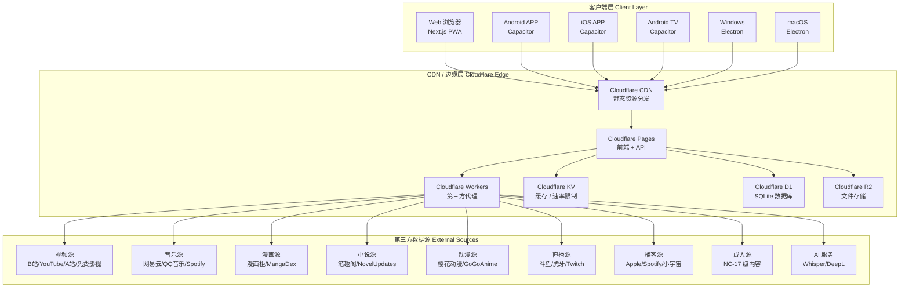
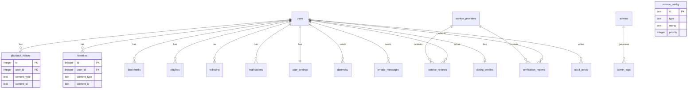

# 技术设计文档 — 星聚娱乐平台整合

## 概述

本设计文档描述星聚（StarHub）娱乐平台的全面升级架构，涵盖十二大核心模块的技术实现方案。平台采用前后端一体化架构，以 Next.js 14 静态导出为前端核心，Cloudflare Pages Functions 为后端 API 层，通过 Capacitor（移动端/TV端）和 Electron（桌面端）实现全平台分发。

### 核心设计原则

1. **聚合优先**：所有内容模块（视频、音乐、漫画、小说、动漫、直播、播客）采用统一的"源适配器"模式，通过配置驱动的方式接入多个第三方数据源
2. **安全隐身**：遵循项目宪法，NAS 零公网端口，所有流量走 Cloudflare，真实 IP 永远不可见
3. **分级保护**：MPAA 五级内容分级贯穿所有模块，Age_Gate 在前端统一拦截
4. **代码复用**：前端组件高度复用（如 Video_Player、Music_Player、Comic_Reader、Novel_Reader），后端聚合引擎共享统一的源管理框架
5. **离线优先**：关键数据本地缓存（IndexedDB/Cache API），支持离线使用

### 技术栈总览

| 层级 | 技术选型 |
|------|---------|
| 前端框架 | Next.js 14 App Router + Tailwind CSS（静态导出 `output: 'export'`） |
| 后端 API | Cloudflare Pages Functions（`functions/api/` 目录） |
| 数据库 | Cloudflare D1（SQLite 兼容） |
| 缓存 | Cloudflare KV（速率限制、会话、热数据缓存） |
| 文件存储 | Cloudflare R2（图片、音频、ROM、用户上传文件） |
| 代理层 | Cloudflare Workers（第三方 API 代理、视频流代理） |
| 移动端 | Capacitor（Android / iOS / Android TV） |
| 桌面端 | Electron（Windows / macOS） |
| 游戏引擎 | Canvas 2D + 自研游戏循环框架 |
| 模拟器 | Nostalgist（浏览器内经典主机模拟） |
| 实时通信 | WebRTC（P2P 视频聊天、多人联机）、WebSocket（弹幕、聊天） |
| 测试 | Vitest + fast-check（属性测试） |
| 图标 | Lucide React（SVG），禁止 Emoji |

---

## 架构

### 整体架构图



### 前端架构分层

```mermaid
graph TB
    subgraph "页面层 Pages (src/app/)"
        P_HOME[首页 page.tsx]
        P_VIDEO[视频中心 videos/]
        P_MUSIC[音乐中心 music/]
        P_COMIC[漫画中心 comics/]
        P_NOVEL[小说中心 novels/]
        P_ANIME[动漫中心 anime/]
        P_GAME[游戏中心 games/]
        P_LIVE[直播中心 live/]
        P_PODCAST[播客中心 podcasts/]
        P_SEARCH[全局搜索 search/]
        P_ADULT[成人专区 zone/]
        P_ADMIN[管理后台 admin/]
        P_PROFILE[个人中心 profile/]
        P_DOWNLOAD[下载管理 download/]
        P_SETTINGS[设置 settings/]
    end

    subgraph "组件层 Components (src/components/)"
        C_PLAYER[VideoPlayer 视频播放器]
        C_MUSIC[MusicPlayer 音乐播放器]
        C_COMIC[ComicReader 漫画阅读器]
        C_NOVEL[NovelReader 小说阅读器]
        C_SEARCH[SearchHub 全局搜索]
        C_HEADER[Header 导航头]
        C_SIDEBAR[Sidebar 侧边栏]
        C_CARD[ContentCard 内容卡片]
        C_RATING[RatingBadge 分级标签]
        C_DANMAKU[DanmakuLayer 弹幕层]
        C_AUTOPLAY[AutoPlayOverlay 自动播放]
        C_FOCUS[FocusNavigation TV焦点导航]
        C_ELDER[ElderMode 老人模式]
    end

    subgraph "业务逻辑层 Lib (src/lib/)"
        L_AUTH[auth.ts 认证]
        L_AGEGATE[age-gate.ts 分级控制]
        L_AGGREGATOR[aggregator/ 聚合引擎]
        L_PLAYER[player/ 播放器核心]
        L_GAME[game-engine/ 游戏引擎]
        L_EMULATOR[emulator/ 模拟器]
        L_DOWNLOAD[download/ 下载管理]
        L_SEARCH[search/ 搜索引擎]
        L_PRIVACY[privacy/ 隐私防护]
        L_PLATFORM[platform/ 平台适配]
    end

    P_HOME --> C_HEADER
    P_HOME --> C_CARD
    P_VIDEO --> C_PLAYER
    P_VIDEO --> C_DANMAKU
    P_VIDEO --> C_AUTOPLAY
    P_MUSIC --> C_MUSIC
    P_COMIC --> C_COMIC
    P_NOVEL --> C_NOVEL
    P_SEARCH --> C_SEARCH

    C_PLAYER --> L_PLAYER
    C_MUSIC --> L_PLAYER
    C_HEADER --> L_AGEGATE
    C_CARD --> L_AGEGATE
    C_SEARCH --> L_SEARCH
    L_SEARCH --> L_AGGREGATOR


### 后端架构分层

```mermaid
graph TB
    subgraph "API 路由层 (functions/api/)"
        R_AUTH[auth/ 认证注册登录]
        R_SOURCES[sources/ 聚合源管理]
        R_SEARCH[search/ 全局搜索]
        R_VIDEO[video/ 视频聚合]
        R_MUSIC[music/ 音乐聚合]
        R_COMIC[comic/ 漫画聚合]
        R_NOVEL[novel/ 小说聚合]
        R_ANIME[anime/ 动漫聚合]
        R_LIVE[live/ 直播聚合]
        R_PODCAST[podcast/ 播客聚合]
        R_GAME[games/ 游戏数据]
        R_CLASSIC[classic/ 经典模拟器]
        R_COMMUNITY[community/ 社区帖子]
        R_VERIFY[verify/ 成人服务验证]
        R_ADULT[zone/ 成人专区]
        R_ADMIN[admin/ 管理后台]
        R_USERS[users/ 用户管理]
        R_DOWNLOAD[download/ 下载缓存]
        R_AI[ai/ AI字幕配音]
        R_NOTIFY[notify/ 通知系统]
    end

    subgraph "中间件层 Middleware"
        MW_CORS[CORS 跨域处理]
        MW_RATE[速率限制 KV]
        MW_JWT[JWT 认证解析]
        MW_AGEGATE[分级权限校验]
    end

    subgraph "业务逻辑层 _lib/"
        LIB_AUTH[auth.ts JWT/密码]
        LIB_DB[db.ts D1查询]
        LIB_VALIDATE[validate.ts 输入校验]
        LIB_AGGREGATOR[aggregator.ts 聚合引擎核心]
        LIB_SOURCE[source-adapter.ts 源适配器基类]
        LIB_RATING[rating.ts MPAA分级]
        LIB_CACHE[cache.ts KV缓存]
        LIB_PRIVACY[privacy.ts 隐私防护]
    end

    subgraph "存储层 Storage"
        S_D1[D1 数据库]
        S_KV[KV 缓存]
        S_R2[R2 文件存储]
    end

    MW_CORS --> MW_RATE --> MW_JWT --> MW_AGEGATE
    MW_AGEGATE --> R_AUTH
    MW_AGEGATE --> R_SOURCES
    MW_AGEGATE --> R_SEARCH
    MW_AGEGATE --> R_ADULT

    R_AUTH --> LIB_AUTH
    R_SOURCES --> LIB_AGGREGATOR
    R_SEARCH --> LIB_AGGREGATOR
    R_VIDEO --> LIB_SOURCE
    R_ADMIN --> LIB_DB

    LIB_DB --> S_D1
    LIB_CACHE --> S_KV
    LIB_AUTH --> S_D1
```

### 前后端分离协作模型

为支持多人协作和独立 git 管理，前端和后端通过明确的 API 契约解耦：

```
前端团队职责 (src/)                    后端团队职责 (functions/)
├── src/app/          页面路由          ├── functions/api/     API路由
├── src/components/   UI组件            ├── functions/api/_lib/ 业务逻辑
├── src/lib/          前端业务逻辑      ├── functions/api/_middleware.ts
├── src/styles/       样式              └── functions/api/_schema.sql
└── public/           静态资源

共享契约：
├── src/lib/types.ts          TypeScript 类型定义（前后端共享）
├── src/lib/api-client.ts     前端 API 调用封装
└── API 文档                   RESTful 接口规范
```

---

## 组件与接口

### 一、统一源适配器模式（核心架构）

所有聚合引擎（视频、音乐、漫画、小说、动漫、直播、播客）共享同一套源适配器架构。

#### 源适配器基类接口

```typescript
// src/lib/types.ts — 前后端共享类型

/** MPAA 内容分级 */
type ContentRating = 'G' | 'PG' | 'PG-13' | 'R' | 'NC-17';

/** 源健康状态 */
type SourceHealth = 'online' | 'offline' | 'degraded';

/** 聚合源类型 */
type SourceType = 'video' | 'music' | 'comic' | 'novel' | 'anime' | 'live' | 'podcast';

/** 源配置（存储在 D1 中） */
interface SourceConfig {
  id: string;
  name: string;
  type: SourceType;
  enabled: boolean;
  rating: ContentRating;       // 该源的默认 MPAA 分级
  priority: number;            // 搜索结果排序优先级
  searchUrl: string;           // 搜索 API 地址
  parseRules: string;          // JSON 格式的解析规则
  timeout: number;             // 超时时间（毫秒）
  health: SourceHealth;
  avgResponseTime: number;     // 平均响应时间（毫秒）
  successRate: number;         // 成功率 0-100
  failCount: number;           // 连续失败次数
  lastChecked: string;         // ISO 时间戳
}

/** 聚合搜索结果项（通用） */
interface AggregatedItem {
  id: string;
  title: string;
  cover: string;
  source: string;              // 来源站点名称
  sourceId: string;            // 来源站点 ID
  rating: ContentRating;
  type: SourceType;
  url: string;                 // 代理后的播放/阅读 URL
  metadata: Record<string, unknown>;  // 类型特定的元数据
}

/** 聚合搜索请求 */
interface SearchRequest {
  query: string;
  type?: SourceType;
  rating?: ContentRating;      // 用户当前允许的最高分级
  tags?: string[];             // 多标签组合筛选
  region?: string[];           // 地区筛选
  page?: number;
  pageSize?: number;
  sortBy?: 'relevance' | 'latest' | 'popular' | 'rating';
}

/** 聚合搜索响应 */
interface SearchResponse {
  items: AggregatedItem[];
  total: number;
  page: number;
  pageSize: number;
  sources: { name: string; count: number; health: SourceHealth }[];
}
```

#### 后端源适配器抽象

```typescript
// functions/api/_lib/source-adapter.ts

/** 源适配器抽象基类 — 所有聚合源实现此接口 */
interface ISourceAdapter {
  readonly config: SourceConfig;

  /** 搜索该源 */
  search(query: string, page: number, pageSize: number): Promise<AggregatedItem[]>;

  /** 获取详情 */
  getDetail(itemId: string): Promise<AggregatedItem | null>;

  /** 获取播放/阅读流 URL（通过 Cloudflare 代理） */
  getStreamUrl(itemId: string): Promise<string>;

  /** 健康检查 */
  healthCheck(): Promise<SourceHealth>;
}

/** 聚合引擎 — 管理多个源适配器，执行并发搜索和去重 */
interface IAggregatorEngine {
  /** 注册源适配器 */
  registerAdapter(adapter: ISourceAdapter): void;

  /** 并发搜索所有启用的源，合并去重 */
  search(request: SearchRequest): Promise<SearchResponse>;

  /** 获取所有源的健康状态 */
  getHealthStatus(): Promise<SourceConfig[]>;

  /** 标记源为不可用（连续3次失败后自动调用） */
  markSourceUnavailable(sourceId: string): Promise<void>;
}
```

### 二、前端核心组件接口

#### 1.1 全品类内容刮削引擎接口

```typescript
// functions/api/_lib/content-scraper.ts

/** 刮削内容类型 */
type ScrapeContentType = 'video' | 'comic' | 'novel' | 'music' | 'anime' | 'live-recording';

/** 刮削任务状态 */
type ScrapeTaskStatus = 'queued' | 'running' | 'paused' | 'completed' | 'failed' | 'blocked';

/** 刮削规则配置 */
interface ScrapeRule {
  id: string;
  sourceId: string;                // 关联 source_config.id
  contentType: ScrapeContentType;
  enabled: boolean;
  interval: number;                // 刮削间隔（秒），视频默认21600，漫画14400，小说10800，音乐43200，动漫21600
  depth: 'first-page' | 'top-n' | 'full-site';
  maxPages: number;                // depth=top-n 时的最大页数
  keywords: string[];              // 内容筛选关键词
  tags: string[];                  // 内容筛选标签
  minRating: number;               // 最低评分阈值
  qualityPreference: string;       // 视频: '1080p>720p>480p', 音乐: 'lossless>320k>128k', 漫画: 'original>high>medium'
  maxConcurrent: number;           // 最大并发下载数，默认3
  dailyLimit: number;              // 每日最大下载量（MB），默认50000
  maxItemsPerRun: number;          // 每次刮削最大项数
  lastScrapedAt: string;           // 上次刮削时间 ISO
  nextScheduledAt: string;         // 下次计划刮削时间 ISO
}

/** 刮削任务 */
interface ScrapeTask {
  id: string;
  ruleId: string;
  sourceId: string;
  contentType: ScrapeContentType;
  status: ScrapeTaskStatus;
  progress: number;                // 0-100
  itemsFound: number;
  itemsDownloaded: number;
  bytesDownloaded: number;
  errors: string[];
  startedAt: string;
  completedAt?: string;
}

/** 刮削统计 */
interface ScrapeStats {
  totalItems: number;
  totalBytes: number;
  successRate: number;             // 0-100
  lastScrapedAt: string;
  activeTaskCount: number;
}

/** 成人内容刮削状态 */
interface AdultScrapeStatus {
  contentType: ScrapeContentType;
  itemCount: number;
  storageUsedMB: number;
  storageQuotaMB: number;
  lastScrapedAt: string;
  scrapeStatus: 'active' | 'paused' | 'blocked';
  sourceCount: number;
  healthySources: number;
}

/** 存储使用情况 */
interface StorageUsage {
  totalUsedMB: number;
  totalQuotaMB: number;
  byContentType: Record<ScrapeContentType, { usedMB: number; quotaMB: number }>;
}

/** 内容刮削适配器接口 — 每种内容类型实现此接口 */
interface IScrapeAdapter {
  readonly contentType: ScrapeContentType;
  readonly sourceConfig: SourceConfig;

  /** 刮削源站最新内容列表（元数据） */
  scrapeLatest(page: number, pageSize: number): Promise<ScrapedItem[]>;

  /** 刮削指定关键词的内容列表 */
  scrapeByKeyword(keyword: string, page: number): Promise<ScrapedItem[]>;

  /** 下载单个内容资源到 NAS */
  downloadItem(item: ScrapedItem): Promise<DownloadResult>;

  /** 检查内容是否已存在（增量刮削） */
  isAlreadyScraped(itemId: string): Promise<boolean>;
}

/** 刮削到的内容项 */
interface ScrapedItem {
  id: string;
  title: string;
  cover: string;
  source: string;
  sourceUrl: string;
  contentType: ScrapeContentType;
  rating: ContentRating;
  tags: string[];
  metadata: Record<string, unknown>;  // 类型特定元数据
  resourceUrls: string[];             // 资源下载链接列表
}

/** 下载结果 */
interface DownloadResult {
  success: boolean;
  encryptedPath: string;           // NAS 上的加密文件路径
  fileSize: number;
  error?: string;
}

/** 视频刮削适配器 — 扩展通用接口 */
interface IVideoScrapeAdapter extends IScrapeAdapter {
  /** 提取视频流 URL（支持多清晰度） */
  extractStreamUrls(itemId: string): Promise<{ quality: string; url: string }[]>;
}

/** 漫画刮削适配器 — 扩展通用接口 */
interface IComicScrapeAdapter extends IScrapeAdapter {
  /** 提取漫画章节所有图片 URL */
  extractChapterPages(itemId: string, chapterId: string): Promise<string[]>;

  /** 批量下载章节图片到 NAS */
  downloadChapter(itemId: string, chapterId: string): Promise<DownloadResult>;

  /** 校验章节完整性（所有页面是否已下载） */
  verifyChapterIntegrity(itemId: string, chapterId: string): Promise<boolean>;
}

/** 小说刮削适配器 — 扩展通用接口 */
interface INovelScrapeAdapter extends IScrapeAdapter {
  /** 提取小说章节文本内容 */
  extractChapterText(itemId: string, chapterId: string): Promise<string>;

  /** 批量下载全本小说到 NAS */
  downloadFullNovel(itemId: string): Promise<DownloadResult>;

  /** 校验全本完整性（所有章节是否已下载） */
  verifyNovelIntegrity(itemId: string): Promise<boolean>;
}

/** 音乐刮削适配器 — 扩展通用接口 */
interface IMusicScrapeAdapter extends IScrapeAdapter {
  /** 提取音频流 URL（支持多音质） */
  extractAudioUrls(itemId: string): Promise<{ quality: string; url: string }[]>;
}

/** 动漫刮削适配器 — 扩展通用接口 */
interface IAnimeScrapeAdapter extends IScrapeAdapter {
  /** 提取动漫集数视频流 URL */
  extractEpisodeUrls(itemId: string, episodeId: string): Promise<{ quality: string; url: string }[]>;

  /** 批量下载动漫全集到 NAS */
  downloadAllEpisodes(itemId: string): Promise<DownloadResult[]>;
}

/** 成人内容刮削调度器 */
interface IAdultScrapeScheduler {
  /** 启动所有成人内容定时刮削 */
  startAll(): void;

  /** 暂停所有成人内容定时刮削 */
  pauseAll(): void;

  /** 恢复所有成人内容定时刮削 */
  resumeAll(): void;

  /** 触发指定内容类型的全量刮削 */
  triggerFullScrape(contentType: ScrapeContentType): Promise<string>;

  /** 获取所有成人内容刮削状态 */
  getStatus(): Promise<Record<ScrapeContentType, AdultScrapeStatus>>;

  /** 更新指定内容类型的刮削频率 */
  updateInterval(contentType: ScrapeContentType, intervalSeconds: number): void;
}

/** 内容刮削引擎 — 管理所有刮削适配器和调度 */
interface IContentScraper {
  /** 注册刮削适配器 */
  registerAdapter(adapter: IScrapeAdapter): void;

  /** 执行刮削任务 */
  executeScrape(rule: ScrapeRule): Promise<ScrapeTask>;

  /** 获取所有刮削任务 */
  getTasks(filter?: { contentType?: ScrapeContentType; status?: ScrapeTaskStatus }): Promise<ScrapeTask[]>;

  /** 获取刮削统计 */
  getStats(): Promise<Record<ScrapeContentType, ScrapeStats>>;

  /** 暂停/恢复/取消任务 */
  controlTask(taskId: string, action: 'pause' | 'resume' | 'cancel'): Promise<boolean>;

  /** 获取成人内容刮削调度器 */
  getAdultScheduler(): IAdultScrapeScheduler;
}
```

#### 1.2 AI 有声小说 TTS 引擎接口

```typescript
// functions/api/_lib/tts-engine.ts

/** TTS 语音配置 */
interface TTSVoiceConfig {
  gender: 'male' | 'female';
  speed: 0.5 | 0.75 | 1.0 | 1.25 | 1.5 | 2.0;
  style: 'standard' | 'gentle' | 'passionate' | 'deep' | 'lively';
  language: 'zh' | 'en' | 'ja';
}

/** TTS 服务提供商 */
type TTSProvider = 'openai' | 'edge-tts' | 'azure';

/** TTS 生成任务状态 */
type TTSTaskStatus = 'queued' | 'processing' | 'completed' | 'failed' | 'cached';

/** TTS 生成任务 */
interface TTSTask {
  id: string;
  novelId: string;
  chapterId: string;
  voice: TTSVoiceConfig;
  provider: TTSProvider;
  status: TTSTaskStatus;
  audioUrl?: string;              // 生成完成后的音频 URL（NAS 代理 URL）
  cacheKey: string;               // 章节内容哈希 + 语音配置哈希
  audioDuration?: number;         // 音频时长（秒）
  fileSize?: number;              // 文件大小（字节）
  error?: string;
  createdAt: string;
  completedAt?: string;
}

/** TTS 缓存键生成 */
interface ITTSCacheKeyGenerator {
  /** 根据章节内容和语音配置生成唯一缓存键 */
  generateCacheKey(chapterContent: string, voice: TTSVoiceConfig): string;
}

/** TTS 引擎接口 */
interface ITTSEngine {
  /** 生成单章节 TTS 音频（先查缓存，未命中则调用 TTS API） */
  generateChapterAudio(
    novelId: string,
    chapterId: string,
    chapterContent: string,
    voice: TTSVoiceConfig
  ): Promise<TTSTask>;

  /** 批量生成多章节 TTS 音频（管理员触发） */
  batchGenerate(
    novelId: string,
    chapterIds: string[],
    voice: TTSVoiceConfig
  ): Promise<TTSTask[]>;

  /** 查询 TTS 任务状态 */
  getTaskStatus(taskId: string): Promise<TTSTask>;

  /** 获取章节 TTS 音频流 URL（从 NAS 缓存） */
  getAudioStreamUrl(cacheKey: string): Promise<string | null>;

  /** 预加载下一章节音频（当前章节播放到 80% 时触发） */
  preloadNextChapter(
    novelId: string,
    nextChapterId: string,
    chapterContent: string,
    voice: TTSVoiceConfig
  ): Promise<void>;

  /** 检查章节 TTS 音频是否已缓存 */
  isCached(chapterContent: string, voice: TTSVoiceConfig): Promise<boolean>;
}

/** TTS 服务适配器接口 — 每个 TTS 提供商实现此接口 */
interface ITTSProviderAdapter {
  readonly provider: TTSProvider;

  /** 调用 TTS API 将文本转为音频 */
  synthesize(
    text: string,
    voice: TTSVoiceConfig
  ): Promise<{ audioBuffer: ArrayBuffer; duration: number }>;

  /** 检查服务可用性 */
  healthCheck(): Promise<boolean>;

  /** 获取支持的语音列表 */
  getAvailableVoices(language: string): Promise<{ id: string; name: string; gender: string }[]>;
}
```

### 二、前端核心组件接口

#### 2.1 VideoPlayer 视频播放器

```typescript
// src/components/player/VideoPlayer.tsx

interface VideoPlayerProps {
  src: string;                    // 视频流 URL（已代理）
  title: string;
  source: string;                 // 来源平台名称
  rating: ContentRating;
  autoPlay?: boolean;
  startTime?: number;             // 从指定时间开始播放（续播）
  subtitles?: SubtitleTrack[];    // 字幕轨道
  onEnded?: () => void;           // 播放结束回调
  onProgress?: (time: number) => void;  // 播放进度回调
  onError?: (error: Error) => void;
}

interface SubtitleTrack {
  label: string;
  language: string;
  src: string;                    // SRT/ASS 字幕文件 URL
  isAI?: boolean;                 // 是否 AI 生成
}

// 播放器支持的操作
interface VideoPlayerAPI {
  play(): void;
  pause(): void;
  seek(time: number): void;
  setVolume(volume: number): void;
  setPlaybackRate(rate: number): void;
  setQuality(quality: string): void;
  toggleFullscreen(): void;
  togglePiP(): void;              // 画中画
  enableDanmaku(enabled: boolean): void;
}
```

#### 2.2 MusicPlayer 音乐播放器

```typescript
// src/components/player/MusicPlayer.tsx

interface MusicPlayerProps {
  /** 当前播放队列 */
  queue: MusicTrack[];
  currentIndex: number;
  /** 播放模式 */
  mode: 'sequential' | 'repeat-one' | 'shuffle' | 'repeat-all';
  /** 是否显示迷你播放条 */
  mini?: boolean;
}

interface MusicTrack {
  id: string;
  title: string;
  artist: string;
  album: string;
  cover: string;
  source: string;
  duration: number;
  streamUrl: string;              // 代理后的音频流 URL
  lrcUrl?: string;                // LRC 歌词文件 URL
  rating: ContentRating;
}

// 音乐播放器全局状态（跨页面持久化）
interface MusicPlayerState {
  isPlaying: boolean;
  currentTrack: MusicTrack | null;
  queue: MusicTrack[];
  currentIndex: number;
  currentTime: number;
  volume: number;
  mode: 'sequential' | 'repeat-one' | 'shuffle' | 'repeat-all';
  playbackRate: number;           // 播客倍速支持
}
```

#### 2.3 ComicReader 漫画阅读器

```typescript
// src/components/reader/ComicReader.tsx

interface ComicReaderProps {
  pages: ComicPage[];
  mode: 'page' | 'scroll';       // 翻页模式 / 条漫模式
  currentPage: number;
  onPageChange?: (page: number) => void;
  onChapterEnd?: () => void;      // 章节读完回调
}

interface ComicPage {
  url: string;                    // 代理后的图片 URL
  width: number;
  height: number;
}
```

#### 2.4 NovelReader 小说阅读器

```typescript
// src/components/reader/NovelReader.tsx

interface NovelReaderProps {
  content: string;                // 章节文本内容
  title: string;
  mode: 'page' | 'scroll';       // 翻页 / 滚动
  fontSize: number;               // 字号（5档：14/16/18/20/24）
  fontFamily: string;
  lineHeight: number;
  theme: 'dark' | 'light' | 'sepia' | 'green';  // 背景主题
  onChapterEnd?: () => void;
  onBookmark?: (position: number) => void;
}

interface NovelReaderAPI {
  setFontSize(size: number): void;
  setTheme(theme: string): void;
  startTTS(voice: string, rate: number): void;  // 语音朗读
  stopTTS(): void;
  goToBookmark(position: number): void;
}
```

#### 2.5 AutoPlayEngine 自动播放引擎

```typescript
// src/lib/player/autoplay-engine.ts

interface AutoPlayConfig {
  enabled: boolean;
  countdownSeconds: number;       // 默认 5 秒
}

interface AutoPlayCandidate {
  item: AggregatedItem;
  reason: 'next-episode' | 'same-channel' | 'recommended';
  priority: number;               // 优先级：next-episode > same-channel > recommended
}

interface IAutoPlayEngine {
  /** 根据当前播放内容计算下一个播放候选 */
  getNextCandidates(currentItem: AggregatedItem): Promise<AutoPlayCandidate[]>;

  /** 开始倒计时 */
  startCountdown(candidate: AutoPlayCandidate): void;

  /** 取消自动播放 */
  cancelAutoPlay(): void;

  /** 立即播放 */
  playNow(candidate: AutoPlayCandidate): void;
}
```

#### 2.6 AgeGate 分级控制

```typescript
// src/lib/age-gate.ts

type UserMode = 'child' | 'teen' | 'mature' | 'adult' | 'elder';

interface AgeGateConfig {
  mode: UserMode;
  pin: string;                    // 6位数字密码（加密存储）
  dailyLimit: number;             // 每日使用时长限制（分钟），0=无限制
  usedToday: number;              // 今日已使用时长（分钟）
}

/** 各模式允许的最高分级 */
const MODE_MAX_RATING: Record<UserMode, ContentRating> = {
  child: 'G',
  teen: 'PG-13',
  mature: 'R',
  adult: 'NC-17',
  elder: 'PG',
};

interface IAgeGate {
  /** 获取当前用户模式 */
  getMode(): UserMode;

  /** 检查内容是否允许访问 */
  canAccess(rating: ContentRating): boolean;

  /** 过滤内容列表，移除超出分级的项 */
  filterContent<T extends { rating: ContentRating }>(items: T[]): T[];

  /** 切换模式（需要 PIN 验证） */
  switchMode(newMode: UserMode, pin: string): boolean;

  /** 检查每日时长限制 */
  checkDailyLimit(): { allowed: boolean; remainingMinutes: number };

  /** 获取当前模式的导航配置 */
  getNavConfig(): NavConfig;

  /** 获取PIN错误锁定状态 */
  getPinLockStatus(): { locked: boolean; remainingSeconds: number };

  /** 记录模式切换到家长控制日志 */
  logModeSwitch(fromMode: UserMode, toMode: UserMode): void;
}

/** 分级标签颜色映射 */
const RATING_COLORS: Record<ContentRating, string> = {
  'G': '#22c55e',       // 绿色
  'PG': '#3b82f6',      // 蓝色
  'PG-13': '#eab308',   // 黄色
  'R': '#f97316',       // 橙色
  'NC-17': '#ef4444',   // 红色
};

/** 各模式导航配置 */
interface NavConfig {
  mode: UserMode;
  visibleSections: string[];       // 可见的导航分区
  hiddenRatings: ContentRating[];  // 隐藏的分级
  searchBlacklist: string[];       // 搜索关键词黑名单
  uiStyle: 'child' | 'teen' | 'standard' | 'adult' | 'elder';
}

/** 家长控制面板接口 */
interface IParentalControl {
  /** 获取使用时长统计（按日/周/月） */
  getUsageStats(period: 'day' | 'week' | 'month'): UsageStats;

  /** 获取内容访问记录（最近30天） */
  getAccessLog(page: number, pageSize: number): AccessLogEntry[];

  /** 设置最高允许分级（在当前模式基础上进一步限制） */
  setMaxRating(rating: ContentRating): void;

  /** 设置允许使用的时间段 */
  setAllowedTimeSlots(slots: TimeSlot[]): void;

  /** 添加内容黑名单 */
  addToBlacklist(contentId: string, contentType: string): void;

  /** 锁定/解锁特定模块 */
  toggleModuleLock(module: string, locked: boolean): void;
}

interface UsageStats {
  totalMinutes: number;
  byContentType: Record<string, number>;  // 各内容类型使用时长
  byDate: { date: string; minutes: number }[];
}

interface AccessLogEntry {
  title: string;
  contentType: string;
  rating: ContentRating;
  accessedAt: string;
}

interface TimeSlot {
  startHour: number;   // 0-23
  endHour: number;     // 0-23
  daysOfWeek: number[]; // 0=周日, 1=周一, ..., 6=周六
}
```
```

#### 2.7 SearchHub 全局搜索

```typescript
// src/components/search/SearchHub.tsx

interface SearchHubProps {
  /** 初始搜索词 */
  initialQuery?: string;
  /** 限定搜索类型 */
  filterType?: SourceType;
}

interface SearchResultGroup {
  type: SourceType;
  label: string;                  // 显示名称（视频、音乐等）
  items: AggregatedItem[];
  total: number;
  hasMore: boolean;
}

// 全局搜索 API
// GET /api/search?q=xxx&type=video&rating=PG-13&tags=热血,机甲&page=1
```

#### 2.8 成人内容筛选维度类型定义

```typescript
// src/lib/types.ts — 成人内容筛选维度

/** 成人视频筛选维度 */
interface AdultVideoFilters {
  region?: string[];        // 日本AV/欧美/国产/韩国/东南亚/印度/拉美/俄罗斯/非洲
  videoType?: string[];     // 剧情片/纯色情/动画3DCG/业余自拍/直播录像/偷拍/VR/ASMR/按摩店实拍/酒店偷拍
  tags?: string[];          // 校园/职场OL/人妻/户外/制服/SM-BDSM/群交/同性/变装/巨乳/贫乳/肛交/口交/颜射/中出/足交/丝袜/乳交/催眠/NTR/痴女/痴汉/露出/触手/怀孕/母乳
  actorEthnicity?: string[];  // 亚洲/白人/黑人/拉丁/混血
  actorBodyType?: string[];   // 纤细/匀称/丰满/BBW/肌肉
  actorAgeRange?: string[];   // 18-20/20-25/25-30/30-40/40+/熟女
  actorBreast?: string[];     // 贫乳/普通/巨乳/超巨乳
  quality?: string[];       // 4K/1080p/720p/480p
  duration?: string[];      // <10min/10-30min/30-60min/>60min
  sortBy?: 'hot' | 'latest' | 'rating' | 'views' | 'duration' | 'random';
}

/** 成人动漫筛选维度 */
interface AdultAnimeFilters {
  tags?: string[];          // 纯爱/后宫/触手/NTR/百合/耽美/校园/奇幻/调教SM/凌辱/痴女/痴汉/人妻/巨乳/贫乳/萝莉风/正太风/怀孕/母乳/催眠/肛交/群交/人外/机甲色情/热血色情/恐怖色情/搞笑色情/泳装/女仆/护士/教师/修女
  artStyle?: string[];      // 日式动漫/3DCG/像素风/欧美卡通
  episodes?: string[];      // 单集OVA/短篇2-4集/长篇5集以上
  year?: number;
  status?: 'ongoing' | 'completed';
  subtitle?: string[];      // 中文字幕/英文字幕/日文原声/无字幕
  sortBy?: 'hot' | 'latest' | 'rating' | 'random';
}

/** 成人漫画筛选维度 */
interface AdultComicFilters {
  tags?: string[];          // 纯爱/后宫/触手/NTR/百合/耽美/校园/奇幻/调教SM/凌辱/痴女/人妻/巨乳/贫乳/萝莉风/正太风/怀孕/母乳/催眠/肛交/群交/人外/全彩/黑白
  language?: string[];      // 中文翻译/英文翻译/日文原版/韩文原版
  artStyle?: string[];      // 日漫/韩漫竖屏彩漫/欧美/国漫/同人志
  pageCount?: string[];     // <30页/30-100页/>100页
  sortBy?: 'hot' | 'latest' | 'rating' | 'favorites' | 'random';
}

/** 成人小说筛选维度 */
interface AdultNovelFilters {
  tags?: string[];          // 纯爱/后宫/NTR/百合/耽美/校园/奇幻/都市/古代宫廷/科幻/调教SM/凌辱/人妻/催眠/换妻/群交/人外/穿越色情/修仙色情/末日色情
  language?: string[];      // 中文/英文/日文
  wordCount?: string[];     // <5万/5-20万/20-100万/>100万
  status?: 'ongoing' | 'completed';
  sortBy?: 'hot' | 'latest' | 'rating' | 'wordCount' | 'favorites';
}

/** 成人直播筛选维度 */
interface AdultLiveFilters {
  streamerGender?: string[];  // 女主播/男主播/跨性别/情侣
  streamerEthnicity?: string[];  // 亚洲/白人/黑人/拉丁/混血
  streamerBodyType?: string[];   // 纤细/匀称/丰满/BBW/肌肉
  streamerAgeRange?: string[];   // 18-20/20-25/25-30/30-40/40+/熟女
  liveType?: string[];      // 脱衣秀/聊天互动/情侣表演/群体表演/SM表演/户外直播/ASMR
  platform?: string[];      // Chaturbate/StripChat/BongaCams/LiveJasmin/CamSoda/MyFreeCams/Flirt4Free
  sortBy?: 'viewers' | 'latest' | 'rating';
}

/** 成人音乐筛选维度 */
interface AdultMusicFilters {
  type?: string[];          // 成人ASMR(耳语/舔耳/心跳/呼吸/触发音)/成人广播剧(纯爱/NTR/SM/百合/耽美)/音声作品(催眠/调教/女友体验/姐姐体验)/Explicit歌曲(说唱/R&B/流行)/成人催眠音频/性爱环境音
  language?: string[];      // 中文/英文/日文/韩文
  voiceGender?: string[];   // 女声/男声/双人/多人
  duration?: string[];      // <10min/10-30min/>30min
  sortBy?: 'hot' | 'latest' | 'rating' | 'duration';
}

/** 成人游戏筛选维度 */
interface AdultGameFilters {
  gameType?: string[];      // 视觉小说/RPG/模拟经营/动作/解谜/卡牌/格斗/射击/策略/养成/换装脱衣/沙盒/跑酷/消除/节奏/塔防
  tags?: string[];          // 纯色情/热血色情/恋爱色情/奇幻色情/校园色情/后宫/NTR/百合/耽美/触手/调教SM/凌辱/人妻/催眠/怀孕/人外
  artStyle?: string[];      // 2D日式动漫/3D写实/像素风/欧美卡通/Live2D
  language?: string[];      // 中文/英文/日文/韩文
  playable?: 'web' | 'download' | 'all';
  sortBy?: 'hot' | 'rating' | 'latest' | 'random';
}

/** 约会交友筛选维度 */
interface DatingFilters {
  location?: { country?: string; city?: string; distance?: 'local' | 'province' | 'country' | 'any' };
  ageRange?: { min: number; max: number };
  gender?: string[];        // 男/女/跨性别/非二元
  orientation?: string[];   // 异性恋/同性恋/双性恋/泛性恋/其他
  ethnicity?: string[];     // 亚洲/白人/黑人/拉丁/混血/不限
  heightRange?: { min: number; max: number };
  bodyType?: string[];      // 纤细/匀称/丰满/健壮/BBW
  interests?: string[];     // 运动/旅行/美食/电影/音乐/游戏/阅读/摄影/BDSM/角色扮演
  purpose?: string[];       // 一夜情/短期约会/长期关系/开放关系/SugarDaddyBaby/纯聊天交友
  verifiedOnly?: boolean;
  onlineOnly?: boolean;
  sortBy?: 'distance' | 'active' | 'reputation' | 'newest';
}
```

### 三、后端 API 接口定义

#### 3.1 聚合搜索 API

```
GET  /api/search
  Query: q, type?, rating?, tags?, region?, page?, pageSize?, sortBy?
  Response: SearchResponse

GET  /api/search/suggestions
  Query: q
  Response: { suggestions: string[] }

GET  /api/search/hot
  Response: { keywords: string[] }
```

#### 3.2 视频 API

```
GET  /api/video/search
  Query: q, source?, rating?, region?, type?, page?
  Response: SearchResponse

GET  /api/video/[id]
  Response: { item: AggregatedItem, related: AggregatedItem[] }

GET  /api/video/stream/[id]
  Response: 302 Redirect to proxied stream URL

GET  /api/video/history
  Headers: Authorization: Bearer <token>
  Response: { items: PlaybackHistory[] }

POST /api/video/history
  Body: { videoId, progress, duration }
  Response: { success: true }

POST /api/video/favorite
  Body: { videoId }
  Response: { success: true }

GET  /api/video/favorites
  Response: { items: AggregatedItem[] }
```

#### 3.3 音乐 API

```
GET  /api/music/search
  Query: q, source?, rating?, page?
  Response: SearchResponse

GET  /api/music/stream/[id]
  Response: 302 Redirect to proxied audio stream

POST /api/music/playlist
  Body: { name, trackIds }
  Response: { id, name, tracks }

GET  /api/music/playlists
  Response: { playlists: Playlist[] }

PUT  /api/music/playlist/[id]
  Body: { name?, trackIds? }

DELETE /api/music/playlist/[id]
```

#### 3.4 漫画 API

```
GET  /api/comic/search
  Query: q, source?, rating?, tags?, status?, page?
  Response: SearchResponse

GET  /api/comic/[id]
  Response: { manga: MangaDetail, chapters: Chapter[] }

GET  /api/comic/[id]/chapter/[chapterId]
  Response: { pages: ComicPage[] }

POST /api/comic/bookmark
  Body: { mangaId, chapterId, page }
```

#### 3.5 小说 API

```
GET  /api/novel/search
  Query: q, source?, rating?, tags?, status?, page?
  Response: SearchResponse

GET  /api/novel/[id]
  Response: { novel: NovelDetail, chapters: Chapter[] }

GET  /api/novel/[id]/chapter/[chapterId]
  Response: { content: string, title: string }

POST /api/novel/bookmark
  Body: { novelId, chapterId, position }
```

#### 3.6 动漫 API

```
GET  /api/anime/search
  Query: q, source?, rating?, tags?, year?, status?, region?, page?
  Response: SearchResponse

GET  /api/anime/schedule
  Response: { schedule: Record<string, AnimeScheduleItem[]> }  // 按星期分组

GET  /api/anime/[id]
  Response: { anime: AnimeDetail, episodes: Episode[] }

POST /api/anime/follow
  Body: { animeId }

GET  /api/anime/following
  Response: { items: AnimeDetail[] }
```

#### 3.7 直播 API

```
GET  /api/live/rooms
  Query: category?, platform?, page?
  Response: { rooms: LiveRoom[] }

GET  /api/live/stream/[roomId]
  Response: 302 Redirect to proxied live stream

POST /api/live/follow
  Body: { streamerId }

GET  /api/live/following
  Response: { streamers: Streamer[] }
```

#### 3.8 播客 API

```
GET  /api/podcast/search
  Query: q, category?, rating?, page?
  Response: SearchResponse

GET  /api/podcast/[id]
  Response: { podcast: PodcastDetail, episodes: PodcastEpisode[] }

POST /api/podcast/subscribe
  Body: { podcastId }

GET  /api/podcast/subscriptions
  Response: { podcasts: PodcastDetail[] }
```

#### 3.9 游戏 API

```
GET  /api/games/catalog
  Query: platform?, type?, rating?, sortBy?, page?
  Response: { games: GameItem[] }

GET  /api/games/scores/[gameId]
  Response: { scores: GameScore[] }

POST /api/games/scores
  Body: { gameId, score }

GET  /api/games/saves
  Query: gameId
  Response: { saves: GameSave[] }

POST /api/games/saves
  Body: { gameId, slot, saveData }

GET  /api/games/achievements
  Query: gameId?
  Response: { achievements: Achievement[] }
```

#### 3.10 聚合源管理 API（管理员）

```
GET  /api/admin/sources
  Query: type?, health?
  Response: { sources: SourceConfig[] }

POST /api/admin/sources
  Body: SourceConfig
  Response: { source: SourceConfig }

PUT  /api/admin/sources/[id]
  Body: Partial<SourceConfig>

DELETE /api/admin/sources/[id]

POST /api/admin/sources/[id]/test
  Response: { success: boolean, responseTime: number }

POST /api/admin/sources/batch-toggle
  Body: { ids: string[], enabled: boolean }

GET  /api/admin/sources/health
  Response: { sources: SourceHealthReport[] }
```

#### 3.11 成人服务 API

```
GET  /api/zone/services
  Query: country?, city?, ethnicity?, serviceType?, serviceCategory?, status?, rating?, verificationLevel?, priceRange?, language?, page?
  Response: { providers: ServiceProvider[] }

GET  /api/zone/services/[id]
  Response: { provider: ServiceProviderDetail }

POST /api/zone/services
  Body: ServiceProviderSubmission
  Response: { provider: ServiceProvider }

POST /api/zone/services/[id]/video-verify
  Body: { videoFile: File }  (multipart/form-data, 自拍视频)
  Response: { verified: boolean, faceMatchScore: number }

POST /api/zone/services/[id]/health-verify
  Body: { reportImage: File }  (multipart/form-data, STD检测报告/试纸照片)
  Response: { verified: boolean, expiresAt: string }

GET  /api/zone/services/[id]/health-status
  Response: { verified: boolean, expiresAt: string, daysRemaining: number }

POST /api/zone/services/[id]/verify
  Body: { report: VerificationReport }  (社区验证报告)

POST /api/zone/services/[id]/review
  Body: { rating: number, text: string, tags: string[] }

GET  /api/zone/dating/profiles
  Query: country?, city?, distance?, ageMin?, ageMax?, gender?, orientation?, ethnicity?, bodyType?, interests?, purpose?, verifiedOnly?, onlineOnly?, sortBy?, page?
  Response: { profiles: DatingProfile[] }

POST /api/zone/dating/profiles
  Body: DatingProfileSubmission
  Response: { profile: DatingProfile }

POST /api/zone/dating/like
  Body: { targetUserId: string, superLike?: boolean }
  Response: { matched: boolean }

GET  /api/zone/dating/matches
  Response: { matches: DatingMatch[] }

GET  /api/zone/dating/events
  Query: city?, page?
  Response: { events: DatingEvent[] }

POST /api/zone/dating/events
  Body: DatingEventSubmission
  Response: { event: DatingEvent }

GET  /api/zone/jobs
  Query: type?, country?, city?, page?
  Response: { jobs: JobListing[] }

POST /api/zone/jobs
  Body: JobListingSubmission

GET  /api/zone/blacklist
  Query: q?
  Response: { entries: BlacklistEntry[] }

POST /api/zone/report
  Body: { targetId, targetType, reason, description }
```

#### 3.12 MPAA 分级 API

```
GET  /api/rating/config
  Response: { defaultRatings: Record<string, ContentRating>, ratingColors: Record<ContentRating, string> }

PUT  /api/admin/rating/[contentId]
  Body: { rating: ContentRating }

GET  /api/rating/filter
  Query: userMode
  Response: { maxRating: ContentRating, hiddenTags: string[], searchBlacklist: string[], navConfig: NavConfig }

GET  /api/rating/content-rules
  Response: { rules: Record<SourceType, ContentRatingRule[]> }
  // 返回每种内容类型的细化分级规则

GET  /api/parental/usage-stats
  Query: period=day|week|month
  Headers: Authorization: Bearer <token> (需PIN验证)
  Response: { stats: UsageStats }

GET  /api/parental/access-log
  Query: page?, pageSize?
  Headers: Authorization: Bearer <token> (需PIN验证)
  Response: { entries: AccessLogEntry[], total: number }

PUT  /api/parental/max-rating
  Body: { maxRating: ContentRating }
  Headers: Authorization: Bearer <token> (需PIN验证)

PUT  /api/parental/time-slots
  Body: { slots: TimeSlot[] }
  Headers: Authorization: Bearer <token> (需PIN验证)

POST /api/parental/blacklist
  Body: { contentId: string, contentType: string }
  Headers: Authorization: Bearer <token> (需PIN验证)

PUT  /api/parental/module-lock
  Body: { module: string, locked: boolean }
  Headers: Authorization: Bearer <token> (需PIN验证)
```

#### 3.13 用户与认证 API

```
POST /api/auth/register
  Body: { email, password }
  Response: { token, user }

POST /api/auth/login
  Body: { email, password }
  Response: { token, user }

GET  /api/auth/me
  Response: { user: UserProfile }

PUT  /api/users/me
  Body: { nickname?, avatar?, bio? }

PUT  /api/users/me/password
  Body: { oldPassword, newPassword }

DELETE /api/users/me
  Response: { success: true }  // 72小时内彻底删除

GET  /api/users/me/sync
  Response: { history, favorites, bookmarks, playlists, settings }

PUT  /api/users/me/settings
  Body: { ageGateMode, pin, dailyLimit, notificationPrefs }
```

#### 3.14 通知 API

```
GET  /api/notify/list
  Query: type?, unreadOnly?
  Response: { notifications: Notification[] }

PUT  /api/notify/[id]/read

PUT  /api/notify/read-all

GET  /api/notify/preferences
  Response: { prefs: NotificationPreferences }

PUT  /api/notify/preferences
  Body: NotificationPreferences
```

#### 3.15 AI 字幕与配音 API

```
POST /api/ai/subtitle
  Body: { videoUrl, sourceLang?, targetLang }
  Response: { taskId, status }

GET  /api/ai/subtitle/[taskId]
  Response: { status, subtitleUrl? }

POST /api/ai/dubbing
  Body: { videoUrl, targetLang, voice }
  Response: { taskId, status }

GET  /api/ai/dubbing/[taskId]
  Response: { status, audioUrl? }
```

#### 3.15.1 AI 聊天 API

```
POST /api/ai/chat
  Body: { messages: ChatMessage[], model?: string }
  Response: SSE stream of { content: string, done: boolean }

GET  /api/ai/chat/history
  Query: page?, pageSize?
  Response: { conversations: Conversation[] }

GET  /api/ai/chat/history/[conversationId]
  Response: { messages: ChatMessage[] }

DELETE /api/ai/chat/history/[conversationId]

DELETE /api/ai/chat/history
  (清除所有聊天历史)
```

#### 3.15.2 AI 有声小说 TTS API

```
POST /api/ai/tts/generate
  Body: { novelId: string, chapterId: string, voice: TTSVoiceConfig }
  Response: { taskId: string, status: 'queued' | 'cached', audioUrl?: string }
  // 如果 NAS 缓存命中，直接返回 status='cached' + audioUrl
  // 如果缓存未命中，返回 status='queued' + taskId，后端异步生成

GET  /api/ai/tts/status/[taskId]
  Response: { status: 'queued' | 'processing' | 'completed' | 'failed', audioUrl?: string, error?: string }

GET  /api/ai/tts/stream/[cacheId]
  Response: 音频流（从 NAS 解密返回）
  Headers: X-Cache-Source: nas

POST /api/admin/tts/batch-generate
  Body: { novelId: string, chapterIds?: string[], voice: TTSVoiceConfig }
  Response: { taskIds: string[], totalChapters: number }
  // 管理员批量生成热门小说的 TTS 音频

GET  /api/admin/tts/stats
  Response: { totalGenerated: number, totalCachedMB: number, apiCallsToday: number, cacheHitRate: number }
```

#### 3.16 弹幕 API

```
GET  /api/danmaku/[videoId]
  Query: from?, to?
  Response: { danmaku: DanmakuItem[] }

POST /api/danmaku/[videoId]
  Body: { time, text, color?, position?, size? }
```

#### 3.17 管理后台 API

```
POST /api/admin/auth/login
  Body: { username, password }
  Response: { token }

GET  /api/admin/dashboard
  Response: { stats: DashboardStats }

GET  /api/admin/users
  Query: q?, role?, page?
  Response: PaginatedResult<AdminUser>

PUT  /api/admin/users/[id]/ban
  Body: { reason }

PUT  /api/admin/users/[id]/unban

GET  /api/admin/content
  Query: type?, rating?, reported?, page?
  Response: PaginatedResult<AdminContent>

DELETE /api/admin/content/[id]

GET  /api/admin/logs
  Query: admin?, action?, from?, to?, page?
  Response: PaginatedResult<AdminLog>

GET  /api/admin/cache/status
  Response: { totalSize, itemCount, hitRate }

POST /api/admin/cache/clear
  Body: { type?, olderThan? }

POST /api/admin/cache/destroy
  Body: { confirmPassword }  // 紧急销毁
```

#### 3.18 全品类内容刮削引擎 API

```
GET  /api/admin/scraper/tasks
  Query: contentType?, status?, page?
  Response: { tasks: ScrapeTask[], total: number }

POST /api/admin/scraper/trigger
  Body: { sourceId?, contentType?, keywords?, depth?, maxItems? }
  Response: { taskId: string, status: 'queued' }

PUT  /api/admin/scraper/tasks/[id]
  Body: { action: 'pause' | 'resume' | 'cancel' }
  Response: { success: boolean }

GET  /api/admin/scraper/stats
  Response: { byContentType: Record<string, ScrapeStats>, total: ScrapeStats }

GET  /api/admin/scraper/rules
  Response: { rules: ScrapeRule[] }

PUT  /api/admin/scraper/rules/[id]
  Body: Partial<ScrapeRule>
  Response: { rule: ScrapeRule }

GET  /api/admin/scraper/adult-dashboard
  Response: { byContentType: Record<string, AdultScrapeStatus>, storageUsage: StorageUsage, recentActivity: ScrapeActivity[] }

POST /api/admin/scraper/adult/toggle
  Body: { action: 'pause-all' | 'resume-all' }
  Response: { success: boolean }

POST /api/admin/scraper/adult/full-scrape
  Body: { contentTypes?: string[] }
  Response: { taskIds: string[] }
```


---

## 数据模型

### 现有表（已实现，保持不变）

现有 D1 数据库已包含 15 张核心表（见 `functions/api/_schema.sql`）：
`users`, `verify_items`, `verify_records`, `verify_votes`, `posts`, `comments`, `post_likes`, `game_scores`, `game_saves`, `game_achievements`, `chat_messages`, `live_rooms`, `live_messages`, `ai_usage`, `comment_likes`

以及经典模拟器相关表：
`rom_metadata`, `player_profile`, `game_session`, `achievement_definition`, `player_achievement`, `cheat_code`, `tournament`, `tournament_participant`, `tournament_match`, `replay`

### 新增表

#### 聚合源配置表

```sql
CREATE TABLE IF NOT EXISTS source_config (
  id TEXT PRIMARY KEY,
  name TEXT NOT NULL,
  type TEXT NOT NULL,              -- video/music/comic/novel/anime/live/podcast
  enabled INTEGER NOT NULL DEFAULT 1,
  rating TEXT NOT NULL DEFAULT 'PG', -- MPAA 分级
  priority INTEGER NOT NULL DEFAULT 50,
  search_url TEXT NOT NULL,
  parse_rules TEXT NOT NULL DEFAULT '{}',
  timeout INTEGER NOT NULL DEFAULT 10000,
  health TEXT NOT NULL DEFAULT 'online',
  avg_response_time INTEGER NOT NULL DEFAULT 0,
  success_rate INTEGER NOT NULL DEFAULT 100,
  fail_count INTEGER NOT NULL DEFAULT 0,
  last_checked TEXT,
  created_at TEXT NOT NULL DEFAULT (datetime('now')),
  updated_at TEXT NOT NULL DEFAULT (datetime('now'))
);
CREATE INDEX IF NOT EXISTS idx_source_type ON source_config(type);
CREATE INDEX IF NOT EXISTS idx_source_enabled ON source_config(enabled);
CREATE INDEX IF NOT EXISTS idx_source_health ON source_config(health);
```

#### 播放历史表

```sql
CREATE TABLE IF NOT EXISTS playback_history (
  id INTEGER PRIMARY KEY AUTOINCREMENT,
  user_id INTEGER NOT NULL REFERENCES users(id),
  content_type TEXT NOT NULL,      -- video/music/anime/podcast
  content_id TEXT NOT NULL,
  title TEXT NOT NULL,
  source TEXT NOT NULL,
  cover TEXT,
  rating TEXT NOT NULL DEFAULT 'PG',
  progress INTEGER NOT NULL DEFAULT 0,  -- 播放进度（秒）
  duration INTEGER NOT NULL DEFAULT 0,
  watched_at TEXT NOT NULL DEFAULT (datetime('now'))
);
CREATE INDEX IF NOT EXISTS idx_history_user ON playback_history(user_id);
CREATE INDEX IF NOT EXISTS idx_history_type ON playback_history(content_type);
CREATE INDEX IF NOT EXISTS idx_history_watched ON playback_history(watched_at);
```

#### 收藏表

```sql
CREATE TABLE IF NOT EXISTS favorites (
  id INTEGER PRIMARY KEY AUTOINCREMENT,
  user_id INTEGER NOT NULL REFERENCES users(id),
  content_type TEXT NOT NULL,
  content_id TEXT NOT NULL,
  title TEXT NOT NULL,
  source TEXT NOT NULL,
  cover TEXT,
  rating TEXT NOT NULL DEFAULT 'PG',
  created_at TEXT NOT NULL DEFAULT (datetime('now')),
  UNIQUE(user_id, content_type, content_id)
);
CREATE INDEX IF NOT EXISTS idx_fav_user ON favorites(user_id);
CREATE INDEX IF NOT EXISTS idx_fav_type ON favorites(content_type);
```

#### 书签表（漫画/小说阅读进度）

```sql
CREATE TABLE IF NOT EXISTS bookmarks (
  id INTEGER PRIMARY KEY AUTOINCREMENT,
  user_id INTEGER NOT NULL REFERENCES users(id),
  content_type TEXT NOT NULL,      -- comic/novel
  content_id TEXT NOT NULL,
  chapter_id TEXT NOT NULL,
  position INTEGER NOT NULL DEFAULT 0,  -- 漫画=页码, 小说=字符位置
  updated_at TEXT NOT NULL DEFAULT (datetime('now')),
  UNIQUE(user_id, content_type, content_id)
);
CREATE INDEX IF NOT EXISTS idx_bookmark_user ON bookmarks(user_id);
```

#### 播放列表表

```sql
CREATE TABLE IF NOT EXISTS playlists (
  id INTEGER PRIMARY KEY AUTOINCREMENT,
  user_id INTEGER NOT NULL REFERENCES users(id),
  name TEXT NOT NULL,
  type TEXT NOT NULL DEFAULT 'music',  -- music/video
  track_ids TEXT NOT NULL DEFAULT '[]', -- JSON 数组
  created_at TEXT NOT NULL DEFAULT (datetime('now')),
  updated_at TEXT NOT NULL DEFAULT (datetime('now'))
);
CREATE INDEX IF NOT EXISTS idx_playlist_user ON playlists(user_id);
```

#### 追番/追剧表

```sql
CREATE TABLE IF NOT EXISTS following (
  id INTEGER PRIMARY KEY AUTOINCREMENT,
  user_id INTEGER NOT NULL REFERENCES users(id),
  content_type TEXT NOT NULL,      -- anime/live
  content_id TEXT NOT NULL,
  title TEXT NOT NULL,
  cover TEXT,
  last_episode TEXT,               -- 最新集数
  notified INTEGER NOT NULL DEFAULT 0,
  created_at TEXT NOT NULL DEFAULT (datetime('now')),
  UNIQUE(user_id, content_type, content_id)
);
CREATE INDEX IF NOT EXISTS idx_following_user ON following(user_id);
```

#### 弹幕表

```sql
CREATE TABLE IF NOT EXISTS danmaku (
  id INTEGER PRIMARY KEY AUTOINCREMENT,
  video_id TEXT NOT NULL,
  user_id INTEGER REFERENCES users(id),
  time_offset REAL NOT NULL,       -- 弹幕出现时间（秒）
  text TEXT NOT NULL,
  color TEXT NOT NULL DEFAULT '#FFFFFF',
  position TEXT NOT NULL DEFAULT 'scroll', -- scroll/top/bottom
  size TEXT NOT NULL DEFAULT 'normal',     -- small/normal/large
  created_at TEXT NOT NULL DEFAULT (datetime('now'))
);
CREATE INDEX IF NOT EXISTS idx_danmaku_video ON danmaku(video_id);
CREATE INDEX IF NOT EXISTS idx_danmaku_time ON danmaku(video_id, time_offset);
```

#### 通知表

```sql
CREATE TABLE IF NOT EXISTS notifications (
  id INTEGER PRIMARY KEY AUTOINCREMENT,
  user_id INTEGER NOT NULL REFERENCES users(id),
  type TEXT NOT NULL,              -- episode_update/streamer_live/message/system/comment_reply
  title TEXT NOT NULL,
  body TEXT NOT NULL,
  link TEXT,                       -- 跳转链接
  is_read INTEGER NOT NULL DEFAULT 0,
  created_at TEXT NOT NULL DEFAULT (datetime('now'))
);
CREATE INDEX IF NOT EXISTS idx_notify_user ON notifications(user_id);
CREATE INDEX IF NOT EXISTS idx_notify_unread ON notifications(user_id, is_read);
```

#### 用户设置表

```sql
CREATE TABLE IF NOT EXISTS user_settings (
  user_id INTEGER PRIMARY KEY REFERENCES users(id),
  age_gate_mode TEXT NOT NULL DEFAULT 'adult',
  age_gate_pin TEXT,               -- 加密存储的 6 位 PIN
  daily_limit INTEGER NOT NULL DEFAULT 0,  -- 0=无限制
  pin_fail_count INTEGER NOT NULL DEFAULT 0,  -- PIN连续错误次数
  pin_locked_until TEXT,           -- PIN锁定截止时间
  max_rating_override TEXT,        -- 家长手动限制的最高分级（覆盖模式默认值）
  allowed_time_slots TEXT NOT NULL DEFAULT '[]',  -- JSON: TimeSlot[]
  module_locks TEXT NOT NULL DEFAULT '{}',  -- JSON: Record<string, boolean>
  content_blacklist TEXT NOT NULL DEFAULT '[]',  -- JSON: string[]
  notification_prefs TEXT NOT NULL DEFAULT '{}',
  theme TEXT NOT NULL DEFAULT 'dark',
  updated_at TEXT NOT NULL DEFAULT (datetime('now'))
);
```

#### 家长控制访问日志表

```sql
CREATE TABLE IF NOT EXISTS parental_access_log (
  id INTEGER PRIMARY KEY AUTOINCREMENT,
  user_id INTEGER NOT NULL REFERENCES users(id),
  content_type TEXT NOT NULL,
  content_id TEXT,
  content_title TEXT NOT NULL,
  content_rating TEXT NOT NULL,
  accessed_at TEXT NOT NULL DEFAULT (datetime('now'))
);
CREATE INDEX IF NOT EXISTS idx_pal_user ON parental_access_log(user_id);
CREATE INDEX IF NOT EXISTS idx_pal_accessed ON parental_access_log(accessed_at);
```

#### 家长控制使用时长表

```sql
CREATE TABLE IF NOT EXISTS parental_usage (
  id INTEGER PRIMARY KEY AUTOINCREMENT,
  user_id INTEGER NOT NULL REFERENCES users(id),
  date TEXT NOT NULL,              -- YYYY-MM-DD
  content_type TEXT NOT NULL,
  minutes INTEGER NOT NULL DEFAULT 0,
  UNIQUE(user_id, date, content_type)
);
CREATE INDEX IF NOT EXISTS idx_pu_user_date ON parental_usage(user_id, date);
```

#### 模式切换日志表

```sql
CREATE TABLE IF NOT EXISTS mode_switch_log (
  id INTEGER PRIMARY KEY AUTOINCREMENT,
  user_id INTEGER NOT NULL REFERENCES users(id),
  from_mode TEXT NOT NULL,
  to_mode TEXT NOT NULL,
  switched_at TEXT NOT NULL DEFAULT (datetime('now'))
);
CREATE INDEX IF NOT EXISTS idx_msl_user ON mode_switch_log(user_id);
```

#### 成人服务者表

```sql
CREATE TABLE IF NOT EXISTS service_providers (
  id INTEGER PRIMARY KEY AUTOINCREMENT,
  user_id INTEGER REFERENCES users(id),
  nickname TEXT NOT NULL,
  nationality TEXT,
  country TEXT NOT NULL,
  region TEXT,
  city TEXT,
  ethnicity TEXT,
  height INTEGER,                  -- cm
  weight INTEGER,                  -- kg
  body_type TEXT,
  measurements TEXT,               -- 三围 JSON
  age_range TEXT,
  languages TEXT DEFAULT '[]',     -- JSON 数组
  service_types TEXT DEFAULT '[]', -- JSON 数组
  skills TEXT,
  price_range TEXT,
  availability TEXT,
  location_type TEXT,              -- home/store/both
  photos TEXT DEFAULT '[]',        -- R2 URL JSON 数组
  status TEXT NOT NULL DEFAULT 'pending', -- pending/verified/warning/fraud
  video_verified INTEGER NOT NULL DEFAULT 0,
  video_verified_at TEXT,
  video_url TEXT,                   -- R2 存储的验证视频 URL
  face_match_score REAL,            -- AI 人脸比对分数
  health_verified INTEGER NOT NULL DEFAULT 0,
  health_report_url TEXT,           -- R2 存储的健康报告照片 URL
  health_expires_at TEXT,           -- 健康证明过期时间（30天）
  verification_level TEXT NOT NULL DEFAULT 'none', -- none/video/health/community/full
  verify_count INTEGER NOT NULL DEFAULT 0,
  avg_rating REAL NOT NULL DEFAULT 0,
  review_count INTEGER NOT NULL DEFAULT 0,
  reputation INTEGER NOT NULL DEFAULT 0,
  created_at TEXT NOT NULL DEFAULT (datetime('now')),
  updated_at TEXT NOT NULL DEFAULT (datetime('now'))
);
CREATE INDEX IF NOT EXISTS idx_sp_country ON service_providers(country);
CREATE INDEX IF NOT EXISTS idx_sp_city ON service_providers(city);
CREATE INDEX IF NOT EXISTS idx_sp_status ON service_providers(status);
CREATE INDEX IF NOT EXISTS idx_sp_ethnicity ON service_providers(ethnicity);
```

#### 服务点评表

```sql
CREATE TABLE IF NOT EXISTS service_reviews (
  id INTEGER PRIMARY KEY AUTOINCREMENT,
  provider_id INTEGER NOT NULL REFERENCES service_providers(id),
  reviewer_id INTEGER NOT NULL REFERENCES users(id),
  rating INTEGER NOT NULL CHECK(rating BETWEEN 1 AND 5),
  text TEXT,
  tags TEXT DEFAULT '[]',          -- JSON 数组
  is_anonymous INTEGER NOT NULL DEFAULT 1,
  created_at TEXT NOT NULL DEFAULT (datetime('now'))
);
CREATE INDEX IF NOT EXISTS idx_review_provider ON service_reviews(provider_id);
```

#### 验证报告表

```sql
CREATE TABLE IF NOT EXISTS verification_reports (
  id INTEGER PRIMARY KEY AUTOINCREMENT,
  provider_id INTEGER NOT NULL REFERENCES service_providers(id),
  verifier_id INTEGER NOT NULL REFERENCES users(id),
  photo_match INTEGER NOT NULL,    -- 1-5 照片一致性
  description_accuracy INTEGER NOT NULL, -- 1-5 描述准确度
  safety_rating INTEGER NOT NULL,  -- 1-5 安全性
  comments TEXT,
  is_positive INTEGER NOT NULL DEFAULT 1,
  created_at TEXT NOT NULL DEFAULT (datetime('now'))
);
CREATE INDEX IF NOT EXISTS idx_vr_provider ON verification_reports(provider_id);
```

#### 招聘信息表

```sql
CREATE TABLE IF NOT EXISTS job_listings (
  id INTEGER PRIMARY KEY AUTOINCREMENT,
  employer_id INTEGER NOT NULL REFERENCES users(id),
  business_name TEXT NOT NULL,
  country TEXT NOT NULL,
  region TEXT,
  city TEXT,
  venue_type TEXT,
  job_description TEXT NOT NULL,
  requirements TEXT,
  salary_range TEXT,
  benefits TEXT,
  work_hours TEXT,
  appearance_reqs TEXT,
  skill_reqs TEXT DEFAULT '[]',
  language_reqs TEXT DEFAULT '[]',
  status TEXT NOT NULL DEFAULT 'pending', -- pending/verified/warning
  created_at TEXT NOT NULL DEFAULT (datetime('now')),
  updated_at TEXT NOT NULL DEFAULT (datetime('now'))
);
CREATE INDEX IF NOT EXISTS idx_job_country ON job_listings(country);
CREATE INDEX IF NOT EXISTS idx_job_city ON job_listings(city);
CREATE INDEX IF NOT EXISTS idx_job_status ON job_listings(status);
```

#### 黑名单表

```sql
CREATE TABLE IF NOT EXISTS blacklist (
  id INTEGER PRIMARY KEY AUTOINCREMENT,
  target_type TEXT NOT NULL,       -- provider/employer/consumer
  target_id INTEGER NOT NULL,
  nickname TEXT NOT NULL,
  region TEXT,
  fraud_type TEXT NOT NULL,
  description TEXT NOT NULL,
  report_count INTEGER NOT NULL DEFAULT 1,
  created_at TEXT NOT NULL DEFAULT (datetime('now'))
);
CREATE INDEX IF NOT EXISTS idx_bl_type ON blacklist(target_type);
```

#### 私信表

```sql
CREATE TABLE IF NOT EXISTS private_messages (
  id INTEGER PRIMARY KEY AUTOINCREMENT,
  sender_id INTEGER NOT NULL REFERENCES users(id),
  receiver_id INTEGER NOT NULL REFERENCES users(id),
  content_encrypted TEXT NOT NULL,  -- 端到端加密内容
  message_type TEXT NOT NULL DEFAULT 'text', -- text/image/voice
  is_read INTEGER NOT NULL DEFAULT 0,
  auto_delete_at TEXT,             -- 阅后即焚时间
  created_at TEXT NOT NULL DEFAULT (datetime('now'))
);
CREATE INDEX IF NOT EXISTS idx_pm_sender ON private_messages(sender_id);
CREATE INDEX IF NOT EXISTS idx_pm_receiver ON private_messages(receiver_id);
CREATE INDEX IF NOT EXISTS idx_pm_unread ON private_messages(receiver_id, is_read);
```

#### 约会档案表

```sql
CREATE TABLE IF NOT EXISTS dating_profiles (
  id INTEGER PRIMARY KEY AUTOINCREMENT,
  user_id INTEGER NOT NULL UNIQUE REFERENCES users(id),
  nickname TEXT NOT NULL,
  nationality TEXT,
  city TEXT,
  age_range TEXT,
  gender TEXT,
  orientation TEXT,
  ethnicity TEXT,
  height INTEGER,
  body_type TEXT,
  interests TEXT DEFAULT '[]',     -- JSON 数组
  bio TEXT,
  photos TEXT DEFAULT '[]',        -- R2 URL JSON 数组
  reputation INTEGER NOT NULL DEFAULT 0,
  created_at TEXT NOT NULL DEFAULT (datetime('now')),
  updated_at TEXT NOT NULL DEFAULT (datetime('now'))
);
CREATE INDEX IF NOT EXISTS idx_dating_city ON dating_profiles(city);
CREATE INDEX IF NOT EXISTS idx_dating_gender ON dating_profiles(gender);
```

#### 约会匹配表

```sql
CREATE TABLE IF NOT EXISTS dating_matches (
  id INTEGER PRIMARY KEY AUTOINCREMENT,
  user_a INTEGER NOT NULL REFERENCES users(id),
  user_b INTEGER NOT NULL REFERENCES users(id),
  user_a_liked INTEGER NOT NULL DEFAULT 0,
  user_b_liked INTEGER NOT NULL DEFAULT 0,
  matched INTEGER NOT NULL DEFAULT 0,
  created_at TEXT NOT NULL DEFAULT (datetime('now')),
  UNIQUE(user_a, user_b)
);
CREATE INDEX IF NOT EXISTS idx_match_a ON dating_matches(user_a);
CREATE INDEX IF NOT EXISTS idx_match_b ON dating_matches(user_b);
```

#### 成人论坛帖子表

```sql
CREATE TABLE IF NOT EXISTS adult_posts (
  id INTEGER PRIMARY KEY AUTOINCREMENT,
  section TEXT NOT NULL,           -- exchange/experience/resource/dating/worker/safety
  author_id INTEGER NOT NULL REFERENCES users(id),
  anonymous_id TEXT NOT NULL,      -- 随机匿名 ID
  title TEXT NOT NULL,
  content TEXT NOT NULL,
  images TEXT DEFAULT '[]',        -- R2 URL JSON 数组
  tags TEXT DEFAULT '[]',
  likes INTEGER NOT NULL DEFAULT 0,
  reply_count INTEGER NOT NULL DEFAULT 0,
  pinned INTEGER NOT NULL DEFAULT 0,
  created_at TEXT NOT NULL DEFAULT (datetime('now')),
  updated_at TEXT NOT NULL DEFAULT (datetime('now'))
);
CREATE INDEX IF NOT EXISTS idx_ap_section ON adult_posts(section);
CREATE INDEX IF NOT EXISTS idx_ap_author ON adult_posts(author_id);
CREATE INDEX IF NOT EXISTS idx_ap_created ON adult_posts(created_at);
```

#### 管理员表

```sql
CREATE TABLE IF NOT EXISTS admins (
  id INTEGER PRIMARY KEY AUTOINCREMENT,
  username TEXT NOT NULL UNIQUE,
  password_hash TEXT NOT NULL,
  role TEXT NOT NULL DEFAULT 'content', -- super/content/source/community
  last_login TEXT,
  created_at TEXT NOT NULL DEFAULT (datetime('now'))
);

CREATE TABLE IF NOT EXISTS admin_logs (
  id INTEGER PRIMARY KEY AUTOINCREMENT,
  admin_id INTEGER NOT NULL REFERENCES admins(id),
  action TEXT NOT NULL,
  target_type TEXT,
  target_id TEXT,
  details TEXT,
  created_at TEXT NOT NULL DEFAULT (datetime('now'))
);
CREATE INDEX IF NOT EXISTS idx_alog_admin ON admin_logs(admin_id);
CREATE INDEX IF NOT EXISTS idx_alog_action ON admin_logs(action);
CREATE INDEX IF NOT EXISTS idx_alog_created ON admin_logs(created_at);
```

#### NAS 缓存索引表

```sql
CREATE TABLE IF NOT EXISTS cache_index (
  id TEXT PRIMARY KEY,             -- 内容哈希
  content_type TEXT NOT NULL,
  original_url TEXT NOT NULL,
  encrypted_path TEXT NOT NULL,    -- NAS 上的加密文件路径
  file_size INTEGER NOT NULL,
  access_count INTEGER NOT NULL DEFAULT 0,
  last_accessed TEXT NOT NULL DEFAULT (datetime('now')),
  cached_at TEXT NOT NULL DEFAULT (datetime('now'))
);
CREATE INDEX IF NOT EXISTS idx_cache_type ON cache_index(content_type);
CREATE INDEX IF NOT EXISTS idx_cache_accessed ON cache_index(last_accessed);
CREATE INDEX IF NOT EXISTS idx_cache_count ON cache_index(access_count);
```

#### Telegram 频道配置表

```sql
CREATE TABLE IF NOT EXISTS telegram_channels (
  id TEXT PRIMARY KEY,             -- Telegram 频道 ID
  name TEXT NOT NULL,
  content_type TEXT NOT NULL,      -- video/image/mixed
  rating TEXT NOT NULL DEFAULT 'PG',
  enabled INTEGER NOT NULL DEFAULT 1,
  last_fetched TEXT,
  fetch_interval INTEGER NOT NULL DEFAULT 1800, -- 秒
  created_at TEXT NOT NULL DEFAULT (datetime('now'))
);
```

#### AI 聊天会话表

```sql
CREATE TABLE IF NOT EXISTS ai_conversations (
  id INTEGER PRIMARY KEY AUTOINCREMENT,
  user_id INTEGER NOT NULL REFERENCES users(id),
  title TEXT,                      -- 会话标题（取第一条消息摘要）
  model TEXT NOT NULL DEFAULT 'auto',
  created_at TEXT NOT NULL DEFAULT (datetime('now')),
  updated_at TEXT NOT NULL DEFAULT (datetime('now'))
);
CREATE INDEX IF NOT EXISTS idx_ai_conv_user ON ai_conversations(user_id);

CREATE TABLE IF NOT EXISTS ai_messages (
  id INTEGER PRIMARY KEY AUTOINCREMENT,
  conversation_id INTEGER NOT NULL REFERENCES ai_conversations(id),
  role TEXT NOT NULL,              -- user/assistant/system
  content TEXT NOT NULL,
  created_at TEXT NOT NULL DEFAULT (datetime('now'))
);
CREATE INDEX IF NOT EXISTS idx_ai_msg_conv ON ai_messages(conversation_id);
```

#### 刮削规则配置表

```sql
CREATE TABLE IF NOT EXISTS scrape_rules (
  id TEXT PRIMARY KEY,
  source_id TEXT NOT NULL REFERENCES source_config(id),
  content_type TEXT NOT NULL,      -- video/comic/novel/music/anime/live-recording
  enabled INTEGER NOT NULL DEFAULT 1,
  interval_seconds INTEGER NOT NULL DEFAULT 21600,  -- 刮削间隔（秒）
  depth TEXT NOT NULL DEFAULT 'first-page',  -- first-page/top-n/full-site
  max_pages INTEGER NOT NULL DEFAULT 5,
  keywords TEXT NOT NULL DEFAULT '[]',  -- JSON 数组
  tags TEXT NOT NULL DEFAULT '[]',      -- JSON 数组
  min_rating REAL NOT NULL DEFAULT 0,
  quality_preference TEXT NOT NULL DEFAULT '1080p>720p>480p',
  max_concurrent INTEGER NOT NULL DEFAULT 3,
  daily_limit_mb INTEGER NOT NULL DEFAULT 50000,
  max_items_per_run INTEGER NOT NULL DEFAULT 100,
  last_scraped_at TEXT,
  next_scheduled_at TEXT,
  created_at TEXT NOT NULL DEFAULT (datetime('now')),
  updated_at TEXT NOT NULL DEFAULT (datetime('now'))
);
CREATE INDEX IF NOT EXISTS idx_sr_source ON scrape_rules(source_id);
CREATE INDEX IF NOT EXISTS idx_sr_type ON scrape_rules(content_type);
CREATE INDEX IF NOT EXISTS idx_sr_enabled ON scrape_rules(enabled);
CREATE INDEX IF NOT EXISTS idx_sr_next ON scrape_rules(next_scheduled_at);
```

#### 刮削任务表

```sql
CREATE TABLE IF NOT EXISTS scrape_tasks (
  id TEXT PRIMARY KEY,
  rule_id TEXT NOT NULL REFERENCES scrape_rules(id),
  source_id TEXT NOT NULL,
  content_type TEXT NOT NULL,
  status TEXT NOT NULL DEFAULT 'queued',  -- queued/running/paused/completed/failed/blocked
  progress INTEGER NOT NULL DEFAULT 0,    -- 0-100
  items_found INTEGER NOT NULL DEFAULT 0,
  items_downloaded INTEGER NOT NULL DEFAULT 0,
  bytes_downloaded INTEGER NOT NULL DEFAULT 0,
  errors TEXT NOT NULL DEFAULT '[]',      -- JSON 数组
  started_at TEXT NOT NULL DEFAULT (datetime('now')),
  completed_at TEXT
);
CREATE INDEX IF NOT EXISTS idx_st_rule ON scrape_tasks(rule_id);
CREATE INDEX IF NOT EXISTS idx_st_type ON scrape_tasks(content_type);
CREATE INDEX IF NOT EXISTS idx_st_status ON scrape_tasks(status);
CREATE INDEX IF NOT EXISTS idx_st_started ON scrape_tasks(started_at);
```

#### 成人内容存储配额表

```sql
CREATE TABLE IF NOT EXISTS adult_storage_quota (
  content_type TEXT PRIMARY KEY,   -- video/comic/novel/music/anime/live-recording
  quota_mb INTEGER NOT NULL DEFAULT 50000,  -- 存储配额（MB）
  used_mb INTEGER NOT NULL DEFAULT 0,       -- 已使用（MB）
  item_count INTEGER NOT NULL DEFAULT 0,
  last_cleanup_at TEXT,
  updated_at TEXT NOT NULL DEFAULT (datetime('now'))
);
```

#### TTS 音频生成任务表

```sql
CREATE TABLE IF NOT EXISTS tts_tasks (
  id TEXT PRIMARY KEY,
  novel_id TEXT NOT NULL,
  chapter_id TEXT NOT NULL,
  cache_key TEXT NOT NULL,          -- 章节内容哈希 + 语音配置哈希
  voice_gender TEXT NOT NULL DEFAULT 'female',
  voice_speed REAL NOT NULL DEFAULT 1.0,
  voice_style TEXT NOT NULL DEFAULT 'standard',
  voice_language TEXT NOT NULL DEFAULT 'zh',
  provider TEXT NOT NULL DEFAULT 'edge-tts',
  status TEXT NOT NULL DEFAULT 'queued',  -- queued/processing/completed/failed/cached
  encrypted_path TEXT,              -- NAS 上的加密音频文件路径
  audio_duration INTEGER,           -- 音频时长（秒）
  file_size INTEGER,                -- 文件大小（字节）
  error TEXT,
  created_at TEXT NOT NULL DEFAULT (datetime('now')),
  completed_at TEXT
);
CREATE INDEX IF NOT EXISTS idx_tts_novel ON tts_tasks(novel_id);
CREATE INDEX IF NOT EXISTS idx_tts_chapter ON tts_tasks(chapter_id);
CREATE INDEX IF NOT EXISTS idx_tts_cache_key ON tts_tasks(cache_key);
CREATE INDEX IF NOT EXISTS idx_tts_status ON tts_tasks(status);
```

### 数据模型 ER 关系图




---

## 正确性属性 (Correctness Properties)

*属性（Property）是一种在系统所有合法执行中都应成立的特征或行为——本质上是对系统应做什么的形式化陈述。属性是人类可读规范与机器可验证正确性保证之间的桥梁。*

### Property 1: 聚合引擎合并保留所有唯一项

*For any* 一组来自多个已启用源的搜索结果集合，聚合引擎的合并操作应产生一个包含所有源中所有唯一项的结果集，不丢失任何项，且结果数量等于所有源结果去重后的总和。

**Validates: Requirements 4.2, 8.2, 18.2, 22.2, 23.2, 24.2, 25.2**

### Property 2: 去重保留最高质量唯一项

*For any* 包含重复项的聚合搜索结果列表（重复定义为标题和内容ID相同），去重操作应产生一个无重复项的列表，且对于每组重复项，保留的是来源优先级最高（quality最高）的那一条。

**Validates: Requirements 4.8, 8.14, 18.12**

### Property 3: 超时源被排除在结果之外

*For any* 一组聚合源，其中部分源在指定超时时间内未响应，聚合引擎返回的结果应仅包含来自未超时源的项，且不包含任何来自超时源的项。

**Validates: Requirements 4.7, 8.13, 10.5, 18.11, 22.10, 23.12, 25.9**

### Property 4: 自动播放优先级排序

*For any* 一组自动播放候选项（包含"下一集"、"同频道推荐"和"平台推荐"三种类型的任意组合），AutoPlayEngine 选择的下一个播放项应始终是优先级最高的候选项（下一集 > 同频道 > 平台推荐）。

**Validates: Requirements 5.1**

### Property 5: 游戏存档保存/加载往返一致性

*For any* 合法的游戏状态对象，将其序列化保存到 IndexedDB 后再反序列化加载，应产生与原始状态等价的对象。

**Validates: Requirements 6.10**

### Property 6: 游戏目录筛选正确性

*For any* 游戏目录列表和筛选条件组合（平台、类型、分级），筛选结果中的每一项都应满足所有指定的筛选条件，且原列表中满足条件的项不应被遗漏。

**Validates: Requirements 7.4, 7.5**

### Property 7: 源健康状态机

*For any* 聚合源，当其连续失败次数达到 3 次时，健康状态应变为 'offline'；当连续失败次数小于 3 时，健康状态应保持 'online' 或 'degraded'。

**Validates: Requirements 10.5, 15.5, 20.5**

### Property 8: 用户模式内容过滤

*For any* 内容列表和用户分级模式（child/teen/mature/adult/elder），AgeGate 的 filterContent 函数返回的列表中每一项的 MPAA 分级都应小于等于该模式允许的最高分级（child=G, teen=PG-13, mature=R, adult=NC-17, elder=PG），且不应遗漏任何符合条件的项。

**Validates: Requirements 14.3, 14.4, 14.5, 14.6, 27.7, 35.5, 35.6**

### Property 9: PIN 设置/验证往返一致性

*For any* 合法的 6 位数字 PIN，设置 PIN 后使用相同 PIN 验证应返回 true，使用任何不同的 6 位数字 PIN 验证应返回 false。

**Validates: Requirements 14.7**

### Property 10: 聚合源自动分级映射

*For any* 已知源名称（在默认分级映射表中），autoRate 函数应返回该源配置的默认 MPAA 分级，且映射结果是确定性的。

**Validates: Requirements 14.9, 8.15**

### Property 11: ESRB 到 MPAA 分级映射

*For any* 合法的 ESRB 分级值（E, E10+, T, M, AO），esrbToMpaa 映射函数应返回对应的 MPAA 分级（G, PG, PG-13, R, NC-17），且映射是双射的（一对一）。

**Validates: Requirements 35.4**

### Property 12: 服务者验证状态转换

*For any* 服务提供者，当其收到的正面验证报告数量达到 3 个或以上时，其状态应转换为 'verified'；当收到多个负面报告时，状态应转换为 'warning' 或 'fraud'。

**Validates: Requirements 36.6, 36.7**

### Property 13: AES-256 加密往返一致性

*For any* 字节序列和合法的 AES-256 密钥，加密后再用相同密钥解密应产生与原始字节序列完全相同的数据。

**Validates: Requirements 52.3**

### Property 14: 多标签 AND 组合筛选

*For any* 内容列表和任意标签子集，AND 组合筛选的结果中每一项都应包含所有选中的标签，且原列表中包含所有选中标签的项不应被遗漏。

**Validates: Requirements 53.2**

### Property 15: 信誉积分确定性

*For any* 一组信誉输入参数（验证状态、平均评分、活跃时长、举报次数），信誉积分计算函数应产生确定性的结果（相同输入总是产生相同输出），且结果在有效范围 [0, 100] 内。

**Validates: Requirements 40.8**

### Property 16: 管理员角色权限检查

*For any* 管理员角色（super/content/source/community）和任意操作，hasPermission(role, action) 应返回确定性结果，且 'super' 角色对所有操作返回 true，其他角色仅对其权限范围内的操作返回 true。

**Validates: Requirements 55.4**

### Property 17: 漫画章节完整性校验

*For any* 已刮削的漫画章节，`verifyChapterIntegrity` 应在所有页面都已下载时返回 true，在任何页面缺失时返回 false，且校验结果与 `cache_index` 表中的记录一致。

**Validates: Requirements 58.14**

### Property 18: 小说全本完整性校验

*For any* 已刮削的小说，`verifyNovelIntegrity` 应在所有章节都已下载时返回 true，在任何章节缺失时返回 false，且校验结果与 `cache_index` 表中的记录一致。

**Validates: Requirements 58.15**

### Property 19: 成人内容存储配额 LRU 清理

*For any* 成人内容类型，当已使用存储超出配额时，LRU 清理操作应删除 `last_accessed` 最早的内容，清理后已使用存储应小于等于配额，且不删除最近访问的内容。

**Validates: Requirements 61.4**

### Property 20: TTS 缓存键唯一性与命中一致性

*For any* 小说章节内容和 TTSVoiceConfig 组合，`generateCacheKey` 函数应产生确定性的缓存键（相同输入总是产生相同输出），且不同的章节内容或不同的语音配置应产生不同的缓存键。当缓存键命中 `cache_index` 时，返回的音频应与该配置生成的音频一致。

**Validates: Requirements 62.6, 62.12**


---

## 错误处理

### 错误处理策略总览

| 错误类型 | 处理策略 | 用户体验 |
|---------|---------|---------|
| 聚合源超时 | 跳过该源，返回其他源结果 | 搜索结果可能不完整，显示"部分源不可用"提示 |
| 聚合源连续失败 | 3次失败后标记为 offline，1小时后自动重试 | 源管理后台显示健康状态 |
| 视频流加载失败 | 显示错误提示 + 重试按钮 + "在原平台打开"链接 | 用户可重试或跳转原平台 |
| 音乐播放失败 | 自动尝试其他源的同一首歌，全部失败则跳过播放下一首 | 无缝切换，用户几乎无感知 |
| 漫画/小说加载失败 | 显示加载失败提示 + 重试按钮 | 用户可重试 |
| 认证失败（JWT过期） | 自动跳转登录页，登录后恢复之前的页面 | 无缝重新认证 |
| 速率限制触发 | 返回 429 + Retry-After 头 | 显示"请求过于频繁，请稍后重试" |
| D1 数据库错误 | 返回 500 + 通用错误信息，日志记录详细错误 | 显示"服务暂时不可用" |
| R2 文件上传失败 | 返回错误 + 重试建议 | 显示"上传失败，请重试" |
| NAS 缓存不可达 | 回退到直接从源站获取 | 用户无感知，可能稍慢 |
| Cloudflare Tunnel 断开 | NAS 缓存不可用，所有请求走源站 | 用户无感知 |
| 刮削目标反爬虫阻止 | 自动暂停冷却30分钟后重试，3次失败标记为"刮削受阻" | 管理后台显示刮削状态 |
| 刮削下载失败 | 记录错误日志，跳过该项继续下一项 | 管理后台显示失败统计 |
| 成人内容存储配额超限 | 按 LRU 自动清理最久未访问内容 | 管理后台显示存储使用率 |
| AI 字幕/配音生成失败 | 返回错误提示 + 允许手动上传字幕 | 显示"AI处理失败，可手动上传" |
| TTS 音频生成失败 | 自动尝试备用 TTS 服务提供商，全部失败返回错误 | 显示"语音生成失败，请稍后重试" |
| TTS API 配额耗尽 | 返回配额不足提示，管理员可切换 TTS 提供商 | 显示"语音服务暂时不可用" |
| WebRTC 连接失败 | 显示连接失败提示 + 重试 | 视频聊天/联机游戏提示重连 |
| 分级校验失败 | 拒绝访问 + 提示切换模式 | 显示"需要切换到成人模式" |

### 前端错误处理模式

```typescript
// src/lib/api-client.ts

/** 统一 API 调用封装，自动处理认证和错误 */
async function fetchAPI<T>(
  path: string,
  options?: RequestInit
): Promise<{ data: T | null; error: string | null }> {
  try {
    const token = getAuthToken();
    const headers: Record<string, string> = {
      'Content-Type': 'application/json',
      ...(token ? { Authorization: `Bearer ${token}` } : {}),
    };

    const res = await fetch(`/api${path}`, { ...options, headers });

    if (res.status === 401) {
      clearAuthToken();
      redirectToLogin();
      return { data: null, error: '认证已过期，请重新登录' };
    }

    if (res.status === 429) {
      const retryAfter = res.headers.get('Retry-After');
      return { data: null, error: `请求过于频繁，请 ${retryAfter} 秒后重试` };
    }

    if (!res.ok) {
      const body = await res.json().catch(() => ({}));
      return { data: null, error: body.error || `请求失败 (${res.status})` };
    }

    const data = await res.json();
    return { data, error: null };
  } catch (err) {
    return { data: null, error: '网络连接失败，请检查网络' };
  }
}
```

### 后端错误处理模式

```typescript
// functions/api/_lib/errors.ts

/** 标准化 API 错误响应 */
class APIError extends Error {
  constructor(
    public statusCode: number,
    message: string,
    public code?: string
  ) {
    super(message);
  }
}

/** 聚合源错误（不中断整体搜索） */
class SourceError extends Error {
  constructor(
    public sourceId: string,
    public sourceName: string,
    message: string
  ) {
    super(message);
  }
}

/** 统一错误处理中间件 */
function handleError(error: unknown): Response {
  if (error instanceof APIError) {
    return jsonResponse(
      { error: error.message, code: error.code },
      error.statusCode
    );
  }

  // 未知错误 — 不暴露内部细节
  console.error('Unhandled error:', error);
  return jsonResponse(
    { error: '服务暂时不可用，请稍后重试' },
    500
  );
}
```

### 聚合引擎容错机制

```typescript
// functions/api/_lib/aggregator.ts

/** 并发搜索所有源，单个源失败不影响整体 */
async function aggregateSearch(
  sources: ISourceAdapter[],
  query: string,
  timeout: number
): Promise<{ results: AggregatedItem[]; errors: SourceError[] }> {
  const errors: SourceError[] = [];

  const promises = sources.map(async (source) => {
    try {
      const controller = new AbortController();
      const timer = setTimeout(() => controller.abort(), timeout);

      const items = await source.search(query, 1, 20);
      clearTimeout(timer);

      // 重置失败计数
      await resetFailCount(source.config.id);
      return items;
    } catch (err) {
      // 记录失败
      await incrementFailCount(source.config.id);
      errors.push(new SourceError(
        source.config.id,
        source.config.name,
        err instanceof Error ? err.message : 'Unknown error'
      ));
      return [];
    }
  });

  const allResults = await Promise.allSettled(promises);
  const results = allResults
    .filter((r): r is PromiseFulfilledResult<AggregatedItem[]> =>
      r.status === 'fulfilled')
    .flatMap(r => r.value);

  return { results, errors };
}
```

---

## 测试策略

### 测试框架

- **单元测试**: Vitest（已配置，见 `package.json`）
- **属性测试**: fast-check（已安装，见 `package.json` devDependencies）
- **测试运行**: `vitest --run`（单次执行，非 watch 模式）

### 双轨测试方法

#### 1. 属性测试（Property-Based Testing）

属性测试用于验证系统的通用正确性属性，每个属性测试至少运行 100 次迭代。

属性测试库：**fast-check**（已安装）

每个属性测试必须：
- 引用设计文档中的属性编号
- 标签格式：`Feature: platform-entertainment-hub, Property {number}: {property_text}`
- 最少 100 次迭代
- 使用 fast-check 的 `fc.assert` 和 `fc.property`

属性测试覆盖范围：

| 属性 | 测试目标 | 生成器 |
|------|---------|--------|
| P1 聚合合并 | `aggregateSearch` 合并逻辑 | 随机源结果数组 |
| P2 去重 | `deduplicateResults` 函数 | 含重复项的随机列表 |
| P3 超时排除 | 聚合引擎超时处理 | 随机源+超时标记 |
| P4 自动播放优先级 | `getNextCandidate` 选择逻辑 | 随机候选项集合 |
| P5 游戏存档往返 | 序列化/反序列化 | 随机游戏状态对象 |
| P6 目录筛选 | `filterGames` 函数 | 随机游戏列表+筛选条件 |
| P7 源健康状态机 | `updateSourceHealth` | 随机失败序列 |
| P8 内容分级过滤 | `AgeGate.filterContent` | 随机内容列表+用户模式 |
| P9 PIN 往返 | PIN 设置/验证 | 随机 6 位数字 |
| P10 源自动分级 | `autoRate` 映射 | 随机源名称 |
| P11 ESRB映射 | `esrbToMpaa` 函数 | 随机 ESRB 值 |
| P12 验证状态转换 | 状态机逻辑 | 随机报告序列 |
| P13 AES-256往返 | 加密/解密 | 随机字节序列 |
| P14 多标签筛选 | `filterByTags` 函数 | 随机内容+标签组合 |
| P15 信誉积分 | `calculateReputation` | 随机输入参数 |
| P16 权限检查 | `hasPermission` | 随机角色+操作 |
| P17 漫画章节完整性 | `verifyChapterIntegrity` | 随机章节+页面下载状态 |
| P18 小说全本完整性 | `verifyNovelIntegrity` | 随机小说+章节下载状态 |
| P19 成人存储LRU清理 | LRU清理逻辑 | 随机内容列表+配额 |
| P20 TTS缓存键唯一性 | `generateCacheKey` 函数 | 随机章节内容+语音配置 |

#### 2. 单元测试（Example-Based Testing）

单元测试用于验证具体场景、边界条件和集成点：

| 测试类别 | 覆盖范围 |
|---------|---------|
| API 路由测试 | 每个 API 端点的请求/响应格式、状态码 |
| 认证测试 | JWT 签发/验证、密码哈希、角色权限 |
| 输入校验测试 | `validate.ts` 中所有校验函数 |
| 组件渲染测试 | 关键 UI 组件的渲染和交互 |
| 播放器测试 | VideoPlayer、MusicPlayer 的控制逻辑 |
| 阅读器测试 | ComicReader、NovelReader 的翻页/滚动逻辑 |
| 游戏引擎测试 | 游戏循环、碰撞检测、得分计算 |
| 错误处理测试 | 各种错误场景的处理和恢复 |

#### 3. 集成测试

| 测试类别 | 覆盖范围 |
|---------|---------|
| D1 数据库测试 | CRUD 操作、分页、索引性能 |
| KV 缓存测试 | 速率限制、缓存命中/未命中 |
| R2 存储测试 | 文件上传/下载/删除 |
| 聚合源集成 | 真实源的连通性和解析正确性 |

### 测试文件组织

```
src/__tests__/
  setup.test.ts                    # 现有测试
  lib/
    age-gate.test.ts               # P8, P9 属性测试
    aggregator.test.ts             # P1, P2, P3 属性测试
    autoplay.test.ts               # P4 属性测试
    rating.test.ts                 # P10, P11 属性测试
    reputation.test.ts             # P15 属性测试
    filter.test.ts                 # P6, P14 属性测试
    source-health.test.ts          # P7 属性测试
    crypto.test.ts                 # P13 属性测试
    permissions.test.ts            # P16 属性测试
    tts-engine.test.ts             # P20 属性测试
  components/
    VideoPlayer.test.tsx
    MusicPlayer.test.tsx
    ComicReader.test.tsx
    NovelReader.test.tsx
    SearchHub.test.tsx
functions/api/__tests__/
  auth.test.ts
  search.test.ts
  sources.test.ts
  games.test.ts
  admin.test.ts
  validate.test.ts                 # 现有测试
```

### 前后端测试分工

为支持多人协作，测试也按前后端分离：

**前端测试**（`src/__tests__/`）：
- 组件渲染和交互测试
- 前端业务逻辑的属性测试（P4, P5, P6, P8, P9, P14）
- 前端工具函数的单元测试

**后端测试**（`functions/api/__tests__/`）：
- API 路由的请求/响应测试
- 后端业务逻辑的属性测试（P1, P2, P3, P7, P10, P11, P12, P13, P15, P16）
- 数据库操作的集成测试
- 输入校验的单元测试

