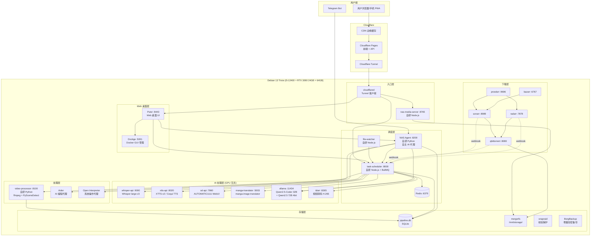
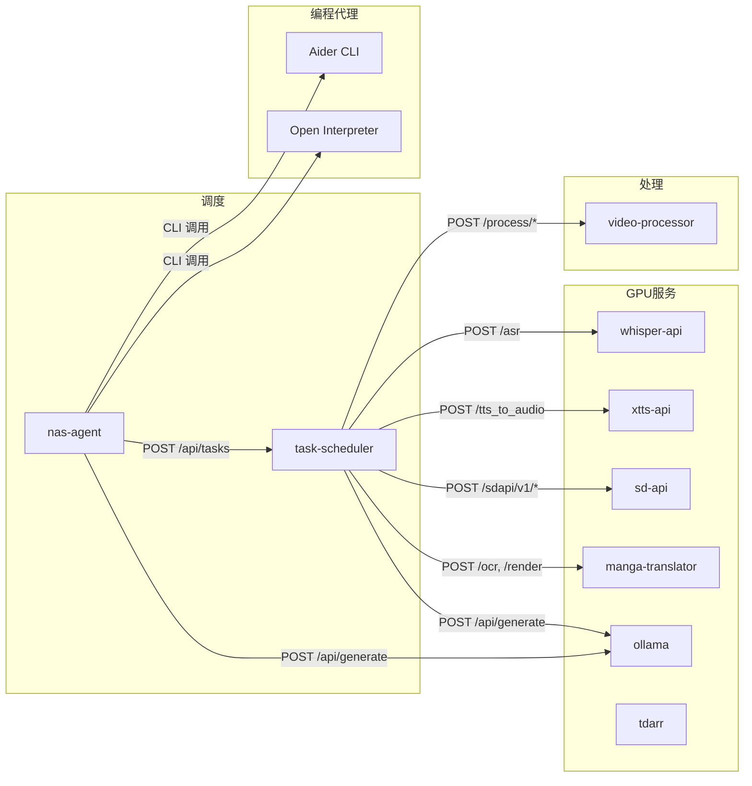
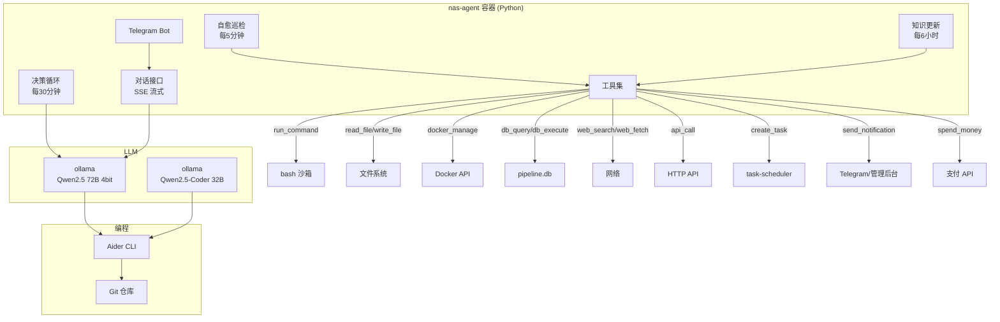
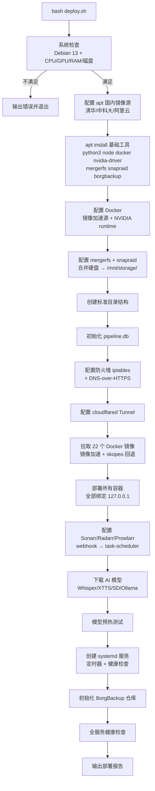

# 技术设计文档 — 星聚OS（StarHub OS）自主 AI 服务器操作系统

## 概述

星聚OS 是基于 Debian 13 "Trixie"（内核 6.12 LTS）的自主 AI 服务器操作系统。系统运行在 i5-12400 + RTX 3090 24GB + 64GB DDR4 硬件上，集五大核心能力于一体：

1. **私有网盘** — 文件上传/下载/分享/WebDAV，AES-256 加密存储
2. **AI 内容处理流水线** — 4 条流水线（视频12步/漫画9步/小说10步/音频6步），GPU 互斥调度
3. **自主 AI 代理** — 7x24 自主决策循环、自愈、代码生成、工具调用、对话界面、Telegram Bot
4. **娱乐内容聚合** — 多源自动刮削/下载/去重/标签/分级，覆盖视频/漫画/小说/音频/直播
5. **Web 桌面管理界面** — 基于 Puter 的飞牛风格桌面，含应用市场

**核心设计原则：**
- 最大化复用开源项目，自研仅写胶水代码
- NAS 零公网端口，所有流量走 Cloudflare Tunnel
- 所有数据本地存储（SQLite `pipeline.db` + mergerfs 文件系统）
- GPU 互斥调度：同一时间仅一个 GPU 密集型任务运行
- systemd 原生服务管理，apt 安装所有依赖
- 深色主题、SVG 图标、默认中文

**目标硬件：**
| 组件 | 规格 | 说明 |
|------|------|------|
| CPU | i5-12400 (6C12T, 65W) | 待机 < 12W |
| GPU | RTX 3090 24GB | AI 推理专用 |
| RAM | 64GB DDR4 (2x32GB) | |
| 系统盘 | 512GB NVMe SSD | Debian + Docker + pipeline.db |
| 缓存盘 | 1TB NVMe SSD | AI 临时文件 + 热门内容缓存 |
| 存储盘 | 用户现有 HDD | mergerfs 合并 |
| 电源 | 650W 80Plus 金牌 | 目标待机 35-45W |

---

## 架构

### 高层架构图 — 开源项目集成拓扑



### 开源项目 → 需求映射表

| 开源项目 | 负责的需求 | 自研胶水代码 |
|---------|-----------|------------|
| **Puter** (Web 桌面) | 需求 85 (Web 桌面 UI) | 自定义应用窗口（AI 队列、存储管理、备份管理等） |
| **Dockge** (Docker GUI) | 需求 85.4 (Docker 管理窗口) | 嵌入 Puter iframe，SSO 集成 |
| **Aider** (AI 编程) | 需求 92 (自主编写代码) | Agent 调用 Aider CLI，传入 ollama endpoint |
| **Open Interpreter** (系统操作) | 需求 96 (工具调用) | Agent 调用 OI 执行 bash/文件/Docker 操作 |
| **manga-image-translator** | 需求 9 (漫画 OCR+翻译), 53 (漫画流水线) | task-scheduler HTTP 调用 |
| **ffmpeg + PySceneDetect** | 需求 1-3, 34, 52 (视频处理) | video-processor Python 封装 |
| **Sonarr/Radarr/Prowlarr/Bazarr** | 需求 24, 29, 48 (自动刮削) | webhook 集成到 task-scheduler |
| **Ollama** | 需求 74-77, 87-97 (AI 代理), 5,7 (翻译) | Agent 决策循环调用 ollama API |
| **Whisper** (large-v3) | 需求 4, 6 (字幕/配音) | task-scheduler HTTP 调用 |
| **XTTS-v2 / Coqui TTS** | 需求 6, 13 (配音/VN语音) | task-scheduler HTTP 调用 |
| **AUTOMATIC1111 SD WebUI** | 需求 3, 8, 12 (水印/上色/CG) | task-scheduler HTTP 调用 sd-api |
| **BullMQ + Redis** | 需求 7, 31, 58 (任务队列) | task-scheduler 核心 |
| **mergerfs + snapraid** | 需求 82 (存储管理) | deploy.sh 配置 |
| **BorgBackup** | 需求 83 (自动备份) | deploy.sh + systemd timer |
| **cloudflared** | 需求 23, 70 (网络安全) | deploy.sh 配置 |

### 自研代码清单（仅胶水代码）

| 自研组件 | 语言 | 代码量估计 | 职责 |
|---------|------|-----------|------|
| `task-scheduler` | Node.js/TS | ~3000 行 | BullMQ 队列、GPU 锁、webhook、Telegram 抓取、带宽调度、标签分析 |
| `nas-media-server` | Node.js/TS | ~800 行 | 媒体文件 HTTP 服务（已有，复用 nas-service/） |
| `video-processor` | Python | ~2000 行 | ffmpeg/PySceneDetect 封装、哈希计算、广告检测、水印处理 |
| `nas-agent` | Python | ~4000 行 | 自主决策循环、自愈、工具调用、对话、Telegram Bot |
| `file-watcher` | Node.js/TS | ~300 行 | chokidar 目录监控 |
| `deploy.sh` | Bash | ~1500 行 | Debian 13 一键部署 |
| `puter-apps/` | React/TS | ~2000 行 | Puter 自定义应用窗口（AI 队列、存储、备份等） |
| **总计** | | **~13600 行** | |

### 数据流路径

**内容入库流：**
```
下载源(Sonarr/Radarr/Telegram/手动) → qBittorrent/直接下载
  → /mnt/storage/media/*/incoming/
  → file-watcher 检测
  → task-scheduler 创建任务
  → AI 处理链（去重→标签→分级→处理→封装）
  → /mnt/storage/media/*/ready/
  → pipeline.db 注册
  → nas-media-server 通过 Tunnel+CDN 分发
```

**AI 代理决策流：**
```
每30分钟 → Agent 收集数据（用户行为+系统状态+内容库+外部源）
  → 调用 ollama LLM 推理
  → 输出决策 JSON（下载/优先级/清理/配置）
  → 低风险自动执行 / 高风险等待确认
  → 记录到 agent_decisions 表
```

**用户访问流：**
```
用户 → Cloudflare CDN（缓存命中直返）→ Tunnel → cloudflared → nas-media-server → /mnt/storage/media/*/ready/
```

---

## 组件与接口

### Docker 容器拓扑（22 个容器）

系统由 22 个 Docker 容器组成，全部绑定 `127.0.0.1`：

#### 1. 入口层（无 GPU）

| 容器 | 镜像 | 端口 | 职责 |
|------|------|------|------|
| `cloudflared` | `cloudflare/cloudflared` | 无（出站） | Tunnel 客户端 |
| `nas-media-server` | 自研 Node.js | :8765 | 媒体文件 HTTP + Range + ETag |

#### 2. Web 桌面层（无 GPU）

| 容器 | 镜像 | 端口 | 职责 |
|------|------|------|------|
| `puter` | `ghcr.io/heyputer/puter` | :8443 | Web 桌面 UI（飞牛风格） |
| `dockge` | `louislam/dockge` | :5001 | Docker Compose GUI |

#### 3. 调度层（无 GPU）

| 容器 | 镜像 | 端口 | 职责 |
|------|------|------|------|
| `task-scheduler` | 自研 Node.js | :8000 | BullMQ 队列 + GPU 锁 + webhook |
| `redis` | `redis:7-alpine` | :6379 | BullMQ 后端 |
| `file-watcher` | 自研 Node.js | 无 | 监控 incoming 目录 |
| `nas-agent` | 自研 Python | :8200 | 自主 AI 代理 |

#### 4. AI 处理层（GPU 互斥）

| 容器 | 镜像 | 端口 | GPU | 职责 |
|------|------|------|-----|------|
| `whisper-api` | `onerahmet/openai-whisper-asr-webservice` | :9000 | 是 | Whisper large-v3 |
| `xtts-api` | `ghcr.io/coqui-ai/xtts-streaming-server` | :8020 | 是 | XTTS-v2 TTS |
| `sd-api` | `AUTOMATIC1111/stable-diffusion-webui` | :7860 | 是 | SD 图像生成/修复 |
| `manga-translator` | `zyddnys/manga-image-translator` | :5003 | 是 | OCR+翻译+渲染 |
| `ollama` | `ollama/ollama` | :11434 | 是 | LLM 推理 |
| `tdarr` | `haveagitgat/tdarr` | :8265 | 是 | H.265 转码 |

#### 5. 辅助处理层

| 容器 | 镜像 | 端口 | 职责 |
|------|------|------|------|
| `video-processor` | 自研 Python | :8100 | ffmpeg + PySceneDetect 封装 |

#### 6. 下载层（无 GPU）

| 容器 | 镜像 | 端口 | 职责 |
|------|------|------|------|
| `qbittorrent` | `linuxserver/qbittorrent` | :8080 | BT 下载 |
| `sonarr` | `linuxserver/sonarr` | :8989 | 电视剧/动漫刮削 |
| `radarr` | `linuxserver/radarr` | :7878 | 电影刮削 |
| `prowlarr` | `linuxserver/prowlarr` | :9696 | 索引器管理 |
| `bazarr` | `linuxserver/bazarr` | :6767 | 字幕下载 |

### 服务间通信

所有服务间通信使用 HTTP REST over localhost，无需 TLS。



### task-scheduler API 规范

**基础路径：** `http://127.0.0.1:8000`

```
-- 任务管理
POST   /api/tasks                    创建任务
GET    /api/tasks                    查询任务列表（分页+过滤）
GET    /api/tasks/:id                任务详情
PUT    /api/tasks/:id/priority       调整优先级
PUT    /api/tasks/:id/retry          重试失败任务
PUT    /api/tasks/:id/retry-step     重试某个失败步骤
DELETE /api/tasks/:id                取消排队中的任务

-- GPU 与系统状态
GET    /api/gpu/status               GPU 使用率/显存/当前模型
GET    /api/gpu/lock                 GPU 锁持有者
GET    /api/queue/stats              队列统计
GET    /api/system/health            容器健康状态

-- Webhook 接收
POST   /webhook/download-complete    qBittorrent 完成回调
POST   /webhook/import-complete      Sonarr/Radarr 导入回调
POST   /webhook/file-detected        file-watcher 新文件回调

-- Telegram 管理
GET    /api/telegram/channels        频道列表
POST   /api/telegram/channels        添加频道
PUT    /api/telegram/channels/:id    编辑频道
DELETE /api/telegram/channels/:id    删除频道

-- 带宽调度
GET    /api/bandwidth/status         带宽使用情况
PUT    /api/bandwidth/rules          更新调度规则

-- 去重管理
GET    /api/dedup/stats              去重统计
POST   /api/dedup/full-scan          触发全库扫描

-- AI 标签管理
GET    /api/tagger/stats             标签统计
GET    /api/tagger/review            待审核标签列表
PUT    /api/tagger/:contentId/tags   修正标签
PUT    /api/tagger/:contentId/rating 修正分级

-- 刮削源管理
GET    /api/scrapers                 刮削源列表
PUT    /api/scrapers/:id/config      更新配置
POST   /api/scrapers/:id/trigger     手动触发
```

### nas-agent API 规范

**基础路径：** `http://127.0.0.1:8200`

```
-- 对话接口（类 ChatGPT）
POST   /api/chat                     对话（SSE 流式输出）
GET    /api/chat/history             对话历史

-- 系统状态
GET    /api/system/status            CPU/GPU/RAM/磁盘/容器状态
GET    /api/system/health            健康巡检结果

-- 决策与运营
GET    /api/decisions                决策日志
GET    /api/decisions/next           下一轮决策预告
GET    /api/reports/daily            每日运营报告
GET    /api/reports/monthly          月度报告

-- 知识库
GET    /api/knowledge                知识库条目
GET    /api/knowledge/updates        最近更新

-- 消费管理
GET    /api/expenses                 消费记录
GET    /api/expenses/budget          预算状态
PUT    /api/expenses/limits          更新消费限额

-- 工具调用
POST   /api/tools/execute            执行工具（run_command/read_file/write_file/docker_manage/db_query/web_search 等）

-- 代码生成
POST   /api/code/generate            Aider 代码生成
GET    /api/code/branches            Agent 创建的 Git 分支
POST   /api/code/merge               合并分支（需确认）
```

### Puter Web 桌面集成方案

Puter 自带文件管理器、终端、设置等基础应用。我们需要添加自定义应用：

**集成方式：** Puter 支持通过 iframe 嵌入外部应用作为桌面窗口。

| 桌面应用 | 实现方式 | 数据源 |
|---------|---------|--------|
| 文件管理器 | Puter 内置 | nas-media-server API |
| 终端 | Puter 内置 | WebSocket → bash shell |
| 系统监控 | 自研 React SPA → iframe | nas-agent /api/system/status |
| Docker 管理 | Dockge iframe | Dockge :5001 |
| AI 队列 | 自研 React SPA → iframe | task-scheduler /api/tasks |
| 存储管理 | 自研 React SPA → iframe | nas-agent /api/system/status |
| 备份管理 | 自研 React SPA → iframe | BorgBackup CLI 封装 API |
| 龙虾 AI 对话 | 自研 React SPA → iframe | nas-agent /api/chat |
| 应用市场 | 自研 React SPA → iframe | Docker Hub API + 模板 JSON |
| 设置 | Puter 内置 + 扩展 | 系统配置 API |

**应用市场设计：**
```json
// /mnt/storage/starhub/app-store/templates.json
{
  "apps": [
    {
      "id": "jellyfin",
      "name": "Jellyfin",
      "description": "开源媒体服务器",
      "icon": "/icons/jellyfin.svg",
      "category": "媒体",
      "docker_compose": "version: '3'\nservices:\n  jellyfin:\n    image: jellyfin/jellyfin\n    ...",
      "ports": [8096],
      "gpu": false
    }
  ]
}
```

一键安装 = 写入 docker-compose.yml + `docker compose up -d`，由 Dockge 管理。

---

## 数据模型

### SQLite 数据库 `pipeline.db` 完整 Schema

数据库位于 `/mnt/storage/starhub/pipeline.db`，由 task-scheduler、video-processor、nas-agent 共同读写。

复用前版设计的 16 张核心表，新增 8 张表支持 AI 代理和私有网盘功能：

```sql
-- ═══════════════════════════════════════════════════════
-- 复用前版核心表（16 张）
-- ═══════════════════════════════════════════════════════

-- 1. tasks — 核心任务表
CREATE TABLE tasks (
    id              TEXT PRIMARY KEY,
    type            TEXT NOT NULL,              -- video_pipeline | comic_pipeline | novel_pipeline | audio_pipeline | dedup_scan | face_verify | tagger
    status          TEXT NOT NULL DEFAULT 'pending',
    priority        INTEGER NOT NULL DEFAULT 100,
    source          TEXT,                       -- sonarr | radarr | telegram | manual | scraper | agent
    source_url      TEXT,
    file_path       TEXT NOT NULL,
    content_id      TEXT,
    content_type    TEXT,
    mpaa_rating     TEXT DEFAULT 'PG',
    current_step    INTEGER DEFAULT 0,
    total_steps     INTEGER,
    error_message   TEXT,
    retry_count     INTEGER DEFAULT 0,
    created_at      TEXT NOT NULL DEFAULT (datetime('now')),
    started_at      TEXT,
    completed_at    TEXT,
    metadata        TEXT                        -- JSON
);

-- 2. task_steps — 步骤级状态持久化
CREATE TABLE task_steps (
    id              TEXT PRIMARY KEY,
    task_id         TEXT NOT NULL REFERENCES tasks(id) ON DELETE CASCADE,
    step_number     INTEGER NOT NULL,
    step_name       TEXT NOT NULL,
    status          TEXT NOT NULL DEFAULT 'pending',
    error_message   TEXT,
    retry_count     INTEGER DEFAULT 0,
    started_at      TEXT,
    completed_at    TEXT,
    duration_ms     INTEGER,
    output_path     TEXT,
    metadata        TEXT
);

-- 3. video_hashes — 视频去重索引
CREATE TABLE video_hashes (
    id              TEXT PRIMARY KEY,
    content_id      TEXT,
    file_path       TEXT NOT NULL,
    phash           TEXT NOT NULL,
    scene_fingerprint TEXT,
    resolution      TEXT,
    duration_sec    REAL,
    file_size       INTEGER,
    codec           TEXT,
    created_at      TEXT NOT NULL DEFAULT (datetime('now'))
);

-- 4. comic_hashes — 漫画去重索引
CREATE TABLE comic_hashes (
    id              TEXT PRIMARY KEY,
    content_id      TEXT,
    file_path       TEXT NOT NULL,
    cover_phash     TEXT NOT NULL,
    page_hashes     TEXT,
    page_count      INTEGER,
    resolution      TEXT,
    language        TEXT,
    is_bw           INTEGER DEFAULT 0,
    created_at      TEXT NOT NULL DEFAULT (datetime('now'))
);

-- 5. audio_fingerprints — 音频去重索引
CREATE TABLE audio_fingerprints (
    id              TEXT PRIMARY KEY,
    content_id      TEXT,
    file_path       TEXT NOT NULL,
    fingerprint     TEXT NOT NULL,
    duration_sec    REAL,
    bitrate         INTEGER,
    format          TEXT,
    title           TEXT,
    artist          TEXT,
    album           TEXT,
    created_at      TEXT NOT NULL DEFAULT (datetime('now'))
);

-- 6. novel_fingerprints — 小说去重索引
CREATE TABLE novel_fingerprints (
    id              TEXT PRIMARY KEY,
    content_id      TEXT,
    file_path       TEXT NOT NULL,
    title           TEXT,
    author          TEXT,
    simhash         TEXT,
    word_count      INTEGER,
    chapter_count   INTEGER,
    language        TEXT,
    created_at      TEXT NOT NULL DEFAULT (datetime('now'))
);

-- 7. face_features — 人脸特征（服务者验证）
CREATE TABLE face_features (
    id              TEXT PRIMARY KEY,
    provider_id     TEXT NOT NULL,
    photo_path      TEXT NOT NULL,
    face_vector     BLOB,
    phash           TEXT,
    created_at      TEXT NOT NULL DEFAULT (datetime('now'))
);

-- 8. dedup_records — 去重记录
CREATE TABLE dedup_records (
    id              TEXT PRIMARY KEY,
    content_type    TEXT NOT NULL,
    original_id     TEXT NOT NULL,
    duplicate_id    TEXT NOT NULL,
    similarity      REAL,
    status          TEXT DEFAULT 'pending',
    action          TEXT,
    created_at      TEXT NOT NULL DEFAULT (datetime('now')),
    resolved_at     TEXT
);

-- 9. ad_segments — 广告片段
CREATE TABLE ad_segments (
    id              TEXT PRIMARY KEY,
    task_id         TEXT NOT NULL REFERENCES tasks(id),
    start_time      REAL NOT NULL,
    end_time        REAL NOT NULL,
    ad_type         TEXT,
    confidence      REAL,
    status          TEXT DEFAULT 'detected',
    created_at      TEXT NOT NULL DEFAULT (datetime('now'))
);

-- 10. content_registry — 处理完成的最终内容
CREATE TABLE content_registry (
    id              TEXT PRIMARY KEY,
    type            TEXT NOT NULL,
    title           TEXT,
    mpaa_rating     TEXT DEFAULT 'PG',
    status          TEXT DEFAULT 'active',
    duration_sec    REAL,
    resolution      TEXT,
    audio_tracks    TEXT,
    subtitle_tracks TEXT,
    page_count      INTEGER,
    versions        TEXT,
    word_count      INTEGER,
    chapter_count   INTEGER,
    modes           TEXT,
    artist          TEXT,
    formats         TEXT,
    file_path       TEXT NOT NULL,
    thumbnail_path  TEXT,
    source          TEXT,
    source_url      TEXT,
    metadata        TEXT,                       -- JSON: 含 AI 自动标签
    created_at      TEXT NOT NULL DEFAULT (datetime('now')),
    updated_at      TEXT NOT NULL DEFAULT (datetime('now'))
);

-- 11. telegram_channels — Telegram 频道配置
CREATE TABLE telegram_channels (
    id              TEXT PRIMARY KEY,
    channel_id      TEXT NOT NULL UNIQUE,
    name            TEXT NOT NULL,
    type            TEXT DEFAULT 'channel',
    mpaa_rating     TEXT DEFAULT 'PG',
    scrape_interval INTEGER DEFAULT 1800,
    enabled         INTEGER DEFAULT 1,
    last_scraped_at TEXT,
    last_message_id INTEGER DEFAULT 0,
    total_downloaded INTEGER DEFAULT 0,
    created_at      TEXT NOT NULL DEFAULT (datetime('now'))
);

-- 12. scraper_sources — 刮削源配置
CREATE TABLE scraper_sources (
    id              TEXT PRIMARY KEY,
    name            TEXT NOT NULL,
    url             TEXT NOT NULL,
    type            TEXT NOT NULL,
    mpaa_rating     TEXT DEFAULT 'PG',
    scrape_interval INTEGER DEFAULT 21600,
    max_per_run     INTEGER DEFAULT 20,
    enabled         INTEGER DEFAULT 1,
    filter_tags     TEXT,
    last_scraped_at TEXT,
    created_at      TEXT NOT NULL DEFAULT (datetime('now'))
);

-- 13. bandwidth_rules — 带宽调度规则
CREATE TABLE bandwidth_rules (
    id              TEXT PRIMARY KEY,
    start_hour      INTEGER NOT NULL,
    end_hour        INTEGER NOT NULL,
    download_limit  INTEGER,
    upload_limit    INTEGER,
    enabled         INTEGER DEFAULT 1
);

-- 14. bandwidth_usage — 带宽使用记录
CREATE TABLE bandwidth_usage (
    date            TEXT PRIMARY KEY,
    bytes_downloaded INTEGER DEFAULT 0,
    bytes_uploaded  INTEGER DEFAULT 0,
    daily_limit     INTEGER DEFAULT 53687091200
);

-- 15. gpu_lock — GPU 互斥锁（单行表）
CREATE TABLE gpu_lock (
    id              INTEGER PRIMARY KEY CHECK (id = 1),
    locked_by       TEXT,
    service         TEXT,
    locked_at       TEXT,
    expires_at      TEXT
);
INSERT INTO gpu_lock (id) VALUES (1);

-- 16. vn_saves — 视觉小说存档
CREATE TABLE vn_saves (
    id              TEXT PRIMARY KEY,
    user_id         TEXT NOT NULL,
    content_id      TEXT NOT NULL,
    chapter         INTEGER NOT NULL,
    scene_index     INTEGER NOT NULL,
    dialogue_index  INTEGER NOT NULL,
    save_name       TEXT,
    created_at      TEXT NOT NULL DEFAULT (datetime('now'))
);

-- ═══════════════════════════════════════════════════════
-- 新增表（8 张）— AI 代理 + 私有网盘 + 应用市场
-- ═══════════════════════════════════════════════════════

-- 17. agent_decisions — AI 代理决策日志
CREATE TABLE agent_decisions (
    id              TEXT PRIMARY KEY,
    cycle_id        TEXT NOT NULL,              -- 决策循环 ID
    decision_type   TEXT NOT NULL,              -- content_acquire | priority_adjust | storage_cleanup | config_optimize | content_recommend
    risk_level      TEXT NOT NULL,              -- low | medium | high
    input_summary   TEXT,                       -- 输入数据摘要 JSON
    reasoning       TEXT,                       -- LLM 推理过程
    actions         TEXT,                       -- 决策动作列表 JSON
    status          TEXT DEFAULT 'pending',     -- pending | approved | executed | rejected | failed
    executed_at     TEXT,
    created_at      TEXT NOT NULL DEFAULT (datetime('now'))
);

-- 18. agent_actions — AI 代理执行的操作日志
CREATE TABLE agent_actions (
    id              TEXT PRIMARY KEY,
    decision_id     TEXT REFERENCES agent_decisions(id),
    action_type     TEXT NOT NULL,              -- restart_container | cleanup_files | adjust_config | download_content | run_command | write_file | git_commit | spend_money
    description     TEXT,
    command         TEXT,
    rollback_cmd    TEXT,
    status          TEXT DEFAULT 'pending',
    result          TEXT,
    executed_at     TEXT,
    created_at      TEXT NOT NULL DEFAULT (datetime('now'))
);

-- 19. agent_expenses — AI 代理消费记录
CREATE TABLE agent_expenses (
    id              TEXT PRIMARY KEY,
    amount_cents    INTEGER NOT NULL,           -- 金额（分）
    currency        TEXT DEFAULT 'CNY',
    purpose         TEXT NOT NULL,              -- api_credit | domain_renewal | vps_renewal
    description     TEXT,
    status          TEXT DEFAULT 'pending',     -- pending | approved | completed | rejected
    approved_by     TEXT,                       -- 'auto' | 'admin'
    created_at      TEXT NOT NULL DEFAULT (datetime('now'))
);

-- 20. agent_config_changes — 配置变更记录
CREATE TABLE agent_config_changes (
    id              TEXT PRIMARY KEY,
    config_key      TEXT NOT NULL,
    old_value       TEXT,
    new_value       TEXT,
    reason          TEXT,
    status          TEXT DEFAULT 'applied',     -- applied | rolled_back
    applied_at      TEXT NOT NULL DEFAULT (datetime('now')),
    rolled_back_at  TEXT
);

-- 21. knowledge_base — AI 代理知识库
CREATE TABLE knowledge_base (
    id              TEXT PRIMARY KEY,
    category        TEXT NOT NULL,              -- github_trending | docker_update | security | tech_blog | source_change
    title           TEXT NOT NULL,
    summary         TEXT NOT NULL,
    source_url      TEXT,
    relevance_score REAL DEFAULT 0.5,
    created_at      TEXT NOT NULL DEFAULT (datetime('now')),
    expires_at      TEXT                        -- 知识过期时间
);

-- 22. cloud_files — 私有网盘文件表
CREATE TABLE cloud_files (
    id              TEXT PRIMARY KEY,
    user_id         TEXT NOT NULL,
    parent_id       TEXT,                       -- 父目录 ID，NULL=根目录
    name            TEXT NOT NULL,
    type            TEXT NOT NULL,              -- file | directory
    mime_type       TEXT,
    size            INTEGER DEFAULT 0,
    encrypted_path  TEXT,                       -- AES-256 加密后的实际存储路径
    version         INTEGER DEFAULT 1,
    share_token     TEXT,                       -- 分享链接 token
    share_password  TEXT,                       -- 分享密码（bcrypt）
    share_expires   TEXT,                       -- 分享过期时间
    created_at      TEXT NOT NULL DEFAULT (datetime('now')),
    updated_at      TEXT NOT NULL DEFAULT (datetime('now'))
);

CREATE INDEX idx_cloud_files_user ON cloud_files(user_id, parent_id);
CREATE INDEX idx_cloud_files_share ON cloud_files(share_token);

-- 23. cloud_file_versions — 文件版本历史
CREATE TABLE cloud_file_versions (
    id              TEXT PRIMARY KEY,
    file_id         TEXT NOT NULL REFERENCES cloud_files(id) ON DELETE CASCADE,
    version         INTEGER NOT NULL,
    size            INTEGER,
    encrypted_path  TEXT NOT NULL,
    created_at      TEXT NOT NULL DEFAULT (datetime('now'))
);

-- 24. app_store_installs — 应用市场安装记录
CREATE TABLE app_store_installs (
    id              TEXT PRIMARY KEY,
    app_id          TEXT NOT NULL,
    app_name        TEXT NOT NULL,
    docker_compose  TEXT NOT NULL,
    status          TEXT DEFAULT 'running',     -- running | stopped | error
    installed_at    TEXT NOT NULL DEFAULT (datetime('now')),
    updated_at      TEXT NOT NULL DEFAULT (datetime('now'))
);
```

### 目录结构（Debian 13 版本）

```
/mnt/storage/                          ← mergerfs 合并挂载点
├── media/
│   ├── videos/
│   │   ├── incoming/                  ← file-watcher 监控
│   │   ├── processing/{task_id}/      ← 处理中临时目录
│   │   ├── ready/{content_id}.mkv     ← 最终产出
│   │   ├── originals/{hash}.mkv       ← 原始备份
│   │   ├── duplicates/                ← 待清理
│   │   └── failed/
│   ├── comics/
│   │   ├── incoming/
│   │   ├── processing/
│   │   ├── ready/{content_id}/        ← original/ translated/ colorized/
│   │   ├── duplicates/
│   │   └── failed/
│   ├── novels/
│   │   ├── incoming/
│   │   ├── processing/
│   │   ├── ready/{content_id}/        ← text/ vn/
│   │   ├── duplicates/
│   │   └── failed/
│   ├── music/
│   │   ├── incoming/
│   │   ├── processing/
│   │   ├── ready/{content_id}/        ← hq.flac + stream.m4a
│   │   ├── duplicates/
│   │   └── failed/
│   ├── telegram/{channel_id}/         ← Telegram 原始文件
│   ├── downloads/
│   │   ├── complete/
│   │   └── incomplete/
│   ├── cloud/{user_id}/               ← 私有网盘用户文件
│   └── games/roms/{platform}/         ← 街机 ROM 文件
│
├── starhub/
│   ├── pipeline.db                    ← SQLite 主数据库
│   ├── config/                        ← 系统配置文件
│   ├── app-store/templates.json       ← 应用市场模板
│   ├── repo/                          ← 星聚项目 Git 仓库（Agent 代码生成用）
│   └── backups/                       ← BorgBackup 仓库
│
└── ai_models/
    ├── whisper/                        ← Whisper large-v3 (~3GB)
    ├── xtts/                           ← XTTS-v2 (~2GB)
    ├── sd/                             ← SD 1.5/SDXL + LoRA (~6GB)
    ├── ollama/                         ← Qwen2.5 模型 (~20GB)
    └── manga/                          ← 漫画翻译/上色模型
```

---

## GPU 调度与流水线

### GPU 互斥锁机制

与前版设计完全一致：RTX 3090 24GB 显存有限，GPU 密集型服务不能并发。task-scheduler 维护基于 SQLite 的 GPU 互斥锁。

**GPU 服务超时保护：**

| 服务 | 最大执行时间 | 说明 |
|------|-------------|------|
| whisper-api | 60 分钟 | 长视频语音识别 |
| xtts-api | 120 分钟 | 全片配音生成 |
| sd-api (inpaint) | 180 分钟 | 全片水印移除 |
| sd-api (txt2img) | 30 分钟 | CG/立绘生成 |
| manga-translator | 60 分钟 | 整章 OCR+渲染 |
| ollama | 30 分钟 | LLM 推理 |
| tdarr | 240 分钟 | H.265 转码 |

**优先级规则：**

| 优先级 | 值 | 场景 |
|--------|---|------|
| 紧急 | 0-10 | 服务者照片验证（5分钟 SLA） |
| 高 | 11-50 | 用户手动触发 / Agent 紧急任务 |
| 中 | 51-100 | 新入库内容自动处理 |
| 低 | 101-200 | 批量历史内容处理 |
| 后台 | 201-999 | 全库扫描、转码优化 |

### 4 条处理流水线

流水线状态机与前版设计完全一致（视频12步、漫画9步、小说10步、音频6步），每条流水线在去重步骤后新增 **AI 自动标签+分级** 步骤（需求 59-64）。

**新增标签步骤插入位置：**
- 视频：S2 去重 → **S2.5 AI标签+分级** → S3 合集检测
- 漫画：S2 去重 → **S2.5 AI标签+分级** → S3 OCR
- 小说：S2 去重 → **S2.5 AI标签+分级** → S3 翻译
- 音频：S2 去重 → **S2.5 AI标签+分级** → S3 格式标准化

**标签步骤实现：**
```
Content_Tagger（集成在 task-scheduler 中）:
  1. 提取特征（截图/封面/文本/ID3/文件名）
  2. 调用 ollama LLM → 输出结构化标签 JSON
  3. 写入 content_registry.metadata
  4. 置信度 < 50% → 标记"待人工审核"
```

---

## NAS 自主 AI 代理设计

### 代理架构



### 决策循环伪代码

```python
async def decision_loop():
    while True:
        # 1. 收集数据
        context = {
            "user_searches": await fetch_unsatisfied_searches(),
            "content_stats": await db.query("SELECT type, count(*) FROM content_registry GROUP BY type"),
            "queue_status": await fetch_queue_stats(),
            "system_resources": await get_system_status(),
            "trending": await fetch_trending_content(),
        }

        # 2. 调用 LLM 推理
        prompt = build_decision_prompt(context)
        decisions = await ollama.generate(model="qwen2.5:72b-instruct-q4_K_M", prompt=prompt)

        # 3. 解析并执行决策
        for decision in parse_decisions(decisions):
            if decision.risk == "low":
                await execute_decision(decision)  # 自动执行
            else:
                await save_for_approval(decision)  # 等待管理员确认

        # 4. 记录日志
        await db.insert("agent_decisions", {...})

        await asyncio.sleep(1800)  # 30 分钟
```

### 工具调用安全规则

```python
DANGEROUS_PATTERNS = [
    r"rm\s+-rf\s+/",           # 禁止删除根目录
    r"rm\s+-rf\s+/etc",        # 禁止删除系统配置
    r"rm\s+-rf\s+/boot",
    r"iptables\s+-F",          # 禁止清空防火墙
    r"docker\s+stop\s+cloudflared",  # 禁止停止 Tunnel
    r"systemctl\s+stop\s+docker",    # 禁止停止 Docker
]

SPENDING_LIMITS = {
    "daily_max_cents": 5000,    # 50 元/天
    "monthly_max_cents": 50000, # 500 元/月
    "single_max_cents": 10000,  # 100 元/笔
}
```

### Telegram Bot 集成

```python
# Agent 同时作为 Telegram Bot 运行
# 用户在 Telegram 中发消息 → Agent 处理 → 回复
# 支持：自然语言指令、系统查询、故障排查

from telegram import Bot, Update
bot = Bot(token=TELEGRAM_BOT_TOKEN)

@bot.message_handler()
async def handle_message(update: Update):
    response = await agent_chat(update.message.text)
    await update.message.reply_text(response)
```

---

## 部署脚本设计（Debian 13 专用）

### deploy.sh 执行流程



### systemd 服务单元

```
starhub-docker.service      — Docker 启动后恢复容器
starhub-firewall.service    — 开机加载防火墙规则
starhub-dns.service         — DNS-over-HTTPS (cloudflared proxy-dns)
starhub-backup.timer        — 每日 03:00 BorgBackup
starhub-snapraid.timer      — 每日 02:00 snapraid sync
starhub-health.timer        — 每 5 分钟健康检查
starhub-cleanup.timer       — 每周清理 Docker 悬空镜像
```

### 幂等性保证

```bash
# 每个容器部署前检查
if docker ps -a --format '{{.Names}}' | grep -q "^starhub-${NAME}$"; then
    echo "[跳过] ${NAME} 已存在"
else
    docker run -d --name "starhub-${NAME}" ...
fi

# apt install 天然幂等
# systemd enable 天然幂等
# mergerfs/snapraid 配置检查后写入
```

### Docker 镜像加速回退链

```bash
MIRRORS=("https://xuanyuan.cloud/free" "https://docker.aityp.com" "https://1ms.run" "https://docker.m.daocloud.io")

pull_image() {
    local image=$1
    # 先检查本地是否已有
    docker image inspect "$image" &>/dev/null && return 0
    # 尝试各镜像源
    for mirror in "${MIRRORS[@]}"; do
        docker pull "${mirror}/${image}" 2>/dev/null && docker tag "${mirror}/${image}" "$image" && return 0
    done
    # 最终回退: skopeo
    skopeo copy "docker://${image}" "docker-daemon:${image}"
}
```

---

## 多人街机 WebRTC 架构

与前版设计一致：
- **动态实例分配**：`ceil(N/M)` 个 WASM 模拟器实例
- **观战系统**：`canvas.captureStream(30)` → WebRTC MediaStream
- **语音聊天**：WebRTC P2P 音频 + Opus 编码
- **ROM 加载**：NAS → nas-media-server → Tunnel → CDN → IndexedDB → WASM

---

## 错误处理

### 步骤级状态持久化

每个处理步骤完成后立即写入 `task_steps` 表，进程崩溃后从断点恢复。

### 重试策略

```
指数退避: 1分钟 → 5分钟 → 30分钟
3 次均失败 → 跳过该步骤，继续后续步骤（降级处理）
```

### 降级处理

| 失败步骤 | 降级影响 |
|---------|---------|
| 水印移除 | 保留水印，有字幕和配音 |
| 语音识别 | 无字幕，无配音 |
| 字幕翻译 | 仅原始语言字幕 |
| 配音生成 | 有字幕但无配音 |
| 漫画上色 | 保持黑白，有翻译 |
| OCR 识别 | 仅原始版本 |
| AI 标签 | 无自动标签，待人工标注 |

### 崩溃恢复

task-scheduler 启动时：
1. 恢复所有 `processing` 状态的任务，从最后完成步骤继续
2. 释放过期的 GPU 锁
3. 清理超过 7 天的 processing/ 临时目录

### AI 代理自愈

nas-agent 每 5 分钟巡检：
- Docker 容器状态 → 异常自动重启
- GPU 响应 → 无响应重启 GPU 容器
- 磁盘空间 → < 10% 自动清理
- Tunnel 连接 → 断开自动重启 cloudflared
- Redis 连接 → 断开重启 Redis + task-scheduler
- pipeline.db 完整性 → `PRAGMA integrity_check`
- 同一异常连续 3 次 → Telegram 通知管理员

---

## 正确性属性

*属性（Property）是在系统所有有效执行中都应成立的特征或行为——本质上是对系统应做什么的形式化陈述。属性是人类可读规格说明与机器可验证正确性保证之间的桥梁。*

以下属性使用 `fast-check` 库（Node.js）或 `hypothesis` 库（Python）实现，每个属性测试最少 100 次迭代。

### Property 1: 汉明距离去重决策正确性

*For any* 两个 64-bit 感知哈希值，去重决策函数应在汉明距离 < 10 时返回 `duplicate`，在汉明距离 >= 10 时返回 `not_duplicate`。决策边界严格在 10。

**Validates: Requirements 1.2, 36.2**

### Property 2: 质量优选版本保留

*For any* 两个内容的元数据对（分辨率、文件大小、比特率、页数），版本选择算法应始终保留质量更高的版本（分辨率优先 → 文件大小/比特率优先 → 页数/完整性优先），且选择结果具有反对称性（A > B 则 B < A）。

**Validates: Requirements 1.4, 36.3, 46.3**

### Property 3: 字幕翻译时间戳不变性

*For any* 有效的 SRT 字幕文件（包含任意数量的字幕条目和任意时间戳），经过翻译处理后，每条字幕的开始时间和结束时间应与原始字幕完全一致。

**Validates: Requirements 5.2**

### Property 4: 翻译语言跳过逻辑

*For any* 源语言和目标语言列表的组合，当源语言已存在于目标语言列表中时，翻译器应跳过该语言；当源语言不在目标语言列表中时，应对所有目标语言执行翻译。跳过后的输出语言数 = 目标语言数 - (源语言在目标中 ? 1 : 0)。

**Validates: Requirements 5.5**

### Property 5: 流水线步骤顺序不变性

*For any* 内容类型（video/comic/novel/audio）的处理任务，创建的 task_steps 记录应严格按照该类型定义的步骤顺序排列（step_number 单调递增），且步骤名称序列与规范定义完全匹配。

**Validates: Requirements 7.1, 10.1, 15.1, 52, 53, 54, 55**

### Property 6: 步骤失败降级继续

*For any* 流水线任务和任意失败步骤（重试耗尽后），后续步骤应仍被执行（状态为 completed 或 skipped），不应因前置步骤失败而终止整个流水线。

**Validates: Requirements 7.3, 58.3**

### Property 7: GPU 互斥锁不变性

*For any* GPU 任务获取/释放事件序列，在任意时刻最多只有一个任务持有 GPU 锁。即：在锁被释放之前，任何其他任务的获取请求应返回失败或等待。

**Validates: Requirements 7.4, 56.3**

### Property 8: 视觉小说存档读档往返

*For any* 有效的视觉小说存档状态（user_id、content_id、chapter、scene_index、dialogue_index），保存到 pipeline.db 后再读取，应返回与原始状态完全相同的数据。

**Validates: Requirements 14.4**

### Property 9: 动态实例分配正确性

*For any* 玩家数量 N (N >= 1) 和游戏最大玩家数 M (M >= 1)，实例分配器应创建 ceil(N/M) 个实例，且每个实例的玩家数不超过 M，且所有实例的玩家总数等于 N。

**Validates: Requirements 16.1, 16.2, 16.3**

### Property 10: 部署脚本幂等性

*For any* 初始系统状态（部分容器已存在、部分不存在），执行部署逻辑两次后的最终状态应与执行一次后的状态完全相同（相同的容器集合、相同的配置）。

**Validates: Requirements 21.6**

### Property 11: 内容分类与分级继承

*For any* 文件类型（video/image/document）和频道配置（含 MPAA 分级），内容分类器应将文件归入正确的内容类别，且继承频道配置的 MPAA 分级。

**Validates: Requirements 27.1, 27.2**

### Property 12: 带宽调度规则时段匹配

*For any* 时刻（0-23 时）和一组带宽调度规则，调度器应选择覆盖该时刻的规则并应用对应的带宽限制。当多条规则覆盖同一时刻时，应选择最具体（时段最短）的规则。

**Validates: Requirements 30.1, 30.3**

### Property 13: 带宽超限暂停决策

*For any* 当日已用带宽和每日带宽上限的组合，当已用量超过上限的 90% 时，调度器应返回暂停决策；低于 90% 时应返回继续决策。

**Validates: Requirements 30.6**

### Property 14: 任务依赖触发正确性

*For any* 任务依赖 DAG（有向无环图），当某个任务完成时，应触发且仅触发那些所有前置依赖均已完成的后续任务。

**Validates: Requirements 31.7**

### Property 15: 崩溃恢复断点续传

*For any* 流水线任务状态（部分步骤已完成、当前步骤为 running），模拟崩溃恢复后，执行应从最后一个已完成步骤的下一步继续，不重复执行已完成的步骤。

**Validates: Requirements 58.1, 58.6**

### Property 16: 重试退避时间计算

*For any* 重试次数 n（0 <= n <= 2），计算的重试延迟应严格匹配退避表：第 0 次 = 60 秒，第 1 次 = 300 秒，第 2 次 = 1800 秒。当 n >= 3 时，应返回"放弃重试"信号。

**Validates: Requirements 58.2**

### Property 17: MPAA 分级取严格值

*For any* 两个 MPAA 分级（G/PG/PG-13/R/NC-17），AI 判定分级与来源预设分级的合并结果应等于两者中更严格的那个。分级严格度排序：G < PG < PG-13 < R < NC-17。

**Validates: Requirements 64.5**

### Property 18: AI 代理风险决策路由

*For any* AI 代理决策及其风险等级（low/medium/high），低风险决策应自动执行，高风险决策应等待管理员确认后才执行。中风险决策的路由应取决于管理员配置的自主权限等级。

**Validates: Requirements 74.6, 93.4**

### Property 19: 私有网盘加密往返

*For any* 有效的文件内容（任意字节序列），使用 AES-256 加密后再解密，应返回与原始内容完全相同的字节序列。

**Validates: Requirements 78.6**

### Property 20: AI 代理消费限额检查

*For any* 消费请求（金额、当前日累计、当前月累计）和配置的限额（日限/月限/单笔限），当任一限额被超过时应拒绝消费；当所有限额均未超过时应允许消费。

**Validates: Requirements 94.2**

### Property 21: 危险命令安全拦截

*For any* bash 命令字符串，安全检查器应拦截匹配危险模式的命令（rm -rf /、iptables -F、docker stop cloudflared 等），放行不匹配任何危险模式的命令。不应存在漏网的危险命令。

**Validates: Requirements 96.3**

---

## 测试策略

### 测试分层

**属性测试（Property-Based Testing）：**
- Node.js 组件使用 `fast-check` 库
- Python 组件使用 `hypothesis` 库
- 每个属性测试最少 100 次迭代
- 标签格式：`Feature: starhub-os, Property {N}: {描述}`
- 覆盖上述 21 个正确性属性

**单元测试：**
- GPU 调度算法的锁获取/释放逻辑
- 文件写入完成检测算法（5 秒稳定期）
- 带宽调度规则匹配
- 去重相似度计算（汉明距离、余弦相似度、SimHash）
- 任务优先级排序
- 重试退避时间计算
- MPAA 分级比较和合并
- 实例分配算法
- 内容分类路由
- 消费限额检查
- 危险命令模式匹配
- SRT 字幕解析/生成
- AES-256 加密/解密
- Agent 工具调用参数验证

**集成测试：**
- file-watcher → task-scheduler webhook 链路
- qBittorrent webhook → task-scheduler → 文件移动
- task-scheduler → GPU 服务 HTTP 调用
- pipeline.db 读写一致性
- 崩溃恢复流程（模拟进程重启）
- Puter → 自定义应用 iframe 通信
- Agent → ollama LLM 调用
- Agent → Aider CLI 代码生成
- Telegram Bot 消息处理
- BorgBackup 备份/恢复
- mergerfs + snapraid 配置验证

**端到端测试：**
- 完整视频处理流水线（短测试视频）
- 完整漫画处理流水线（测试图片）
- 完整小说处理流水线（测试文本）
- 完整音频处理流水线（测试音频）
- 部署脚本幂等性验证
- Cloudflare Tunnel → nas-media-server → 文件访问
- 私有网盘上传/下载/分享完整流程
- 应用市场一键安装/卸载

### 测试工具

| 层级 | 工具 | 语言 |
|------|------|------|
| 属性测试 | fast-check | Node.js/TS |
| 属性测试 | hypothesis | Python |
| 单元测试 | vitest | Node.js/TS |
| 单元测试 | pytest | Python |
| 集成测试 | vitest + supertest | Node.js/TS |
| 端到端测试 | bash 脚本 + curl | Shell |
| UI 测试 | Playwright | Node.js/TS |
